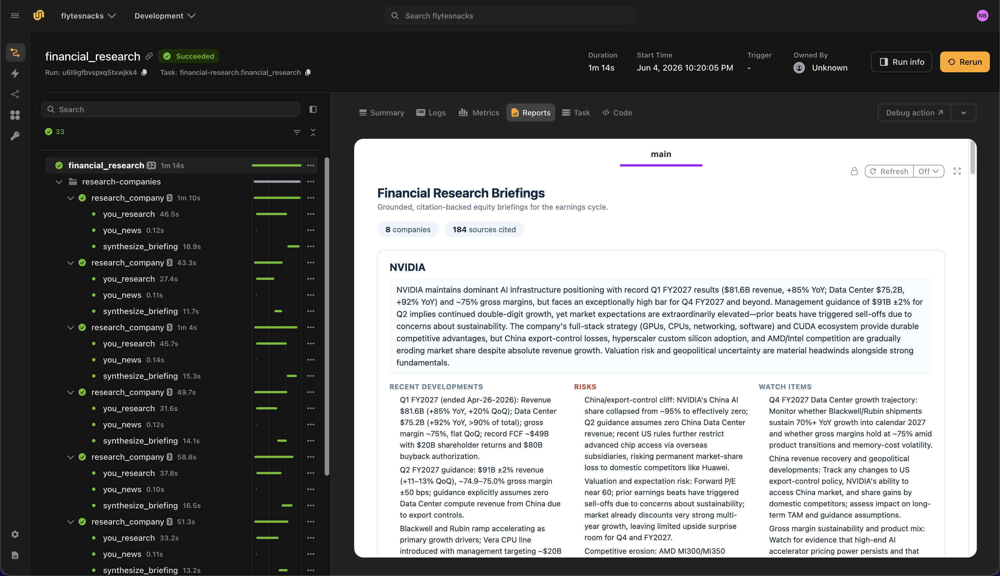

# Financial research agent

> [!NOTE]
> Code available [here](https://github.com/unionai/unionai-examples/tree/main/v2/tutorials/financial_research_agent).

This example demonstrates how to build a financial research and earnings-cycle agent on Flyte. For each company, the agent runs grounded, source-cited research and fresh news, then synthesizes an analyst-ready equity briefing.

Financial research benefits from **low-latency, ranked, source-cited results** across both the general web and news streams. The [You.com Research API](https://you.com/docs/research/overview) produces a grounded, citation-backed synthesis, and the [You.com Search API](https://you.com/docs/search/overview) adds a fresh-news layer. [Claude](https://docs.anthropic.com/) via [LiteLLM](https://docs.litellm.ai/) turns that evidence into an analyst-ready briefing. Flyte's `cache="auto"` reuses prior results when runs converge on the same companies.

Flyte provides:

- **Fan-out parallelism** across companies
- **`cache="auto"`** to reuse prior You.com and LLM results across converging runs
- **`@flyte.trace`** on every external call for full prompt → citation lineage
- **Flyte reports** with thesis, risks, watch items, and source citations per company



## Setting up the environment

The agent runs in a `TaskEnvironment` with secrets for the You.com and Anthropic API keys, automatic caching, and a container image built from the `uv` script dependencies.



The Python packages are declared at the top of the file using the `uv` script style:

```
# /// script
# requires-python = "==3.13"
# dependencies = [
#     "flyte>=2.4.0",
#     "httpx>=0.27.0",
#     "litellm>=1.72.0",
# ]
# ///
```

## Data types

Each `Briefing` carries a thesis, recent developments, risks, watch items, and a list of `Source` objects from both the Research and Search APIs.



## You.com Research and Search APIs

The agent uses both You.com APIs in parallel for each company:

- **Research API** (`https://api.you.com/v1/research`) — grounded, citation-backed analysis with configurable `research_effort` (`lite`, `standard`, `deep`, `exhaustive`). See the [Research API reference](https://you.com/docs/api-reference/research/v1-research).
- **Search API** (`https://ydc-index.io/v1/search`) — fresh news headlines with `freshness` filtering. See the [Search API reference](https://you.com/docs/api-reference/search/v1-search).



## Synthesize briefings with Claude

Claude, routed through LiteLLM, turns the grounded research answer and news headlines into a structured equity briefing grounded in the evidence provided.



## Research one company

The `research_company` task calls both You.com APIs in parallel, collects sources, and synthesizes a structured briefing.



## Orchestration

The `financial_research` driver task fans out across all companies and renders a Flyte report with per-company briefings and citations.



## Run the agent

### Create secrets

Get a You.com API key from the [You.com platform](https://you.com/platform) (see the [quickstart guide](https://you.com/docs/quickstart)). Get an Anthropic API key from the [Anthropic console](https://console.anthropic.com/).

Register both keys as Flyte secrets. The secret key names must match those declared in the `TaskEnvironment`:

```
flyte create secret youdotcom-api-key <YOUR_YOU_API_KEY>
flyte create secret internal-anthropic-api-key <YOUR_ANTHROPIC_API_KEY>
```

See [Secrets](../../user-guide/task-configuration/secrets) for scoping and file-based secrets.

### Run locally or remotely

From the [example directory](https://github.com/unionai/unionai-examples/tree/main/v2/tutorials/financial_research_agent):

```
cd v2/tutorials/financial_research_agent
uv run --script main.py
```

To test locally without Flyte secrets:

```
export YOU_API_KEY=<YOUR_YOU_API_KEY>
export ANTHROPIC_API_KEY=<YOUR_ANTHROPIC_API_KEY>

uv run --script main.py
```

When the run completes, open the Flyte report to review equity briefings with thesis, risks, and You.com source citations for each company.
