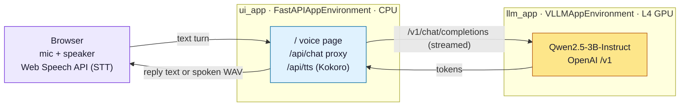

# Voice customer-service agent

> [!NOTE]
> Code available [on GitHub](https://github.com/unionai/unionai-examples/tree/main/v2/tutorials/voice_customer_service).

Talk to a customer-support agent in your browser and hear it answer back. This tutorial builds that agent as two Flyte apps: a small Qwen model served with vLLM on a GPU, and a web app that serves a single-page voice UI and proxies the model. Speech recognition runs in the browser, the reply streams back as text, and the text is spoken aloud. Once Union is set up, bringing the whole thing online is two `python` commands.


By the end you will understand, and have running:

- how to serve an LLM as a Flyte app with `VLLMAppEnvironment`, exposing an OpenAI-compatible endpoint,
- how to build a web app with `FastAPIAppEnvironment` that serves a UI and proxies the model,
- how the two apps compose, with the browser only ever talking to its own origin,
- how text-to-speech is switchable between the browser and a neural voice served on Union, with a live latency comparison, and
- how Flyte app features like health checks, warm replicas, and per-app routing turn this into something that feels like a product.

The agent is "Ava", a support rep for a fictional electronics company called Northwind. The model is `Qwen/Qwen2.5-3B-Instruct`, which is public, so no Hugging Face token is needed, and small enough to be snappy on a single L4 GPU.

## How it fits together

The demo is two apps plus the browser:

| App       | Environment             | Hardware | Job                                                              |
| --------- | ----------------------- | -------- | ---------------------------------------------------------------- |
| `llm_app` | `VLLMAppEnvironment`    | L4 GPU   | serve Qwen with vLLM, OpenAI-compatible `/v1`                    |
| `ui_app`  | `FastAPIAppEnvironment` | CPU      | serve the voice page, proxy chat to `llm_app`, synthesize speech |

Speech recognition and the default text-to-speech run in the browser through the Web Speech API, so there is no audio model to host for input and the GPU footprint stays tiny. The browser talks only to the UI app, and the UI app talks to the model. That keeps the model internal and avoids any cross-origin setup in the browser.



Serving the UI as a Flyte app, rather than hosting it somewhere separate, means the web tier gets the same treatment as the model: a managed endpoint, autoscaling, logs, and one deploy and auth story across both apps, with no separate web server to stand up or operate. It sits next to the model it proxies instead of reaching across the internet to it. Serving over HTTPS by default is part of that same package, and it happens to clear a practical hurdle for voice, since the browser only grants microphone access and speech recognition on a secure origin. So the page works the moment it deploys.

## Serving the model

The model app is a `VLLMAppEnvironment`. It wraps vLLM, downloads the weights, and exposes the standard OpenAI `/v1` API, so the UI talks to it the same way it would talk to any OpenAI-compatible server.

First, the image. Flyte's `Image` API defines the runtime as a chain of layers you control, so you pin exactly what a served model needs.



The app itself is a few lines. `Qwen/Qwen2.5-3B-Instruct` is about 6 GB in bf16 and fits an L4 comfortably. `scaling=flyte.app.Scaling(replicas=(1, 1))` keeps exactly one warm replica so there is no cold start mid-demo, and the short `--max-model-len` keeps the KV cache small and latency low, which is all a customer-service turn needs.



> [!NOTE] Why `llm_app` is a module-level variable
> The default serving entry point resolves the app by `module:attr`, so `llm_app` has to be importable at module level. If it were created inside a function, the resolver would silently fall back to `ui_app`, and the GPU pod would end up running the web UI and returning 404 on `/v1`. The `flyteplugins-vllm` import is guarded so the lightweight UI image, which never installs that plugin, still imports this module cleanly.

## The voice UI app

The UI is a `FastAPIAppEnvironment`. You hand it a plain FastAPI app, and Flyte serves it over HTTPS. This one serves the single-page voice client at `/`, proxies chat to the model at `/api/chat`, and synthesizes neural speech at `/api/tts`.



It runs on CPU, with no GPU at all. The server-side voice uses Kokoro, an 82M-parameter text-to-speech model that runs comfortably on CPU, so the image bundles a CPU build of torch to keep it small.



## The agent and the proxy

The agent's whole personality is a system prompt. Because the replies are spoken aloud in something that feels like a phone call, it asks for short, plain sentences, one question at a time, and tells the model to say it will look into account-specific details rather than invent them.



The proxy is what the browser actually calls. It injects the system prompt, forwards the turn to the selected model backend, and streams the reply back as plain text token by token. Keeping the model behind this proxy is what lets the browser talk only to its own origin.



## Speech in, speech out

Speech recognition happens in the browser through the Web Speech API, so the microphone is transcribed locally and only text is sent to the model. This needs Chrome or Edge.

For the reply, the page offers two voices you can switch between live:

- **Browser**, using the built-in `speechSynthesis`. It is the lowest latency, but its audio is not echo-cancelled, so it is best with headphones.
- **Server, using Kokoro**, a neural voice served by the UI app. Its audio plays through the Web Audio graph, which the browser's echo canceller can subtract, so it works on open speakers without the agent interrupting itself. The page defaults to this when it is ready.

The server voice is one endpoint. It synthesizes a clause of speech with Kokoro and returns a WAV, with the measured synthesis time in a response header so the page can show it.



A few details make the conversation feel natural rather than like a walkie-talkie:

- **Clause-by-clause speech.** The reply is spoken as soon as the first clause is ready, and the next clause is fetched while the current one plays, so only the first clause's latency is ever felt.
- **Barge-in.** The page watches microphone energy, and when you start talking over Ava it cancels both the model stream and the speech playback, so she stops and listens.
- **A live latency comparison.** After each reply the footer shows time-to-first-audio for the voice you used, and keeps a running average for both, so you can compare the browser and server voices side by side.

## What makes this a good Flyte app

The interesting part is not the model, it is how little stands between "I have a model" and "I have a product". A few things the UI surfaces on purpose:

**Two right-sized apps, composed.** A GPU model server and a CPU web app are separate environments with their own images and resources. They are wired together at deploy time by passing the model's URL into the UI app's environment, and nothing else.

**Health you can see.** The header shows two status pills. One pings the UI app's own health endpoint. The other pings the model app and reports whether a warm replica is serving. That second check is a direct read on the `Scaling` policy: it stays warm with `replicas=(1, 1)`, and would show a cold start if you let the model scale to zero when idle.



**Serve many models, switch live.** Because another model is just another app, the UI can route between several. Point it at more than one backend and a model switcher appears in the page; each chat turn goes to the selected one. With a single backend it stays hidden, so the default demo is unchanged.



This is the kind of thing that is painful to stand up by hand and nearly free here: each backend is its own addressable Flyte app, so comparing two models, or two voices, becomes a dropdown rather than a project.

## Deploy

You will need a Union deployment with GPU capacity. The example uses an L4, and any single modern GPU is enough for a 3B model. Point your Flyte config at your endpoint, and the example uses the remote image builder, so no local Docker is needed.

The model is public, so there is no token to set up. Bring up the two apps in order, passing the model URL from the first into the second:

```bash
# 1. Bring up the GPU model server (provisions an L4 and pulls weights, so give it a few minutes)
python app.py llm

# 2. Bring up the voice UI, pointed at the deployed model endpoint from step 1
python app.py ui --llm-url https://<llm-url>
```

Open the UI URL in Google Chrome, click the call button, and start talking. The first deploy of each app also builds its image, which takes a few minutes; later deploys reuse it.

## Test without a microphone

Both apps are ordinary HTTP services, so you can exercise them with `curl`. Hit the model directly through its OpenAI-compatible API:

```bash
curl -s https://<llm-url>/v1/chat/completions -H 'content-type: application/json' -d '{
  "model": "qwen",
  "messages": [{"role": "user", "content": "My order has not arrived. Help?"}]
}' | jq -r .choices[0].message.content
```

Or go through the UI proxy, which streams plain text and applies Ava's persona:

```bash
curl -N https://<ui-url>/api/chat -H 'content-type: application/json' -d '{
  "messages": [{"role": "user", "content": "Do you ship to Canada?"}]
}'
```

## Going further

Because it is all plain Flyte apps, each of these is a small change:

- **A bigger model.** You can swap in a larger model and run it on any silicon for better answers.
- **A model switcher.** Deploy a second model app and set `LLM_BACKENDS` on the UI app to a comma-separated list of `Label|https://url` pairs. The switcher appears automatically and each turn routes to the selected model.
- **Lower cost when idle.** Change the model app's `Scaling` to `replicas=(0, 1)` with a scaledown so the GPU is released when no one is calling, at the cost of a cold start on the next request. The header's model pill will show that cold start as it happens.
- **Authentication.** Set `requires_auth=True` on the apps and pass a token from the client, so the demo doubles as an example of exposing an app safely.
- **A different persona.** The entire agent lives in `SYSTEM_PROMPT`. Change it and you have a different assistant.

An LLM behind a polished web UI, served, scaled, and swappable, usually means standing up a model server, a separate web service, and the glue between them. On Flyte it is two decorated objects and two `python` commands, and the result is an HTTPS app you can hand to anyone with a browser.
