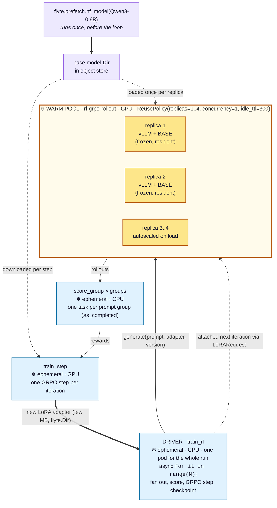
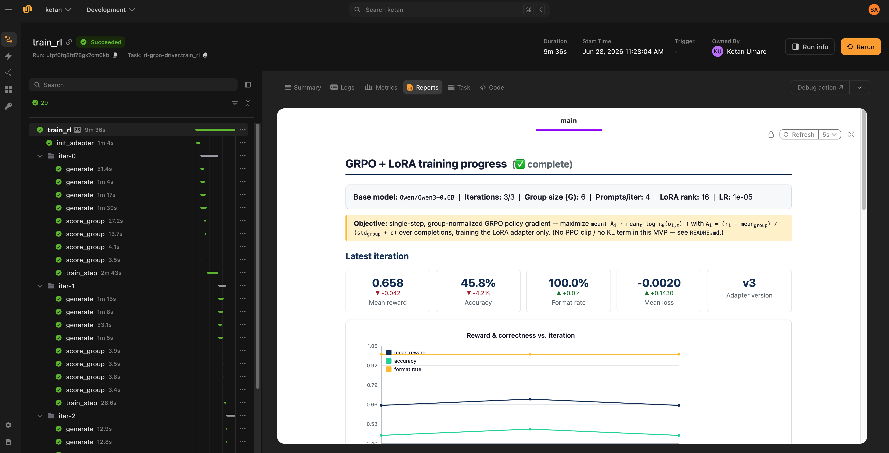

# Reinforcement learning for LLMs with GRPO and LoRA

> [!NOTE]
> Code available [here](https://github.com/unionai/unionai-examples/tree/main/v2/tutorials/rl_grpo_lora).

This tutorial builds a reinforcement learning loop for an LLM, the same shape of loop the major labs use to train reasoning models, and runs it entirely on the Flyte SDK. Flyte orchestrates the tasks and supplies the pieces that make the loop fast and reliable: a warm pool of reusable GPU containers for generation, right-sized environments for each stage, automatic recovery after failures, and a live report you can watch as training moves. Once you have Union and the Flyte SDK installed, running the whole thing is a single `python` command.

By the end you will understand, and have running:

- the RL-for-LLMs loop (sample, generate, score, update, repeat) and the GRPO objective behind it,
- how Flyte keeps a vLLM engine warm across iterations so you never reload the base model,
- how a small LoRA adapter is trained with one policy-gradient step and handed back to the generator,
- how generation and reward scoring overlap so the GPU stays busy, and
- how the run resumes after a preemption and streams a live progress report.

The example uses a small policy (Qwen3-0.6B) on a single L4 GPU so the loop is cheap to run end to end. It was validated on a Union cluster across three GRPO iterations. With a model this size and a toy dataset, the run proves the machinery rather than convergence, so scale the model and dataset once the loop is working for you.

## Why Flyte with Union fits RL training

RL training loops are genuinely awkward to run well. They mix very different work in a tight cycle: GPU text generation, cheap CPU scoring, and GPU gradient steps. They run long enough that failures become a certainty rather than a risk. And they are hard to observe while they run. This is the shape of problem Flyte with Union is built for, which is why the loop in this tutorial is nothing more than a `for` loop of ordinary Python functions. You write plain Flyte tasks, and Union runs them: provisioning the GPUs, holding the warm pools alive, and serving the UI and reports.

What you get without writing any of it yourself:

- **The right hardware for each step.** Generation, reward, and training have different needs, so each is its own task environment with its own resources. GPU for rollouts and the trainer, cheap CPU for reward and the driver. You never pay for a GPU to run a reward function.
- **Warm pools for the expensive parts.** Loading a model into vLLM is slow, so the generator runs in a reusable environment. Flyte holds a pool of warm replicas with the model already resident, and every iteration reuses them. This is the single biggest speedup in an RL-for-LLMs loop, and it costs one line of config.
- **Autoscaling to the resources you have.** The warm pool scales between a minimum and maximum replica count with demand, so the rollout fan-out spreads across whatever GPUs are available and scales back down when the loop is idle. You do not size a cluster up front.
- **Isolation across concurrent runs.** Every run is its own set of containers with its own warm pool, state, and report. You and your teammates can run many experiments at once without them stepping on each other.
- **Long runs that survive failures.** RL runs for hours or days, and spot preemptions and OOMs happen. `flyte.Checkpoint` resumes the loop mid-run, task retries recover transient errors, and the pool recovers replicas on its own. There is no control plane for you to write.
- **Observability and data plumbing, handled.** Every rollout, reward, and gradient step is a tracked task with logs and lineage. `flyte.group` organizes iterations in the workflow, and `report=True` streams a live report. The LoRA adapter flows from trainer to generator as a `flyte.io.Dir`, and the base model is prefetched into object storage once, so there is no shared filesystem and no manual file shuffling.

The rest of this tutorial shows each of these in action.

## The idea: RL for LLMs in one loop

Reinforcement learning fine-tunes a language model against a reward instead of against fixed target text. Whatever the lab or the algorithm, the loop has the same shape:

```
   sample prompts
        │
        ▼
   generate several candidate answers per prompt      ← the policy (our LLM) acts
        │
        ▼
   score each answer with a reward function           ← how good was it?
        │
        ▼
   nudge the policy toward higher-reward answers      ← the gradient step
        │
        ▼
   repeat with the improved policy
```

### What is GRPO?

GRPO (Group Relative Policy Optimization) is the algorithm behind reasoning models like DeepSeek-R1. Its one big idea: to judge whether an answer was good, compare it against other answers to the same prompt, instead of training a separate value network to predict a baseline the way PPO does. That keeps it simple and cheap to run.

For each prompt we sample a group of `G` answers and compute a group-relative advantage:

```
advantage(answer_i) = (reward_i − mean(rewards in group)) / (std(rewards in group) + ε)
```

Answers above their group's average get a positive advantage, which makes them more likely. Answers below it get a negative advantage, which makes them less likely. The objective we maximize is:

```
J(θ) = mean over answers [ advantage_i · (average log-probability the policy assigns to answer_i) ]
```

That is the whole idea with no critic or replay buffer. The example implements this objective directly so you can read exactly what every line does. The full GRPO paper adds a PPO-style clipped ratio and a KL penalty against a reference model. We leave both out to keep the math legible, which is fine for the single-gradient-step-per-iteration setup here, and the code notes where they would go.

### Why LoRA?

Updating all of a model's weights each iteration is expensive, and it makes the handoff between the trainer and the generator enormous. So we freeze the base model and train a small LoRA adapter, a pair of low-rank matrices layered on top of the frozen weights. The adapter is only a few megabytes, and that is what makes the warm-engine trick work: the generator keeps the big frozen base resident and swaps in the tiny adapter each iteration.

> [!NOTE]
>
> ### Coming from Ray or RLlib?
>
> If you have built RL with Ray, the mental map is direct:
>
> | In Ray/RLlib          | Here (Union + Flyte SDK)                     |
> | --------------------- | -------------------------------------------- |
> | Rollout worker actors | the warm vLLM pool (`generate`)              |
> | Learner / trainer     | the `train_step` task                        |
> | Driver / Tune loop    | a plain async driver task (`train_rl`)       |
> | `ray.remote` calls    | calling another task (`await generate(...)`) |
>
> The difference is that there is no separate cluster to launch and operate. Each box is a Python function with a decorator, and Flyte schedules them, moves data between them, retries them, and shows them in a UI.

## How the work is laid out

The loop is four task environments plus a one-time model prefetch:

| Environment            | Hardware       | Job                                                          |
| ---------------------- | -------------- | ------------------------------------------------------------ |
| `generate` (rollout)   | GPU, warm pool | run vLLM, produce candidate answers with the current adapter |
| `score_group` (reward) | CPU            | grade a group of answers (rule-based and verifiable)         |
| `train_step` (trainer) | GPU            | one GRPO step, emit the new LoRA adapter                     |
| `train_rl` (driver)    | CPU            | run the `for` loop, wire everything together, checkpoint     |

The interesting part is the warm pool. Loading even a small model into a vLLM engine takes time, so if `generate` were a fresh container on every call you would pay that cost on every rollout. Instead `generate` runs in a reusable environment: Flyte keeps a pool of warm replicas alive between calls, each holding the loaded engine in memory, and autoscales that pool with demand. Everything else is an ordinary ephemeral pod, cheap to start and stateless between iterations.

### Warm-pool topology

Only the rollout generator is a warm pool (🔥). The driver, reward, and trainer are ephemeral (❄):



🔥 marks the warm pool, reused across iterations via `flyte.ReusePolicy`. ❄ marks ephemeral environments that get a new container per call. In the validated run, the `generate` actions ran as Flyte `actor` tasks (the warm pool), while `init_adapter`, `score_group`, and `train_step` ran as ordinary `python` pods.

## Getting started

Once Union and the Flyte SDK are installed, running this is a single command. You will need:

- A Union deployment with GPU capacity. The example uses `L4:1`, and any single modern GPU is enough for a small model.
- A Hugging Face token stored as a Union secret. The example reads a secret named `hf-token`. Create it with `flyte create secret hf-token`, or point the `HF_SECRET` in the code at an existing one.
- The Flyte SDK pointed at your endpoint via `flyte create config`.

Then run:

```bash
python rl_grpo_lora.py
```

That prefetches the base model and launches the training loop. The very first run also builds the container image (vLLM, flashinfer, and PEFT), which takes a few minutes. Every run after that reuses the image, so you go straight into training.

## The image and environments

A single image backs every environment. It is built explicitly rather than from the `uv` script header so it can pull vLLM's flashinfer kernels as precompiled cubin wheels. Without them, vLLM tries to JIT-compile attention at runtime and fails because there is no CUDA toolkit in the base image. The `unionai-reuse` package provides the actor bridge that the reusable rollout environment needs. The module top level only imports `flyte` and `pydantic`, while torch, vLLM, transformers, and PEFT are imported lazily inside the GPU tasks.



The rollout generator is the one reusable environment. `reusable=flyte.ReusePolicy(...)` is what holds the warm replicas between calls. `concurrency=1` is set because a single in-process vLLM engine batches internally and is not safe to drive from several coroutines at once. The driver still pipelines by fanning `generate()` calls across replicas, and `replicas=(1, 4)` lets the pool autoscale from one replica when idle up to four under load.



The reward environment is cheap CPU only:



The trainer is a single node with one GPU, which is plenty for a 0.6B base plus a LoRA adapter:



The driver does plain async orchestration with no GPU of its own. It invokes tasks in the rollout, reward, and train environments, so it declares them through `depends_on`. That registers their images and environments alongside the driver's when the run is created.



## The model weights: prefetch once

Both vLLM (the generator) and Transformers with PEFT (the trainer) need the base model's weights. Rather than have every task pull from Hugging Face, Flyte prefetches once into object storage and hands the resulting directory to the tasks as a `flyte.io.Dir`. This happens in the script's entry point, which prefetches the model, then launches the driver with the resulting directory:



> [!NOTE] Plain weights, not vLLM-sharded
> `hf_model` can pre-shard weights for vLLM, but that layout is not readable by the Transformers and PEFT trainer. On a single GPU (`tensor_parallel_size=1`), vLLM loads plain Hugging Face weights directly with no downside, so the example prefetches plain weights and shares one directory between the generator and the trainer. Pre-sharding only pays off for multi-GPU rollout replicas, in which case you need a separate copy for the trainer.

## Walkthrough

### Rollouts on a warm vLLM pool

This is the core technique, and where the warm pool earns its keep. The expensive per-replica work, building the engine and downloading each adapter, is wrapped in `@alru_cache`, so it runs once and is reused for every call that replica handles. The caches are keyed on the remote URI string (which is hashable) rather than on the `flyte.io.Dir` object.



The `generate` task attaches the current adapter per request and returns a whole group of completions for one prompt, exactly the group GRPO needs to compute relative advantages:



A few details worth noticing:

- `@alru_cache` does the warm-state caching declaratively. `_load_engine` (`maxsize=1`) builds the vLLM engine the first time and returns the same instance forever after, and `_adapter_local_path` downloads each adapter version exactly once.
- `enable_lora=True` reserves adapter slots when the engine starts, and the frozen base loads once.
- Each call attaches the iteration's adapter with `LoRARequest(name, id, path)`, and vLLM applies the low-rank update on the fly. The base in GPU memory is never touched, so swapping weights is just pointing at a new adapter directory with a new id. The id must be at least 1, which is why the code passes `version + 1`.
- `asyncio.to_thread` runs vLLM's blocking `generate()` off the event loop, so the reusable replica's background heartbeat stays responsive while the GPU is busy. This is the standard way to call blocking code from an async task. The example does not reach for `flyte.extras.DynamicBatcher` here, because that helps when many concurrent producers feed one GPU, whereas this environment runs `concurrency=1` and each call already submits a full group as one vLLM batch.

### Reward

The reward is a plain CPU task. The example uses a verifiable reward, a tiny arithmetic dataset where the answer can be checked exactly, because that is the cleanest way to watch RL actually working. The rule gives a small format bonus for emitting the answer marker and a larger bonus for the correct value:



Scoring runs one task per prompt group rather than one task per rollout:



Why per group? The rule-based reward is microseconds of work, so a task per rollout would pay container startup over and over for trivial compute. With `GROUP_SIZE=6` that is 24 tiny pods an iteration. Scoring at the group granularity, the unit `generate` already returns, keeps reward an observable, pipelined Flyte task while cutting the pod count by a factor of `GROUP_SIZE`.

> [!NOTE] When reward grows up
> A warm pool would not be the right fix here, because a pool amortizes expensive per-replica state like a model in GPU memory, and `score_group` has none. When the reward becomes model-based (an LLM-as-judge or a reward model), it gains that state, and then it should run on a warm vLLM pool, exactly like the generator. Picking the right tool per task is part of what Flyte makes easy.

### Pipelining generation and reward

Instead of waiting for all rollouts before scoring (a barrier), the driver launches every rollout at once and scores each group the moment it finishes, so reward overlaps generation that is still in flight. This is plain `asyncio`: `create_task` to fan out, `as_completed` to drain, and `gather` to collect. Because each `await generate(...)` and `score_group(...)` is a Flyte task call, the overlap happens across containers, and Flyte spreads it over the warm pool's autoscaled replicas. You can see this pattern inside the driver loop below.

### The GRPO update

The trainer resumes the previous adapter (frozen base, trainable LoRA), computes group-relative advantages, takes one policy-gradient step, and saves the new adapter. The advantage helper is the GRPO formula from earlier, standardizing each reward against its prompt group:



The step itself loads the previous adapter as trainable, accumulates the policy-gradient loss across the batch, and takes a single optimizer step. `save_pretrained` on a PEFT model writes only `adapter_config.json` and `adapter_model.safetensors`, a few megabytes, and that directory is the entire trainer-to-generator handoff:



> [!NOTE] Why a custom step instead of a library trainer
> A library trainer like TRL's `GRPOTrainer` owns the entire loop: it runs its own generation backend inside the trainer process and calls your reward as an in-process callback. That is convenient for a single self-contained job, but on Flyte it quietly undoes the three things this example is built around.
>
> Generation moves inside the trainer, so you reload the model on the training GPU and sample on the same box that runs the gradient step, instead of fanning rollouts across a warm, autoscaling vLLM pool that already holds the base resident. Reward stops being a task, so it can no longer run on cheap CPU, overlap with in-flight rollouts through `as_completed`, or appear in the run with its own logs and lineage. And one process doing everything pins generation and training to a single pod, even though one wants many GPU replicas and the other wants one.
>
> The cost of keeping them separate is the single explicit gradient step in `train_step`, which is a few lines of PyTorch. In exchange, generation, reward, and the update stay independently scaled, observable Flyte tasks, and the warm pool keeps paying off across every iteration.

### The driver loop

The driver is a normal async task that owns the `for` loop. Each iteration it samples prompts, fans out rollouts on the warm pool, scores them as they finish, takes a GRPO step, then checkpoints loop state and publishes the report. A small set of helpers handles prompt rotation, the static report config, and re-rendering the report:



Here is the loop itself:



This is where Flyte's reliability shows up with almost no code:

- `flyte.Checkpoint` persists the iteration number, the adapter location, and the report history each step. If the driver is preempted by a spot reclaim or an OOM, it resumes mid-run instead of starting over.
- `flyte.group("iter-N")` nests each iteration's tasks in the UI so the DAG stays readable.
- The fan-out and scoring use `asyncio.create_task` with `asyncio.as_completed`, so reward overlaps in-flight generation across the warm pool, with one reward task per group.

### The live report

`report=True` on the driver, together with the dependency-free toolkit in [`report_helpers.py`](https://github.com/unionai/unionai-examples/blob/main/v2/tutorials/rl_grpo_lora/report_helpers.py), gives you a self-contained HTML report that is re-published every iteration. It charts reward, accuracy, format rate, and loss, shows a per-iteration table, and surfaces the best sample completion. It is pure Python with inline SVG and no plotting dependency, so the CPU driver stays light. Open it from the run's **Report** tab in the Union UI and watch training move in real time.



## What this validates

Running `python rl_grpo_lora.py` against a Union cluster (Qwen3-0.6B, L4 GPUs, three GRPO iterations) exercises the whole loop on real hardware:

- prefetch, then `init_adapter`, then 12 warm-vLLM rollouts (4 prompts × 3 iterations), then 12 group reward tasks, then 3 GRPO steps, then a final LoRA adapter (`v3`) returned as a `flyte.io.Dir`,
- with the live report published each iteration, the driver checkpointing per step, and the rollout tasks running as warm, autoscaled `actor` replicas.

With a 0.6B model and a toy dataset, this proves the machinery rather than convergence. Scale the model and dataset for a real learning signal.

## Going further

The example is deliberately the smallest thing that runs end to end. Because it is all plain Flyte, each of these is a small change rather than a rewrite:

- **A real task and a bigger policy.** Swap `BASE_MODEL_REPO` and `DATASET` for a larger model and a real verifiable-reward dataset (math, code, or tool use). The loop code is unchanged.
- **Model-based reward.** Replace the rule in `score_group` with a call to a second warm vLLM environment (an LLM judge), the same warm-pool pattern as the generator.
- **Multi-GPU rollouts.** Raise `tensor_parallel_size` and prefetch a vLLM-sharded copy for the generator, keeping a plain copy for the trainer.
- **Multi-node training.** When the policy outgrows one GPU, move `train_step` to a clustered task environment with `TorchRun`. The body stays nearly the same.
- **Full-weight RL.** If LoRA capacity is not enough, train all parameters and hand off the full model directory instead of an adapter.
- **Serving the result.** Merge the final adapter into the base with `merge_and_unload()` and serve it with a vLLM app environment.
- **The full GRPO objective.** Add the PPO-style clipped ratio and a KL penalty against a reference model for stability over many steps.

An RL training loop, with warm GPU pools, CPU reward fan-out, a resumable driver, and live reporting, usually means standing up and operating a distributed system. On Flyte with Union it is a handful of decorated Python functions that autoscale to your hardware and stay isolated per run. Start with this small example, then scale the model, the reward, and the hardware without changing the shape of your code.
