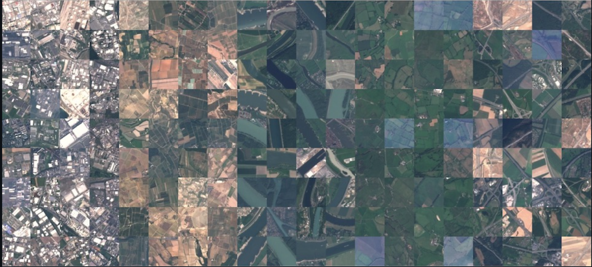
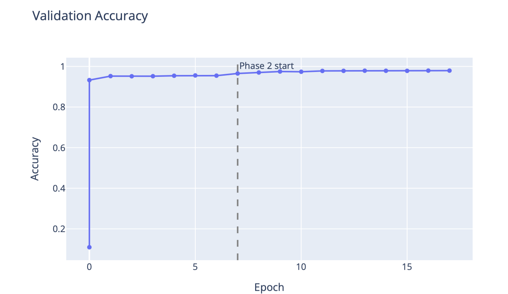
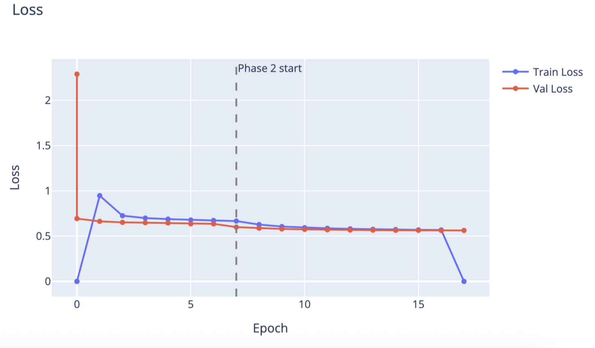
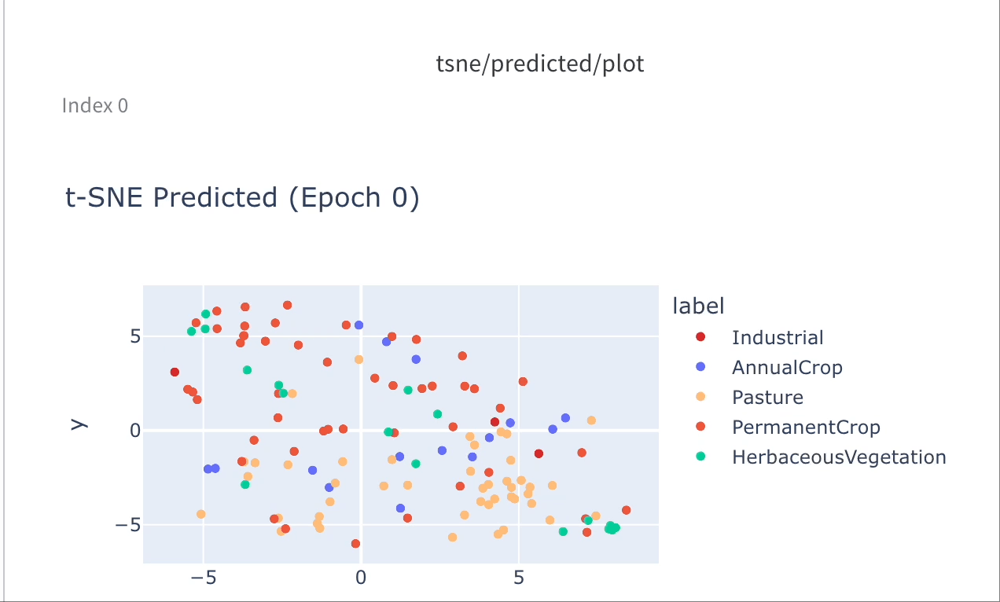

# Satellite Image Classification with EfficientNet



## Background

Remote sensing has transformed how we monitor our planet. From tracking deforestation to detecting urban sprawl, satellite imagery provides a bird's-eye view of land use change at global scale. But training a model that can reliably classify that imagery - across 10 distinct land-use categories, at production quality - requires more than just a good model. It requires a pipeline that handles data, compute, caching, experiment tracking, and reporting as first-class concerns.

In this post, we walk through a complete satellite image classification pipeline built on Union, using EfficientNet-B0, a two-phase training strategy, and Weights & Biases for experiment tracking.

> [!NOTE]
> Full code available [here](https://github.com/unionai/unionai-examples/v2/tutorials/satellite_image_classification).

## Dataset

[EuroSAT](https://github.com/phelber/EuroSAT) is a benchmark dataset of 27,000 labeled satellite images drawn from the Sentinel-2 satellite. Each image is 64×64 pixels across 10 land-use classes: Annual Crop, Forest, Herbaceous Vegetation, Highway, Industrial, Pasture, Permanent Crop, Residential, River, and Sea/Lake.

It's a well-structured dataset - balanced, clearly labeled - which makes it ideal for demonstrating a production-grade training pipeline without the overhead of massive data infrastructure.

## Model

We use EfficientNet-B0 from timm, pretrained on ImageNet. EfficientNet was designed to scale depth, width, and resolution jointly using a compound coefficient, giving strong accuracy with a relatively small parameter count (~5.3M). The ImageNet pretraining means the backbone already understands edges, textures, and shapes - features that transfer well to satellite imagery.

## Two-Phase Training

Fine-tuning a pretrained model naively by using all weights immediately often leads to catastrophic forgetting: the model destroys its learned representations before the new task-specific head has had a chance to stabilize.

Instead, we use a two-phase approach:

Phase 1: Feature Extraction (frozen backbone). The EfficientNet backbone is frozen. Only the classification head is trained, at a relatively high learning rate (2e-3). This gives the head 7 epochs to learn to map ImageNet features to EuroSAT categories, without disturbing the pretrained weights.

Phase 2: Fine-tuning (unfrozen backbone). The backbone is unfrozen and added to the optimizer with a 10× lower learning rate than the head (phase2_lr × 0.1). A fresh cosine annealing schedule is initialized over the remaining steps, so the learning rate doesn't arrive near-zero from Phase 1's schedule before Phase 2 even begins. This lets the backbone adapt to satellite-specific features while preserving the general representations it learned on ImageNet.

The transition happens automatically inside a PhaseChangeCallback:



This two-phase strategy consistently reaches >95% validation accuracy on EuroSAT within 17 total epochs.

## Pipeline

Training a model is only part of the story. The real challenge is building a system that is reproducible, cost-efficient, and easy to iterate on. That's where Union's TaskEnvironment model shines: each stage of the pipeline runs in the right compute environment, and results are cached so you never pay for work you've already done.

The pipeline has four components, each with its own environment defined in config.py.

### Task 1: Data Download (dataset_env)



This task downloads the raw EuroSAT JPEG files via torchvision and packages them as a flyte.io.Dir. It runs on a lightweight CPU container (2 cores, 2 GB RAM) - no GPU needed. With cache="auto", the result is stored and reused on every subsequent run. You pay for the download exactly once.

No preprocessing happens here. Raw images are passed directly to training so that all transforms - resize, normalize, augment. This happens per-batch with the full training context, giving the model properly prepared 224×224 input from the original pixels.

### Task 2: GPU Training (training_env)



This task runs on a T4 GPU with 32 GB RAM. It receives the dataset Dir from Task 1, downloads it locally, then runs the two-phase training loop using PyTorch Lightning.

Two things worth noting:

With cache="auto" training results are cached based on the input data and config. If you rerun the pipeline with the same dataset and hyperparameters, Union skips training entirely and returns the cached metrics. This makes hyperparameter search much cheaper: only configurations you haven't tried before actually execute.

@wandb_init - the flyteplugins-wandb integration initializes a W&B run automatically and makes it available via get_wandb_run(). This means every training run automatically logs metrics, learning rate curves, and t-SNE visualizations of the learned feature space to your W&B project.



### Task 3: Report Generation (report_env)

This task reads the metrics.json produced by training and renders interactive Plotly charts - validation accuracy and train/val loss curves - directly in the Union UI. The report=True flag tells Union to render the task output as a rich report panel. A dashed vertical line marks the Phase 1 → Phase 2 transition, making it easy to see how much the backbone fine-tuning contributes.




### Task 4: Orchestration (pipeline_env)

The pipeline task is a lightweight orchestrator. It has no heavy dependencies of its own, just enough to call the three tasks above in sequence. depends_on ensures the container image is built after all its dependencies are resolved. The async/await pattern means each task handoff is non-blocking: Union manages scheduling, retries, and data movement between tasks transparently.


## Running the Pipeline

Submit the pipeline with a single command from the project directory:

```bash
uv run run.py
```
This calls:


The W&B project and entity are wired in at submission time. Union handles spinning up the right containers, routing data between tasks, and surfacing results in the UI.

## What You Get

After the pipeline completes:

- Union UI: a report panel with interactive accuracy and loss curves, phase transition marker, and full task logs for each stage.

  

  

- Weights & Biases: a complete experiment run with validation metrics like loss and accuracy, train loss, and t-SNE visualizations of the model's learned embeddings at configurable epoch intervals. Every few epochs, a t-SNE plot of the validation set embeddings is logged, showing how the model's feature representations evolve over training — classes that start as an overlapping cloud gradually pull apart into tight, well-separated clusters as the backbone learns satellite-specific features.

  

- Model checkpoints: Lightning's ModelCheckpoint saves the top 3 best-performing checkpoints by validation accuracy, named best-{epoch}-{val_acc}.ckpt. These are standard PyTorch Lightning checkpoints that can be loaded directly for inference.