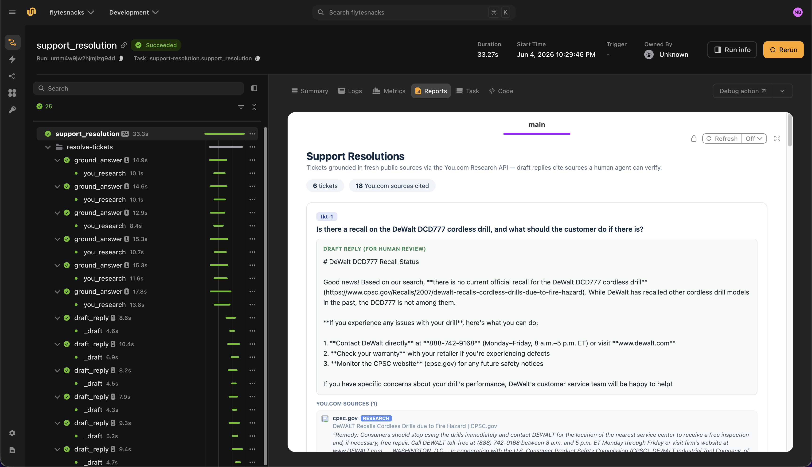

# Support resolution agent

> [!NOTE]
> Code available [here](https://github.com/unionai/unionai-examples/tree/main/v2/tutorials/support_resolution_agent).

This example demonstrates how to build a customer-support and field-service resolution agent on Flyte. The agent resolves tickets that need current public information — return policies, weather advisories, product recalls, manufacturer specs — and drafts a customer-ready reply with sources a human agent can verify before sending.

The [You.com Research API](https://you.com/docs/research/overview) grounds each ticket in fresh, citable sources. [Claude](https://docs.anthropic.com/) via [LiteLLM](https://docs.litellm.ai/) turns that research into a reply draft. With `research_effort="lite"`, the research step stays fast enough for human-in-the-loop support flows.

Flyte provides:

- **Fan-out parallelism** across support tickets
- **`@flyte.trace`** on every external call for lineage
- A **two-step pipeline** per ticket: ground the answer, then draft the reply
- **Flyte reports** with draft replies and verifiable source citations



## Setting up the environment

The agent runs in a `TaskEnvironment` with secrets for the You.com and Anthropic API keys and a container image built from the `uv` script dependencies.



The Python packages are declared at the top of the file using the `uv` script style:

```
# /// script
# requires-python = "==3.13"
# dependencies = [
#     "flyte>=2.4.0",
#     "httpx>=0.27.0",
#     "litellm>=1.72.0",
# ]
# ///
```

## Data types

Each `Ticket` carries a ticket ID, a customer question, and optional product or vendor context. The final `Resolution` includes the grounded answer, a draft reply, and the list of You.com sources.



## Ground answers with the You.com Research API

The `you_research` helper calls the [You.com Research API](https://you.com/docs/research/overview) with a configurable `research_effort`. For support use cases, `lite` provides a fast, citation-backed answer suitable for real-time, human-in-the-loop flows. See the [Research API reference](https://you.com/docs/api-reference/research/v1-research) for effort levels and parameters.



## Ground one ticket

The `ground_answer` task combines the ticket question and context into a research query and collects the grounded answer plus structured sources from the Research API response.



## Draft a customer-ready reply

The `draft_reply` task turns the grounded answer into a concise, friendly reply that cites source URLs inline so a human agent can verify before sending.



## Resolve one ticket

Each ticket runs `ground_answer` followed by `draft_reply` in sequence.



## Orchestration

The `support_resolution` driver task fans out across all tickets and renders a Flyte report with every draft reply and its sources.



## Run the agent

### Create secrets

Get a You.com API key from the [You.com platform](https://you.com/platform) (see the [quickstart guide](https://you.com/docs/quickstart)). Get an Anthropic API key from the [Anthropic console](https://console.anthropic.com/).

Register both keys as Flyte secrets. The secret key names must match those declared in the `TaskEnvironment`:

```
flyte create secret youdotcom-api-key <YOUR_YOU_API_KEY>
flyte create secret internal-anthropic-api-key <YOUR_ANTHROPIC_API_KEY>
```

See [Secrets](../../user-guide/task-configuration/secrets) for scoping and file-based secrets.

### Run locally or remotely

From the [example directory](https://github.com/unionai/unionai-examples/tree/main/v2/tutorials/support_resolution_agent):

```
cd v2/tutorials/support_resolution_agent
uv run --script main.py
```

To test locally without Flyte secrets:

```
export YOU_API_KEY=<YOUR_YOU_API_KEY>
export ANTHROPIC_API_KEY=<YOUR_ANTHROPIC_API_KEY>

uv run --script main.py
```

When the run completes, open the Flyte report to review draft replies for each ticket, with You.com source citations ready for a human agent to verify and paste into a customer response.
