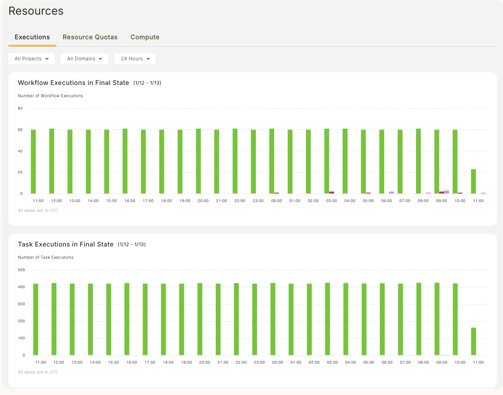
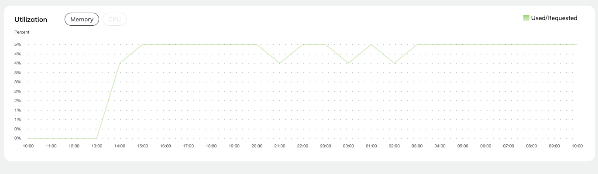
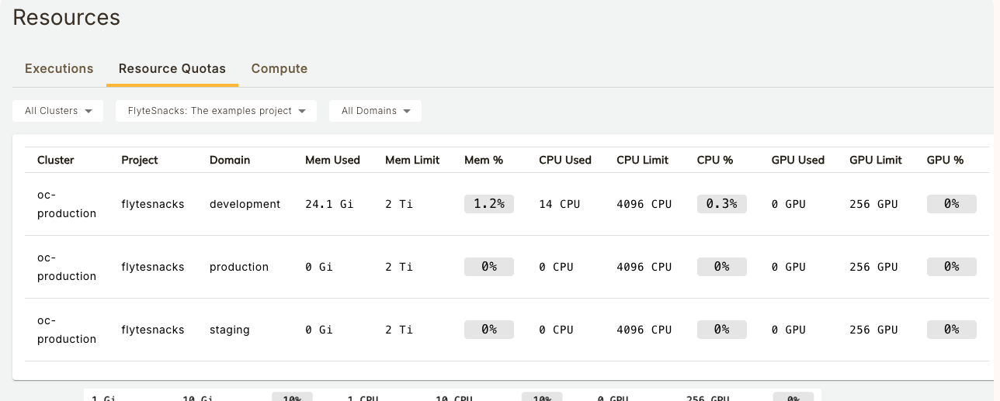
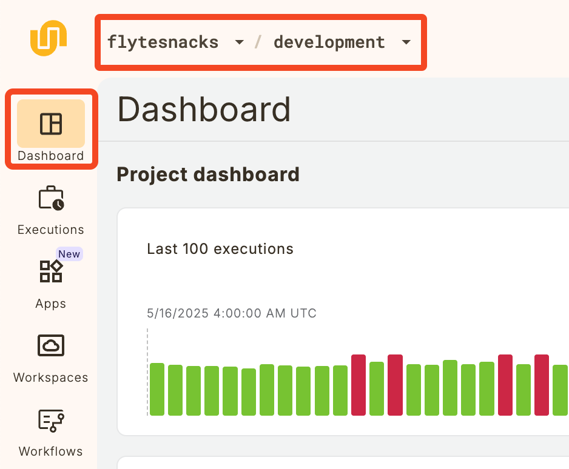
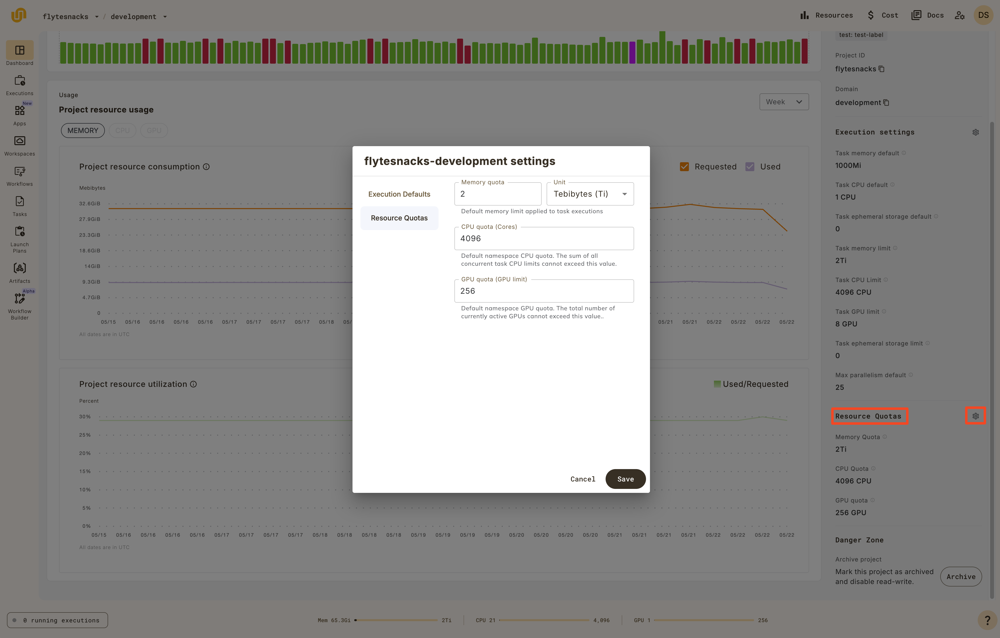

# Resources

Select **Resources** in the top right of the  interface to open a view showing the overall health and utilization of your  installation.


Four tabs are available: [**Executions**](#executions), [**Resource Quotas**](#resource-quotas), and [**Compute**](#compute).

## Executions



This tab displays information about workflows, tasks, resource consumption, and resource utilization.

### Filter

The drop-downs at the top lets you filter the charts below by project, domain and time period:


* **Project**: Dropdown with multi-select over all projects. Making a selection recalculates the charts accordingly. Defaults to **All Projects**.
* **Domain**: Dropdown with multi-select over all domains (for example, **development**, **staging**, **production**). Making a selection recalculates the charts accordingly. Defaults to **All Domains**.
* **Time Period Selector**: Dropdown to select the period over which the charts are plotted. Making a selection recalculates the charts accordingly. Defaults to **24 Hours**. All times are expressed in UTC.

### Workflow Executions in Final State

This chart shows the overall status of workflows at the project-domain level.


For all workflows in the selected project and domain which reached their final state during the selected time period, the chart shows:

* The number of successful workflows.
* The number of aborted workflows.
* The number of failed workflows.

See [Workflow States](/architecture/content/workflow-state-transitions#workflow-states) for the precise definitions of these states.

### Task Executions in Final State

This chart shows the overall status of tasks at the project-domain level.


For all tasks in the selected project and domain which reached their final state during the selected time period, the chart shows:

* The number of successful tasks.
* The number of aborted tasks.
* The number of failed tasks.

See [Task States](/architecture/content/workflow-state-transitions#task-states) for the precise definitions of these states.

### Running Pods

This chart shows the absolute resource consumption for

* Memory (MiB)
* CPU (number of cores)
* GPU (number of cores)

You can select which parameter to show by clicking on the corresponding button at the top of the chart.
You can also select whether to show **Requested**, **Used**, or both.


### Utilization

This chart shows the percent resource utilization for

* Memory
* CPU

You can select which parameter to show by clicking on the corresponding button at the top of the chart.



## Resource Quotas

This dashboard displays the resource quotas for projects and domains in the organization.



### Namespaces and Quotas

Under the hood,  uses Kubernetes to run workloads. To deliver multi-tenancy, the system uses Kubernetes [namespaces](https://kubernetes.io/docs/concepts/overview/working-with-objects/namespaces/). In AWS based installations, each project-domain pair is mapped to a namespace. In GCP-based installations each domain is mapped to a namespace.

Within each namespace, a [resource quota](https://kubernetes.io/docs/concepts/policy/resource-quotas/) is set for each resource type (memory, CPU, GPU). This dashboard displays the current point-in-time quota consumption for memory, CPU, and GPU. Quotas are defined as part of the set-up of the instance types in your data plane. To change them, talk to the  team.


### Examples

Resource requests and limits are set at the task level like this (see [Customizing task resources](../core-concepts/tasks/task-hardware-environment/customizing-task-resources)):

```python
@.task(requests=Resources(cpu="1", mem="1Gi"),
      limits=Resources(cpu="10", mem="10Gi"))
```

This task requests 1 CPU and 1 gibibyte of memory. It sets a limit of 10 CPUs and 10 gibibytes of memory.

If a task requesting the above resources (1 CPU and 1Gi) is executed in a project (for example **cluster-observability**) and domain (for example, **development**) with 10 CPU and 10Gi of quota for CPU and memory respectively, the dashboard will show that 10% of both memory and CPU quotas have been consumed.

<!-- TODO: Add screenshot
[Resource Quotas 10%](../../_static/images/user-guide/administration/resources/resources-resource-quotas-10.png)
-->

Likewise, if a task requesting 10 CPU and 10 Gi of memory is executed, the dashboard will show that 100% of both memory and CPU quotas have been consumed.

<!-- TODO: Add screenshot
[Resource Quotas 100%](../../_static/images/user-guide/administration/resources/resources-resource-quotas-100.png)
-->

Likewise, if a task requesting 10 CPU and 10Gi of memory is executed, the dashboard will show that 100% of both memory and CPU quotas have been consumed.

### Quota Consumption

For each resource type, the sum of all the `limits` parameters set on all the tasks in a namespace determines quota consumption for that resource. Within a namespace, a given resource’s consumption can never exceed that resource’s quota.

## Compute

This dashboard displays information about configured node pools in the organization.





### Configuring Resource Quotas

> [!NOTE]
> Self serve quota configuration is currently only available to AWS customers. To configure quotas on other cloud providers (GCP, Azure, etc.) please reach out to the Union team.

To configure resource quotas for a given project-domain, e.g. flytesnacks-development, start by navigating to the Dashboard in the UI for a given project-domain.



Next, click the gear icon beside the "Resource Quotas" section which is located at the bottom of the right sidebar on the Dashboard page.
From here, you can enter your desired memory, CPU, and GPU quotas and select "Save."







 will schedule tasks on a node pool that meets the requirements of the task (as defined by the `requests` and `limits` parameters in the task definition) and can vertically scale these node pools according to the minimum and maximum configured limits. This dashboard shows all currently-configured node pools, whether they are interruptible, labels and taints, minimum and maximum sizes, and allocatable resources.

The allocatable resource values reflect any compute necessary for  services to function. This is why the value may be slightly lower than the quoted value from the cloud provider. This value, however, does not account for any overhead that may be used by third-party services, like Ray, for example.

### Information displayed

The dashboard provides the following information:

* **Instance Type**: The type of instance/VM/node as defined by your cloud provider.
* **Interruptible:** A boolean. True If the instance is interruptible.
* **Labels:** Node pool labels which can be used to target tasks at specific node types.
* **Taints:** Node pool taints which can be used to avoid tasks landing on a node if they do not have the appropriate toleration.
* **Minimum:** Minimum node pool size. Note that if this is set to zero, the node pool will scale down completely when not in use.
* **Maximum:** Maximum node pool size.
* **Allocatable Resources:**
    * **CPU**: The maximum CPU you can request in a task definition after accounting for overheads and other factors.
    * **Memory**: The maximum memory you can request in a task definition after accounting for overheads and other factors.
    * **GPU**: The maximum number of GPUs you can request in a task definition after accounting for overheads and other factors.
    * **Ephemeral Storage**: The maximum storage you can request in a task definition after accounting for overheads and other factors.
    * Note that these values are estimates and may not reflect the exact allocatable resources on any node in your cluster.

### Examples

In the screenshot above, there is a `t3a.xlarge` with `3670m` (3670 millicores) of allocatable CPU, and a larger `c5.4xlarge` with `15640m` of allocatable CPU. In order to schedule a workload on the smaller node, you could specify the following in a task definition:

```python
@.task(requests=Resources(cpu="3670m", mem="1Gi"),
      limits=Resources(cpu="3670m", mem="1Gi"))
```

In the absence of confounding factors (for example, other workloads fully utilizing all `t3a.xlarge` instances), this task will spin up a `t3a.xlarge` instance and run the execution on it, taking all available allocatable CPU resources.

Conversely, if a user requests the following:

```python
@.task(requests=Resources(cpu="4000m", mem="1Gi"),
      limits=Resources(cpu="4000m", mem="1Gi"))
```

The workload will schedule on a larger instance (like the `c5.4xlarge`) because `4000m` exceeds the allocatable CPU on the `t3a.xlarge`, despite the fact that this instance type is [marketed](https://instances.vantage.sh/aws/ec2/t3a.xlarge) as having 4 CPU cores. The discrepancy is due to overheads and holdbacks introduced by Kubernetes to ensure adequate resources to schedule pods on the node.

