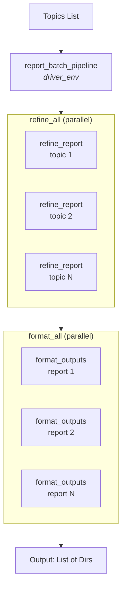
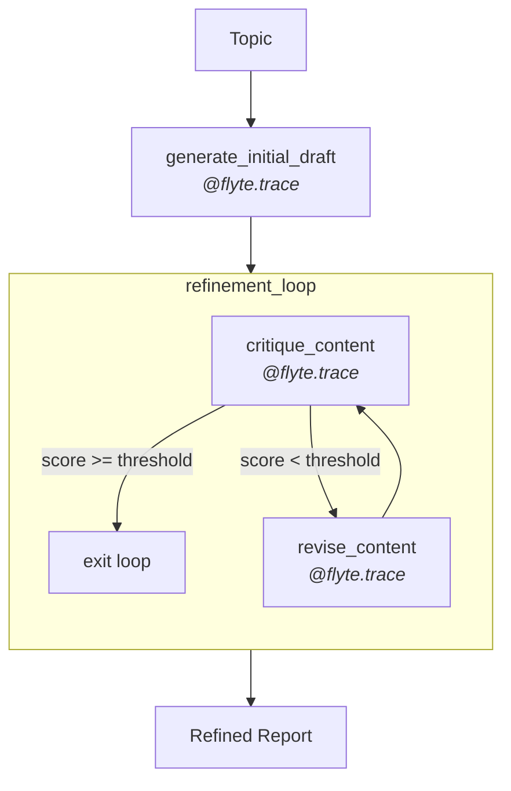

# Advanced project: LLM reporting agent



This example demonstrates a resilient agentic report generator that showcases
Flyte 2.0's advanced features for building production-grade AI workflows.

## What you'll build

A batch report generator that:
1. Processes multiple topics in parallel
2. Iteratively critiques and refines each report until it meets a quality threshold
3. Produces multiple output formats (Markdown, HTML, summary) for each report
4. Serves results through an interactive UI

## Concepts covered

| Feature | Description |
|---------|-------------|
| `ReusePolicy` | Keep containers warm for high-throughput batch processing |
| `@flyte.trace` | Checkpoint LLM calls for recovery and observability |
| `RetryStrategy` | Handle transient API failures gracefully |
| `flyte.group` | Organize parallel batches and iterations in the UI |
| `asyncio.gather` | Fan out to process multiple topics concurrently |
| Pydantic models | Structured LLM outputs |
| `AppEnvironment` | Deploy interactive Streamlit apps |
| `RunOutput` | Connect apps to pipeline outputs |

## Architecture



Each `refine_report` task runs in a reusable container (`llm_env`) and performs
multiple LLM calls through traced functions:



## Prerequisites

- A  account with an active project
- An OpenAI API key stored as a secret named `openai-api-key`

To create the secret:

```bash
flyte secret create openai-api-key
```

## Parts

1. **[Resilient generation](./resilient-generation)**: Set up reusable environments, traced LLM calls, and retry strategies
2. **[Agentic refinement](./agentic-refinement)**: Build the iterative critique-and-revise loop
3. **[Parallel outputs](./parallel-outputs)**: Generate multiple formats concurrently
4. **[Serving app](./serving-app)**: Deploy an interactive UI for report generation

[Resilient generation]()

## Key takeaways

1. **Reusable environments for batch processing**: `ReusePolicy` keeps containers warm,
   enabling efficient processing of multiple topics without cold start overhead. With
   5 topics × ~7 LLM calls each, the reusable pool handles ~35 calls efficiently.

2. **Checkpointed LLM calls**: `@flyte.trace` provides automatic checkpointing at the
   function level, enabling recovery without re-running expensive API calls.

3. **Agentic patterns**: The generate-critique-revise loop demonstrates how to build
   self-improving AI workflows with clear observability through `flyte.group`.

4. **Parallel fan-out**: `asyncio.gather` processes multiple topics concurrently,
   maximizing throughput by running refinement tasks in parallel across the batch.
