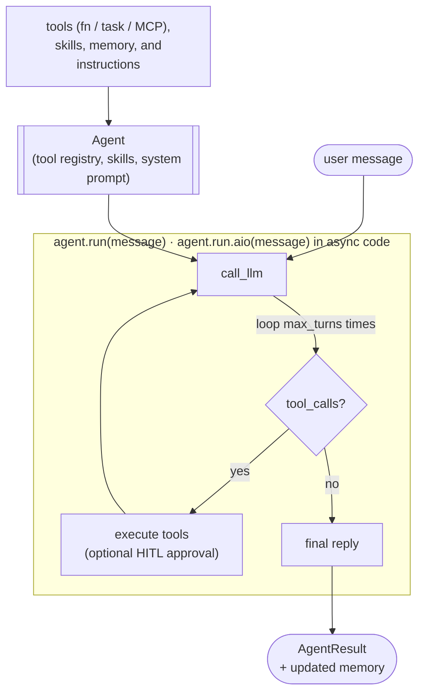

# Flyte-native agents

`flyte.ai.agents.Agent` is a flyte-native, batteries-included agent harness. Instead of hand-rolling the tool-call loop (as in [Build an agent with pure Python](./python-agents)), you declare a set of tools and instructions, and the harness drives a robust LLM ↔ tool loop for you.

The harness deeply integrates with :

- **Tools** can be plain Python callables, `@flyte.trace` helpers, `@env.task` durable tasks, `LazyEntity` remote-task references, or pre-built `AgentTool` instances.
- **MCP servers** (Slack, GitHub, Linear, filesystem, …) are first-class: pass a `MCPServerSpec` and their tools are loaded into the catalog automatically.
- **Memory** persists across runs via `flyte.io.Dir`. See [Agent memory](./agent-memory).
- **HITL** support pauses the loop and asks a human for approval before sensitive tools execute.

## How it works

`Agent(...)` collapses heterogeneous tool sources into a single tool registry plus an auto-generated system prompt. `agent.run(message)` then drives an LLM ↔ tool-call loop:

1. Send the conversation and tool catalog to the LLM.
2. If the assistant returns tool calls, execute each one (sequentially or concurrently), append the results back into the message history, and loop.
3. Stop when the assistant returns a plain-text reply (no tool calls) or when `max_turns` is reached.



The call returns an `AgentResult` with the final `summary`, an `error` string (empty on success), and the number of `attempts` (turns) taken.

### Sync vs async

`agent.run` is synchronous by default. Inside `async def` code (Flyte tasks, FastAPI handlers, etc.) use the `.aio(...)` companion instead.

| Context | Call |
|---------|------|
| Scripts, notebooks, sync code | `result = agent.run(message)` |
| `async def` tasks / handlers | `result = await agent.run.aio(message)` |

## A minimal agent

Declare a few tools as plain async functions, build an `Agent`, and call `run`. The harness reads each tool's signature and docstring to build the JSON schema and description the LLM sees, so well-documented tools work best.



Call it synchronously, or with `await agent.run.aio(message)` inside async code:

```python
result = agent.run("What's 17 * 23 plus the temperature in NYC?")
print(result.summary)
```

## Tools

The `tools=` argument accepts a sequence (or a `{name: tool}` mapping) of any mix of:

| Tool source | What it is | When to use it |
|-------------|------------|----------------|
| Plain callable | A sync or async Python function | Lightweight, in-process helpers |
| `@flyte.trace` helper | A traced function | In-process helpers you want as spans in the dashboard |
| `@env.task` template | A durable Flyte task | Heavy compute / IO that should run on-cluster, be retryable, and observable |
| `LazyEntity` | A reference to a remote deployed task | Calling already-deployed tasks by name |
| `AgentTool` | A pre-built tool descriptor | Renaming, custom schema, or HITL gating |

Pass a mapping to expose a tool under a different name to the LLM:

```python
agent = Agent(
    name="ticket-shepherd",
    tools={"fetch_data": durable_fetch_with_retries, "summarize": summarize},
)
```

When a tool is an `@env.task`, the harness invokes it with `task.aio(...)`, so each tool call executes durably on the cluster and shows up in the  dashboard.

### Customizing a tool with `tool(...)`

Use the `tool` decorator/wrapper to rename a tool, override its description, or gate it behind human approval, without writing an `AgentTool` by hand:

```python
from flyte.ai.agents import tool


@tool(requires_approval=True)
@env.task
async def issue_refund(order_id: str, amount_usd: float) -> dict:
    """Issue a refund to the customer."""
    ...
```

When the LLM tries to call a tool marked `requires_approval=True`, the harness invokes the agent's `approval_callback` and waits for a boolean decision before executing. The default callback raises a human-input request via the `flyteplugins-hitl` plugin and blocks until a human approves or denies. If denied, the agent receives a synthetic tool message explaining the rejection so it can recover gracefully.

Pass `call_handler` to intercept *how* a tool is invoked. The handler is an async callback `(call_llm, tool_fn, **kwargs) -> result` that runs in place of the default execution. Await `tool_fn` to run the default behavior, or reach into `tool_fn.target` (the underlying task / callable) and `call_llm` (the agent's LLM callback) to do something custom. For example, ask the LLM how to size compute, then run the task with overridden resources and retry on OOM:

```python
async def right_size(call_llm, tool_fn, **kwargs):
    resources = await _ask_llm_for_resources(call_llm, tool_fn, kwargs)
    return await tool_fn.target.override(resources=resources).aio(**kwargs)


@tool(call_handler=right_size)
@env.task
async def train(...): ...
```

## MCP integration

The harness can connect to one or more [Model Context Protocol (MCP)](https://modelcontextprotocol.io) servers and surface their tools transparently. On the first `run` call, the harness connects to each server, lists its tools, and registers them in the catalog.

Declare servers with `MCPServerSpec`: either an HTTP(S) `url` (for streamable-http / SSE transports) or a `command` (for stdio servers):

```python
from flyte.ai.agents import Agent, MCPServerSpec

agent = Agent(
    name="release-shepherd",
    instructions="Inspect recent PRs, score release risk, and post a digest.",
    tools=[compute_release_score],          # local durable task tool
    mcp_servers=[
        MCPServerSpec(
            name="github",
            url="https://<host>/mcp/mcp",
            transport="streamable-http",
            tool_prefix="gh_",               # avoid name collisions
            tool_filter=["list_pull_requests", "comment_on_pull_request"],  # allowlist
        ),
        MCPServerSpec(
            name="github-stdio",
            command=["uvx", "mcp-server-github"],
        ),
    ],
)
```

Useful `MCPServerSpec` knobs:

- `tool_prefix`: prepend a prefix to every tool name from this server to avoid collisions.
- `tool_filter`: an allowlist of tool names to expose to the LLM (`None` exposes all).
- `headers`: HTTP headers (e.g. `Authorization`) for authenticated servers.

MCP support requires the `mcp` package: `pip install 'flyte[mcp]'`. To serve your own MCP servers on , see [Build an MCP](../build-mcp/_index).

## Skills

Pass extra context to append to the system prompt via `skills=`. Each entry is either a literal string or a `pathlib.Path` to a local text file:

```python
import pathlib

agent = Agent(
    name="ticket-shepherd",
    instructions="You triage support tickets.",
    tools=[list_open_tickets, summarize],
    skills=[pathlib.Path("TICKETING_HANDBOOK.md")],
)
```

## Observability

Every step of the loop emits a typed `AgentEvent` (`agent_start`, `turn_start`, `tool_start`, `tool_end`, `approval_request`, …). Subscribe by setting the `agent_progress_cb` context variable to forward events to logs, NDJSON streams, websockets, or  reports. The built-in chat UI uses this hook to stream progress; see [Add a chat UI](./agent-chat-ui).

## Extending the agent class

The default loop is robust, but sometimes you need custom behavior around it: input guardrails, output post-processing, a different control flow, or extra bookkeeping. The cleanest way to do this is to subclass `Agent` and override its `run` method.

`Agent` is a [dataclass](https://docs.python.org/3/library/dataclasses.html), and `run` is the single public entry point that drives the loop. There are two common strategies:

1. **Wrap the built-in loop**: add logic before and after `super().run(...)`. Best when you mostly want the default behavior plus pre/post steps.
2. **Replace the loop entirely**: implement `run` (and `tool_descriptions`) yourself. Best when you need a fundamentally different control flow but still want to plug into the rest of the ecosystem (e.g. the chat UI).

### `run` is sync-by-default

`Agent.run` is wrapped with `@syncify`, which means callers can use it synchronously (`agent.run(...)`) or await the async companion (`await agent.run.aio(...)`). When you override `run`, decorate your async implementation with `@syncify` to keep the same dual interface, and call the parent loop via `await super().run.aio(...)`.

### Strategy 1: wrap the built-in loop

Subclass `Agent` as a dataclass so you can add your own fields, then override `run` to add an input guardrail and post-process the answer:



Instantiate and call it just like a regular `Agent`:

```python
agent = GuardedAgent(
    name="guarded-helper",
    instructions="You are a careful assistant.",
    tools=[...],
    banned_terms=("ssn", "password"),
    signature="GuardedAgent",
)

result = agent.run("Summarize today's open tickets.")
```

Because `GuardedAgent` still subclasses `Agent`, every other feature (tools, MCP servers, memory, HITL) keeps working unchanged.

### Strategy 2: implement `run` from scratch

If you want a completely custom loop, implement the `AgentProtocol`: a class exposing `run(message, memory) -> AgentResult` and `tool_descriptions() -> list[dict]`. Any object satisfying this protocol can be used anywhere the harness is accepted, including the [chat UI](./agent-chat-ui). `memory` may be a `list[dict]` of prior messages (a chat history) or a `MemoryStore`.

```python
from __future__ import annotations

from flyte.ai.agents import MemoryStore
from flyte.ai.agents.protocol import AgentResult
from flyte.syncify import syncify


class MyCustomAgent:
    """A fully custom agent that implements the AgentProtocol."""

    def __init__(self, tools: dict):
        self._tools = tools

    @syncify
    async def run(self, message: str, memory: list[dict] | MemoryStore | None = None) -> AgentResult:
        # Your own control flow: reasoning, routing, tool calls, retries, etc.
        prior = memory.messages if isinstance(memory, MemoryStore) else (memory or [])
        answer = await self._my_loop(message, prior)
        return AgentResult(summary=answer)

    def tool_descriptions(self) -> list[dict[str, str]]:
        return [
            {"name": name, "signature": f"{name}(...)", "description": fn.__doc__ or ""}
            for name, fn in self._tools.items()
        ]
```

> [!NOTE]
> `AgentResult` carries `summary`, `error`, `attempts`, and (for code-generating agents) `code` and `charts`. Populate the fields relevant to your loop; downstream consumers like the chat UI read `summary` and `error`.

### Choosing between subclassing and composition

Subclassing is the right tool when you need to change *how the loop runs*. If you only need to change *what happens around a run* (for example, looping the agent until a condition is met, or combining several agents) prefer plain composition: call `agent.run.aio(...)` from inside your own `@env.task`. This keeps the harness untouched and your orchestration logic explicit and observable in the dashboard.

## Next steps

- [Agent memory](./agent-memory): persist transcript and artifacts across runs.
- [Add a chat UI](./agent-chat-ui): wrap the agent in a hosted chat interface.
- [Deploy an agent as a service](./deploy-agent-as-service): run on a schedule or behind a webhook.
