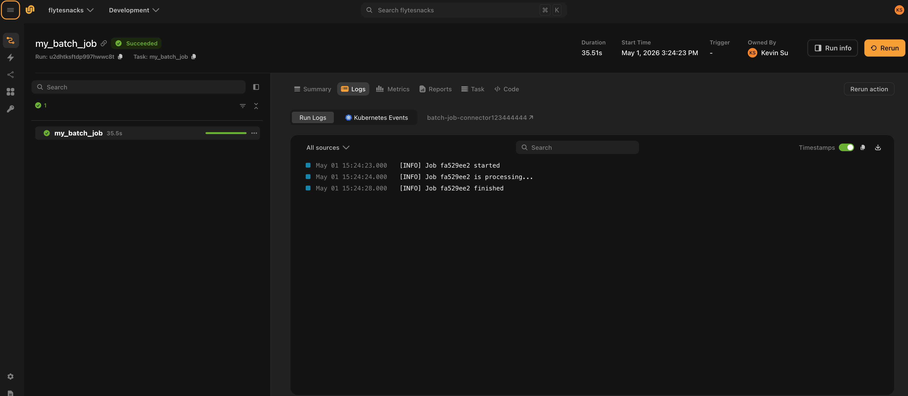

# Connector app

A **connector** lets you extend Flyte with custom task execution backends — for example, submitting jobs to an internal batch service, a proprietary ML platform, or any external API. Rather than running your task code directly in a container, Flyte delegates execution to the connector, which polls the external system and reports status back to the orchestrator.

Connectors are deployed as long-running services via `flyte.app.ConnectorEnvironment`, the same app deployment model used for FastAPI endpoints and model servers.

## When to build a custom connector

Build a connector when:

- Tasks need to submit work to an external system (e.g., a job scheduler, a cloud ML service) and poll for completion asynchronously
- You want Flyte's orchestration, observability, and data lineage on top of a non-Kubernetes backend
- Multiple tasks share the same external integration and you want to centralize that logic

## Project structure

A connector app spans two concerns: the connector service (deployed once) and the task plugin (used in each workflow). A typical layout is:

```
my_project/
├── app.py              # Deploy the connector as a flyte app
├── main.py             # Example task that uses the connector
└── my_connector/
    ├── __init__.py
    ├── connector.py    # AsyncConnector implementation
    └── task.py         # Task plugin (AsyncConnectorExecutorMixin)
```

## Step 1: Implement the connector

The connector implements four lifecycle methods: `create` (submit the job), `get` (poll status), `delete` (cancel), and `get_logs` (stream paginated log lines to the Flyte UI).

```python
# my_connector/connector.py
import time
import uuid
from dataclasses import dataclass
from typing import Any, Dict, Optional

from flyteidl2.connector.connector_pb2 import (
    GetTaskLogsResponse,
    GetTaskLogsResponseBody,
    GetTaskLogsResponseHeader,
)
from flyteidl2.core.execution_pb2 import TaskExecution
from flyteidl2.logs.dataplane.payload_pb2 import LogLine, LogLineOriginator
from google.protobuf.timestamp_pb2 import Timestamp

from flyte import logger
from flyte.connectors import AsyncConnector, ConnectorRegistry, Resource, ResourceMeta


@dataclass
class BatchJobMetadata(ResourceMeta):
    job_id: str
    created_at: float


class BatchJobConnector(AsyncConnector):
    """Submits and polls an external batch job service."""

    name = "Batch Job Connector"
    task_type_name = "batch_job"
    metadata_type = BatchJobMetadata

    async def create(
        self,
        task_template,
        inputs: Optional[Dict[str, Any]] = None,
        **kwargs,
    ) -> BatchJobMetadata:
        job_id = str(uuid.uuid4())[:8]
        logger.info(f"Submitted batch job {job_id}")
        return BatchJobMetadata(job_id=job_id, created_at=time.time())

    async def get(self, resource_meta: BatchJobMetadata, **kwargs) -> Resource:
        elapsed = time.time() - resource_meta.created_at
        if elapsed < 5:
            return Resource(phase=TaskExecution.RUNNING, message="Job in progress")
        return Resource(
            phase=TaskExecution.SUCCEEDED,
            message="Job completed",
            outputs={"result": f"output-from-{resource_meta.job_id}"},
        )

    async def delete(self, resource_meta: BatchJobMetadata, **kwargs):
        logger.info(f"Cancelled job {resource_meta.job_id}")

    async def get_logs(self, resource_meta: BatchJobMetadata, token: str = "", **kwargs):
        """Stream paginated log lines back to the Flyte UI.

        Yield GetTaskLogsResponse messages: body chunks carry log lines,
        and a header with a non-empty token signals that another page follows.
        Omit the final header (or set token to "") to end pagination.
        """
        def line(message: str, ts: float) -> LogLine:
            t = Timestamp()
            t.FromSeconds(int(ts))
            return LogLine(timestamp=t, message=message, originator=LogLineOriginator.USER)

        start = resource_meta.created_at
        job_id = resource_meta.job_id

        pages = {
            "": GetTaskLogsResponseBody(
                lines=[
                    line(f"[INFO] Job {job_id} submitted", start),
                    line(f"[INFO] Job {job_id} started", start + 1),
                ],
            ),
            "page-2": GetTaskLogsResponseBody(
                lines=[
                    line(f"[INFO] Job {job_id} is processing...", start + 2),
                    line(f"[INFO] Job {job_id} step 1 complete", start + 3),
                ],
            ),
            "page-3": GetTaskLogsResponseBody(
                lines=[
                    line(f"[INFO] Job {job_id} step 2 complete", start + 4),
                    line(f"[INFO] Job {job_id} finished", start + 5),
                ],
            ),
        }
        next_tokens = {"": "page-2", "page-2": "page-3", "page-3": ""}

        body = pages.get(token, GetTaskLogsResponseBody(lines=[]))
        next_token = next_tokens.get(token, "")

        yield GetTaskLogsResponse(body=body)
        if next_token:
            yield GetTaskLogsResponse(
                header=GetTaskLogsResponseHeader(token=next_token),
            )


ConnectorRegistry.register(BatchJobConnector())
```

Key points:

- **`task_type_name`** must match the `_TASK_TYPE` on your task plugin (see Step 2)
- **`ResourceMeta`** carries whatever state you need between `create` and subsequent `get` / `delete` calls (e.g., a job ID)
- **`Resource.outputs`** maps output names to values; these become the task's return values
- **`get_logs`** is an async generator that yields `GetTaskLogsResponse` messages. Yield a `body` with log lines, then optionally a `header` carrying the next-page token. Omit the final header to signal end of pagination. The Flyte UI displays these lines under the **Logs** tab of the task run.
- Register the connector with `ConnectorRegistry.register()` at module level so it is discovered on startup

Connector logs as shown in the Flyte UI:



## Step 2: Create the task plugin

The task plugin is the Python object your workflows use. It declares the task type, inputs, outputs, and any configuration; `AsyncConnectorExecutorMixin` wires it to the connector at execution time.

```python
# my_connector/task.py
from dataclasses import dataclass
from typing import Any, Dict, Optional, Type

from flyte.connectors import AsyncConnectorExecutorMixin
from flyte.extend import TaskTemplate
from flyte.models import NativeInterface, SerializationContext


@dataclass
class BatchJobConfig:
    timeout_seconds: int = 300


class BatchJobTask(AsyncConnectorExecutorMixin, TaskTemplate):
    _TASK_TYPE = "batch_job"

    def __init__(
        self,
        name: str,
        plugin_config: BatchJobConfig,
        inputs: Optional[Dict[str, Type]] = None,
        outputs: Optional[Dict[str, Type]] = None,
        **kwargs,
    ):
        super().__init__(
            name=name,
            interface=NativeInterface(
                {k: (v, None) for k, v in inputs.items()} if inputs else {},
                outputs or {},
            ),
            task_type=self._TASK_TYPE,
            image=None,
            **kwargs,
        )
        self.plugin_config = plugin_config

    def custom_config(self, sctx: SerializationContext) -> Optional[Dict[str, Any]]:
        return {"timeout_seconds": self.plugin_config.timeout_seconds}
```

Key points:

- **`_TASK_TYPE`** ties this plugin to the connector that declares the same `task_type_name`
- **`custom_config`** serializes plugin-specific settings into the task template; the connector receives these in `task_template.custom` during `create`
- `image=None` is correct — the connector service, not the task container, executes this task

## Step 3: Deploy the connector

`ConnectorEnvironment` builds and deploys the connector as a long-running service. The `include` parameter lists the Python packages or modules to copy into the connector image.

```python
# app.py
from pathlib import Path

import flyte
import flyte.app

image = flyte.Image.from_debian_base(python_version=(3, 12)).with_pip_packages("flyte[connector]")

connector = flyte.app.ConnectorEnvironment(
    name="batch-job-connector",
    image=image,
    resources=flyte.Resources(cpu="1", memory="1Gi"),
    include=["my_connector"],
)

if __name__ == "__main__":
    flyte.init_from_config(root_dir=Path(__file__).parent)
    d = flyte.deploy(connector)
    print(d[0])
```

Deploy with:

```bash
python app.py
```

Or using the CLI:

```bash
flyte deploy app.py connector
```

Flyte builds the image, pushes it, and starts the connector service. The service stays running and handles all `create` / `get` / `delete` calls for tasks with `task_type_name = "batch_job"`.

## Step 4: Register and run tasks

Create and register a `TaskEnvironment` that points to your connector, then run the task:

```python
# main.py
from pathlib import Path

from my_connector.task import BatchJobConfig, BatchJobTask

import flyte

batch_job = BatchJobTask(
    name="my_batch_job",
    plugin_config=BatchJobConfig(timeout_seconds=60),
    inputs={"name": str},
    outputs={"result": str},
)

flyte.TaskEnvironment.from_task("batch-job-env", batch_job)

if __name__ == "__main__":
    flyte.init_from_config(root_dir=Path(__file__).parent)
    result = flyte.run(batch_job, name="hello")
    print(result.url)
```

`TaskEnvironment.from_task` registers the task under a named environment so Flyte knows which connector service to route executions to.

Run the task:

```bash
python main.py
# or
flyte run main.py my_batch_job --name hello
```

## How it all fits together

```
flyte run main.py my_batch_job
       │
       ▼
  Flyte executor sees task_type = "batch_job"
       │
       ▼
  Routes to the deployed connector service (batch-job-connector)
       │
       ├─ connector.create()  →  submits job, returns BatchJobMetadata
       │
       ├─ connector.get()     →  polls status (RUNNING / SUCCEEDED / FAILED)
       │
       └─ connector.delete()  →  called on cancellation
```

The connector service is the only component that needs network access to the external system. Your workflow code and Flyte's propeller never communicate with it directly.

## Secrets

There are two ways to pass credentials to a connector, depending on whether all users share the same credentials or each user supplies their own.

### Connector-level secrets (shared credentials)

Use `ConnectorEnvironment.secrets` when all tasks that use this connector share the same credentials — for example, a single service account for an internal API. The secret is mounted into the connector process as an environment variable.

```python
connector = flyte.app.ConnectorEnvironment(
    name="batch-job-connector",
    image=image,
    resources=flyte.Resources(cpu="1", memory="1Gi"),
    include=["my_connector"],
    secrets=[flyte.Secret(key="MY_API_KEY")],
)
```

Inside the connector, read it from the environment:

```python
import os

api_key = os.environ["MY_API_KEY"]
```

### Per-task secrets (per-user credentials)

When different users need to run the same connector with their own credentials, pass the secret *name* through the task plugin. Flyte fetches the secret value at execution time and injects it as a keyword argument into the connector's `create` and `get` methods.

**1. Accept a secret name in the task plugin:**

```python
# my_connector/task.py

class BatchJobTask(AsyncConnectorExecutorMixin, TaskTemplate):
    _TASK_TYPE = "batch_job"

    def __init__(
        self,
        name: str,
        plugin_config: BatchJobConfig,
        inputs: Optional[Dict[str, Type]] = None,
        outputs: Optional[Dict[str, Type]] = None,
        api_key: Optional[str] = None,   # name of the secret in Flyte's secret store
        **kwargs,
    ):
        super().__init__(...)
        self.plugin_config = plugin_config
        self.api_key = api_key

    def custom_config(self, sctx: SerializationContext) -> Optional[Dict[str, Any]]:
        config = {"timeout_seconds": self.plugin_config.timeout_seconds}
        if self.api_key is not None:
            config["secrets"] = {"api_key": self.api_key}  # secret name, not value
        return config
```

**2. Receive the secret value as a kwarg in the connector:**

Flyte reads the secret name from `task_template.custom.secrets`, fetches the value from the secrets store, and passes it as a keyword argument to `create` and `get`:

```python
# my_connector/connector.py

class BatchJobConnector(AsyncConnector):
    ...

    async def create(
        self,
        task_template,
        inputs=None,
        api_key: Optional[str] = None,   # value injected by Flyte
        **kwargs,
    ) -> BatchJobMetadata:
        # use api_key to authenticate against the external service
        ...

    async def get(
        self,
        resource_meta: BatchJobMetadata,
        api_key: Optional[str] = None,
        **kwargs,
    ) -> Resource:
        ...
```

**3. Each user specifies their own secret name when defining the task:**

```python
# alice's workflow
batch_job = BatchJobTask(
    name="alice_batch_job",
    plugin_config=BatchJobConfig(timeout_seconds=60),
    inputs={"name": str},
    outputs={"result": str},
    api_key="alice-api-key",   # Alice's secret, stored under this name in Flyte
)

# bob's workflow
batch_job = BatchJobTask(
    name="bob_batch_job",
    plugin_config=BatchJobConfig(timeout_seconds=60),
    inputs={"name": str},
    outputs={"result": str},
    api_key="bob-api-key",     # Bob's own secret
)
```

See [Secrets](../task-configuration/secrets) for how to store secrets in Flyte.

## Related

- [`ConnectorEnvironment` API reference](../../api-reference/flyte-sdk/packages/flyte.app/connectorenvironment)
- [`AsyncConnector` API reference](../../api-reference/flyte-sdk/packages/flyte.connectors/asyncconnector)
- [Task plugins](../task-configuration/task-plugins)
