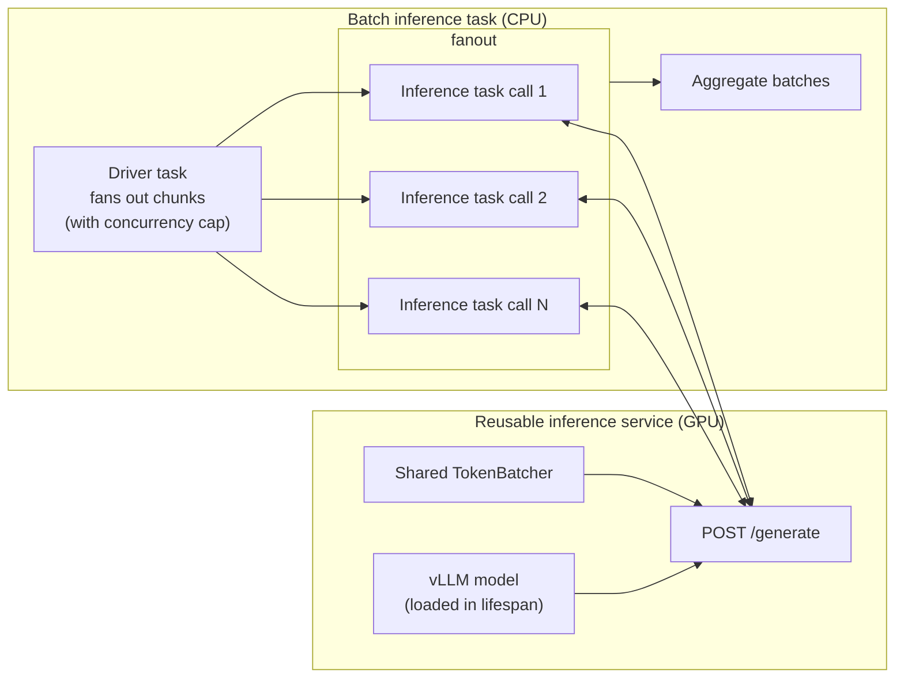

# Hybrid app-task graphs

Apps and tasks can interact with each other: tasks can call apps via HTTP, and apps can trigger task execution via the Flyte SDK. This page covers both patterns.

## Call app from task

Tasks can call apps by making HTTP requests to the app's endpoint. This is useful when:

- You need to use a long-running service during task execution
- You want to call a model serving endpoint from a batch processing task
- You need to interact with an API from a workflow

### Example: FastAPI app called from a task 



Key points:

- The task environment uses `depends_on=[app_env]` to ensure the app is deployed first
- Access the app endpoint via `app_env.endpoint`
- Use standard HTTP client libraries (like `httpx`) to make requests




### Example: Call a model inference service from a task

There are cases where you want to build a durable batch inference workflow that
calls to a reusable inference service. You can achieve this by creating a light-weight,
long-running [`AppEnvironment`](../../api-reference/flyte-sdk/packages/flyte.app/appenvironment) that the task calls via HTTP.



See [Batch inference](../run-scaling/batch-inference) implementation details.





## Call task from app (webhooks / APIs)

Apps can trigger task execution using the Flyte SDK. This is useful for:

- Webhooks that trigger workflows
- APIs that need to run batch jobs
- Services that need to execute tasks asynchronously

Webhooks are HTTP endpoints that trigger actions in response to external events. Flyte apps can serve as webhook endpoints that trigger task runs, workflows, or other operations.

### Example: Basic webhook app

Here's a simple webhook that triggers Flyte tasks:



Once deployed, you can trigger tasks via HTTP POST:

```bash
curl -X POST "https://your-webhook-url/run-task/flytesnacks/development/my_task/v1" \
  -H "Authorization: Bearer test-api-key" \
  -H "Content-Type: application/json" \
  -d '{"input_key": "input_value"}'
```

Response:

```json
{
  "url": "https://console.union.ai/...",
  "id": "abc123",
  "status": "started"
}
```

### Advanced webhook patterns

**Webhook with validation**

Use Pydantic for input validation:





**Webhook with response waiting**

Wait for task completion:



**Webhook with secret management**

Use Flyte secrets for API keys:

```python
env = FastAPIAppEnvironment(
    name="webhook-runner",
    app=app,
    secrets=flyte.Secret(key="webhook-api-key", as_env_var="WEBHOOK_API_KEY"),
    # ...
)
```

Then access in your app:

```python
WEBHOOK_API_KEY = os.getenv("WEBHOOK_API_KEY")
```

### Webhook security and best practices

- **Authentication**: Always secure webhooks with authentication (API keys, tokens, etc.).
- **Input validation**: Validate webhook inputs using Pydantic models.
- **Error handling**: Handle errors gracefully and return meaningful error messages.
- **Async operations**: Use async/await for I/O operations.
- **Health checks**: Include health check endpoints.
- **Logging**: Log webhook requests for debugging and auditing.
- **Rate limiting**: Consider implementing rate limiting for production.

Security considerations:

- Store API keys in Flyte secrets, not in code.
- Always use HTTPS in production.
- Validate all inputs to prevent injection attacks.
- Implement proper access control mechanisms.
- Log all webhook invocations for security auditing.

### Example: GitHub webhook

Here's an example webhook that triggers tasks based on GitHub events:



### Gradio agent UI

For AI agents, a Gradio app lets you build an interactive UI that kicks off agent runs. The app uses `flyte.with_runcontext()` to run the agent task either locally or on a remote cluster, controlled by an environment variable.

```python
import os
import flyte
import flyte.app
from research_agent import agent

RUN_MODE = os.getenv("RUN_MODE", "remote")

serving_env = flyte.app.AppEnvironment(
    name="research-agent-ui",
    image=flyte.Image.from_debian_base(python_version=(3, 12)).with_pip_packages(
        "gradio", "langchain-core", "langchain-openai", "langgraph",
    ),
    secrets=flyte.Secret(key="OPENAI_API_KEY", as_env_var="OPENAI_API_KEY"),
    port=7860,
)

def run_query(request: str):
    """Kick off the agent as a Flyte task."""
    result = flyte.with_runcontext(mode=RUN_MODE).run(agent, request=request)
    result.wait()
    return result.outputs()[0]

@serving_env.server
def app_server():
    create_demo().launch(server_name="0.0.0.0", server_port=7860)

if __name__ == "__main__":
    create_demo().launch()
```

The `RUN_MODE` variable gives you a smooth development progression:

1. **Fully local**: `RUN_MODE=local python agent_app.py`. Everything runs in your local Python environment, great for rapid iteration.
2. **Local app, remote task**: `python agent_app.py`. The UI runs locally but the agent executes on the cluster with full compute resources.
3. **Full remote**: `flyte deploy agent_app.py serving_env`. Both the UI and agent run on the cluster.

## Best practices

1. **Use `depends_on`**: Always specify dependencies to ensure proper deployment order.
2. **Handle errors**: Implement proper error handling for HTTP requests.
3. **Use async clients**: Use async HTTP clients (`httpx.AsyncClient`) in async contexts.
4. **Initialize Flyte**: For apps calling tasks, initialize Flyte in the app's startup.
5. **Endpoint access**: Use `app_env.endpoint` or `AppEndpoint` parameter for accessing app URLs.
6. **Webhook security**: Secure webhooks with auth, validation, and HTTPS.
