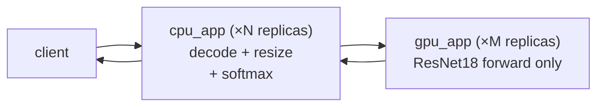
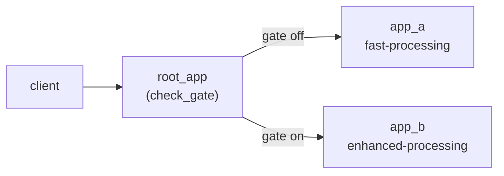

# Serving graphs

A *serving graph* is a set of Flyte apps that talk to each other inside the
cluster. Instead of putting every stage of a request into one process, you
split the work across multiple `AppEnvironment`s that you deploy together:
each one sized for its own bottleneck, with its own image and scaling policy.

This pattern is useful for:

- **Heterogeneous resource requirements**: CPU pre/postprocessing in front of a GPU forward pass
- **Microservice architectures**: Independent components with distinct lifecycles
- **A/B testing and canary rollouts**: A root app routes traffic across variant apps
- **Proxy / gateway patterns**: One app fronts several backends

## Core concepts: a minimal two-app chain

The simplest serving graph (`app2` proxies HTTP calls to `app1`) is enough
to introduce every core concept: deploying multiple apps together, discovering
an upstream app's endpoint, and sizing each app independently.

Both apps share an image and live in the same Python file:





### Deploying multiple apps together with `depends_on`

The callee env is straightforward; it has no upstream dependencies of its
own:



The caller declares `depends_on=[env1]`, which tells Flyte that `env1` must
be deployed alongside this one:



Calling `flyte.serve(env2)` then deploys the whole dependency closure
transitively, so you only ever name the entry-point app:



`depends_on` is about deployment co-scheduling, not request-time ordering:
at runtime each app is independent.

### Getting an upstream app's endpoint

There are two ways for one app to discover another app's URL. Both resolve
correctly across local, in-cluster, and external contexts.

**Pattern A: `env.endpoint` (Python property).** When both apps live in the
same Python module, the upstream env object is in scope and you can read
`env.endpoint` directly. The example above uses this pattern in `app2`'s
proxy endpoint:



**Pattern B: `flyte.app.AppEndpoint` as a parameter.** When the upstream env
object isn't importable (different file, different process, looking it up by
name), declare it as a `flyte.app.Parameter` and have Flyte inject the
resolved URL via an environment variable. The `env2` definition above shows
this. `app1_url` becomes available as `os.getenv("APP1_URL")` at runtime:



### Sizing each node independently

Each `AppEnvironment` carries its own image, resources, and scaling. That's
the entire point of splitting: for example, the GPU side of an inference
graph can stay narrow with `scaling=Scaling(replicas=(1, 2))` while the CPU
side scales wide with `scaling=Scaling(replicas=(1, 8))`, with no shared
autoscaling policy between them. The next example shows this in practice.

## Example: CPU / GPU inference split

The canonical heterogeneous-resource pipeline: heavy CPU preprocessing in
front of a fast GPU forward pass, talking to each other over HTTP inside the
cluster.



In a typical vision/audio pipeline, the GPU forward pass takes milliseconds
but is sandwiched between slow CPU work (image decode, resize, normalization,
softmax, label lookup). If both stages share one process you pay for an idle
GPU during preprocessing. Splitting them lets each side scale independently:
cheap CPU wide, expensive GPU narrow.

### Disjoint images per node

The two apps share a small base image and add their own disjoint stacks. The
CPU app never imports `torch`; the GPU app never imports `PIL`:



### GPU app: model.forward only

The GPU app loads the model once at startup using FastAPI's lifespan, so model
weights stay resident across requests:



The inference endpoint speaks raw `float32` bytes over
`application/octet-stream`. For anything tensor-shaped this is the single
biggest perf knob. JSON-serializing a 19MB batch dominates end-to-end
latency:



The GPU environment requests a GPU and keeps replicas narrow:



### CPU app: pre/postprocess + call GPU

Preprocessing is deliberately CPU-bound (decode, denoise, resize, normalize):



The CPU app uses its lifespan to resolve the GPU endpoint via `gpu_env.endpoint`,
fetch labels once at startup, and build one persistent `httpx.AsyncClient` per
replica. Persistent clients avoid a TCP/TLS handshake per request, which
matters at high request rates:



The `/classify` endpoint glues it all together. Heavy CPU work runs in this
process; the GPU forward pass is delegated over HTTP using the raw-bytes wire
format:



The CPU environment scales wide and declares `depends_on=[gpu_env]` so both
sides deploy together:



### Deploy

`flyte.serve(cpu_env)` deploys both apps. The CPU app is the public entry
point; the GPU app is reached only via the cluster-internal endpoint:



## Example: A/B testing with Statsig

A serving graph also lets you shape traffic. A root app routes each incoming
request to one of two variant apps using a [Statsig](https://www.statsig.com/)
feature gate, with consistent per-user bucketing.



### Statsig client singleton

The variant routing logic needs a single Statsig client per process. Wrap it
in a singleton so lifespan startup/shutdown is the only place that touches its
lifecycle:



### Variant apps

The two variants are independent FastAPI apps with their own endpoints. Each
variant returns a payload labeled with its identity, but they're otherwise
deployed and scaled independently:





### Root app with Statsig in its lifespan

The root app's lifespan initializes Statsig at startup and shuts it down
cleanly. The API key arrives as an env var because the env is configured with
a Flyte secret (see below):



### App environments

Variant envs are minimal:



The root env declares `depends_on=[env_a, env_b]` so all three deploy
together, and pulls the Statsig API key from a Flyte secret:



### Routing endpoint

The root app checks the `variant_b` feature gate against a user key and
proxies to the matching variant using its `endpoint` property:



Use stable identifiers (user ID, session ID) for `user_key` so the same user
always lands in the same bucket. To swap `check_gate` for an experiment or
dynamic config:

```python
experiment = statsig.get_experiment(user, "my_experiment")
variant = experiment.get("variant", "A")
```

### Deploy



**Setup before running:**

1. Get a Server Secret Key at [statsig.com](https://www.statsig.com/) → Settings → API Keys.
2. Create a feature gate named `variant_b` (e.g. 50% rollout).
3. Set the Flyte secret:
   ```bash
   flyte create secret statsig-api-key <your-secret-key-here>
   ```

## When to split into a serving graph

Split when stages have:

- **Different bottlenecks**: CPU vs GPU vs memory
- **Different scaling needs**: bursty vs steady, wide vs narrow
- **Different lifecycles**: model weights you don't want to reload, expensive cold starts
- **Different routing concerns**: A/B, canary, proxy, gateway

Don't split just to separate code; a single app with a few endpoints is
simpler to operate.

## Best practices

1. **Use `depends_on`**: Always specify dependencies to ensure the dependency closure is deployed in one shot.
2. **Persistent HTTP clients**: Open one `httpx.AsyncClient` per replica in the app's lifespan rather than per request, to avoid TCP/TLS setup overhead.
3. **Pick the right wire format**: For tensor-shaped payloads, send raw bytes over `application/octet-stream` instead of JSON.
4. **Size each node independently**: GPU narrow, CPU wide; use scale-to-zero (`replicas=(0, N)`) for bursty downstream services.
5. **Authentication**: Use `requires_auth=True` on internal-only apps so they can't be reached from the public internet, and put public-facing auth on the entry-point app.
6. **Endpoint access**: Prefer `app_env.endpoint` for in-module references; use `flyte.app.AppEndpoint` parameters when the upstream env isn't importable.
