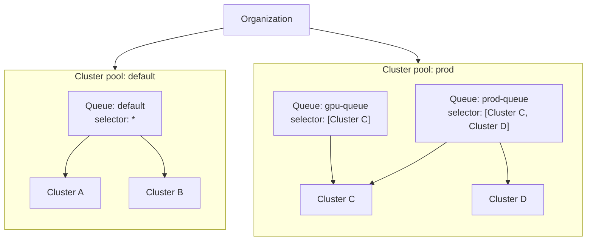

# Cluster and workload management

> [!NOTE] Requires the `flyteplugins-union` plugin
> The `flyte` cluster, pool, and queue commands and the Python objects on these
> pages are provided by the `flyteplugins-union` package. Install it with
> `pip install flyteplugins-union`.

As a  deployment grows past a single cluster, you need to
control *where* a workload runs and *under what limits*. Three primitives do this:

- **Cluster pool**: an isolation boundary. The clusters and queues inside a pool
  share one **data plane**: the same object store, secret store, and container
  registry. Work cannot cross from one pool to another (see
  [Crossing a pool boundary](#crossing-a-pool-boundary)).
- **Cluster**: an execution cluster that lives in exactly one pool.
- **Queue**: what you submit work to. A queue lives in one pool, **routes** work to
  one or more clusters in that pool, and applies the concurrency, depth, priority,
  and fairness limits for the work it admits. Every cluster automatically gets a
  **co-named queue** that routes only to it, so any cluster can be targeted by
  name without creating anything (see
  [Queues you get for free](./queues#queues-you-get-for-free)).

## Tooling

Pools, clusters, and queues are managed with the `flyte` CLI or the
`flyteplugins.union.remote` Python objects, and are set up by your platform
administrator. These are administrative tasks; most workflow authors only need
[task-side queue routing](../task-configuration/queues).

## Standing up a self-managed cluster?

The pages here manage the **control-plane records** for pools, clusters, and
queues. They do not provision the **data plane** itself: the cloud resources
(object store, secret store, registry) and the Helm release that registers a
cluster with the control plane.

If you run a self-managed deployment, provision the data plane first with
[Self-managed deployment](../../deployment/selfmanaged/_index) (for example,
[Data plane setup on AWS](../../deployment/selfmanaged/selfmanaged-aws/_index)),
then use the commands here to manage the pool, cluster, and queue records that
route work to it.

## How they fit together

A **cluster pool** is an isolation boundary: both **clusters** and **queues** live
*inside* a pool, and everything in it shares one data plane. A **queue** routes
work to one or more clusters **in its own pool**, and the three queues above show
the routing choices you have:

- **`default`** uses the wildcard selector `*`: it spreads across every cluster in
  its pool that is healthy and enabled, and picks up new clusters automatically as
  they join. An unhealthy cluster stops receiving new work until it recovers — see
  [Wildcard routing](./queues#how-a-queue-routes).
- **`prod-queue`** names both clusters in its pool explicitly. The result looks
  like the wildcard today, but the membership is frozen: a *Cluster E* added to
  `prod` later gets no work from this queue until you add it to the selector.
- **`gpu-queue`** names a single cluster, pinning that lane to Cluster C while
  Cluster D stays free for other work.

The key invariant: a queue can never reach a cluster outside its pool, because a
run's inputs, code, and secrets are uploaded to that pool's data plane and no other
pool's clusters can read them. That is what makes a pool an isolation boundary.

### Crossing a pool boundary

Because pools don't share a data plane, they don't connect. A run or a queue can
never move from one pool to another *in place*. A **cluster** can be reassigned to
another pool, but only as a disruptive maintenance operation that stops nothing
and reschedules nothing — see
[Move a cluster to a different pool](./clusters#move-a-cluster-to-a-different-pool).
For work in flight, crossing a pool boundary
means physically re-landing the workload in the destination pool's data plane:
moving its **data, containers (images), code, and secrets** into the new pool's
object store, registry, and secret store. This is deliberate friction: it keeps
in-flight work from ever pointing at storage it can't read, and it's why pool
changes are rare and explicit (moving work between pools is a
[drain-and-replace migration](./queues#move-work-to-another-pool)).

> [!NOTE] The simple case is invisible
> Each cluster is assigned exactly one pool. If no custom pool is specified when
> the cluster is created, it joins the `default` pool that every organization is
> provisioned with. So if you run a single cluster, or several clusters that share
> one bucket, secret store, and registry, you never need to think about pools: your
> cluster lands in `default`, queues route to `default`, and you can skip straight
> to [Managing queues](./queues). Pools only matter once you have clusters with **distinct**
> data planes (for example, separate dev and prod cloud accounts).

## In this section




Group clusters that share a data plane. Create and manage pools, or stay on the `default` pool if you only have one.



Register execution clusters into a pool and inspect their state, capacity, and bound queues.



Create and manage the scheduling lanes that route workloads to a pool and enforce concurrency, priority, and fairness.



