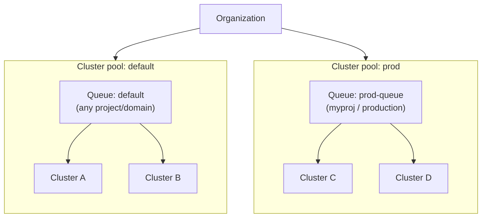

# Cluster and workload management

> [!NOTE] Beta
> Cluster pools, clusters, and queues are managed through the `flyte`
> CLI and are configured by your platform administrator. The commands on these
> pages are administrative operations — most workflow authors only need
> [task-side queue routing](../task-configuration/queues).

As a  deployment grows past a single cluster, you need a
way to decide *where* a workload runs and *under what limits*. Three primitives
work together to make that decision explicit and safe:

- **Cluster pool** — an org-level **isolation boundary**. Both the clusters *and*
  the queues inside a pool share one **data-plane configuration**: the same object
  store, secret store, and container registry. Anything 
  uploads for a run (inputs, code bundles, secrets) is reachable from every cluster
  in the same pool — and from no cluster outside it. Pools do not connect: you
  cannot move a workload directly from one pool to another (see
  [Crossing a pool boundary](#crossing-a-pool-boundary)).
- **Cluster** — an execution cluster that lives in exactly one pool.
- **Queue** — what users actually submit to. A queue lives inside one pool and
  **routes** work to one or more clusters *in that pool*, carrying the concurrency,
  depth, priority, and fairness limits applied to the work it admits.

## How they fit together

A **cluster pool** is an isolation boundary: both **clusters** and **queues** live
*inside* a pool, and everything in it shares one data plane. A **queue** routes
work to one or more clusters **in its own pool** — the platform picks any healthy
cluster in the pool (or the specific clusters you pin it to).

The key invariant: a queue can never reach a cluster outside its pool, because a
run's inputs, code, and secrets are uploaded to that pool's data plane and no other
pool's clusters can read them. That is what makes a pool an isolation boundary.

### Crossing a pool boundary

Because pools don't share a data plane, they don't connect. You cannot move a run,
a queue, or a cluster from one pool to another *in place*. Crossing a pool boundary
means physically re-landing the workload in the destination pool's data plane —
moving its **data, containers (images), code, and secrets** into the new pool's
object store, registry, and secret store. This is deliberate friction: it keeps
in-flight work from ever pointing at storage it can't read, and it's why pool
changes are rare and explicit (a queue's pool change [requires a
drain](./queues#change-a-queues-pool--drain-first)).

> [!NOTE] The simple case is invisible
> Every organization is provisioned with a `default` pool that all clusters join
> automatically. If you run a single cluster — or several clusters that share one
> bucket, secret store, and registry — you never need to think about pools. Your
> cluster lands in `default`, queues route to `default`, and you can skip straight
> to [Queues](./queues). Pools only matter once you have clusters with **distinct**
> data planes (for example, separate dev and prod cloud accounts).

## In this section




Group clusters that share a data plane. Create and manage pools — or stay on the `default` pool if you only have one.



Register execution clusters into a pool and inspect their state, capacity, and bound queues.



Create and manage the scheduling lanes that route workloads to a pool and enforce concurrency, priority, and fairness.



