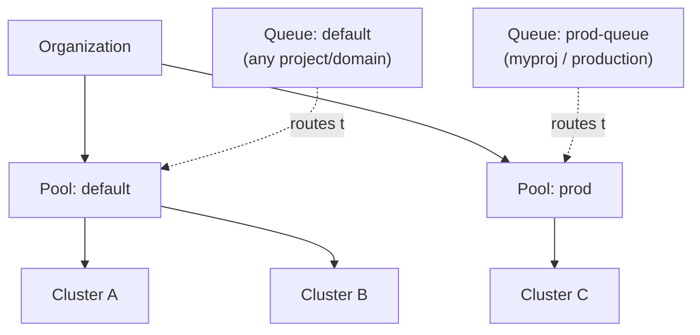

# Cluster and workload management

> [!NOTE] Beta
> Cluster pools, clusters, and queue management are managed through the `flyte`
> CLI and are configured by your platform administrator. The commands on these
> pages are administrative operations — most workflow authors only need
> [task-side queue routing](../task-configuration/queues).

As a  deployment grows past a single cluster, you need a
way to decide *where* a workload runs and *under what limits*. Three primitives
work together to make that decision explicit and safe:

- **Cluster pool** — an org-level group of clusters that share one **data-plane
  configuration**: the same object store, secret store, and container registry.
  Anything  uploads for a run (inputs, code bundles,
  secrets) in one cluster is reachable from every other cluster in the same pool.
- **Cluster** — an execution cluster that subscribes to exactly one pool.
- **Queue** — a project/domain-scoped scheduling lane that targets one pool (and,
  optionally, specific clusters within it) and carries the concurrency, depth,
  priority, and fairness limits applied to the work routed through it.

## How they fit together

A **pool** groups clusters by the data plane they share. A **cluster** belongs to
one pool. A **queue** names the pool its work should land on, then the platform
picks any healthy cluster in that pool (or the specific clusters you pin it to).

The key invariant: a queue can only route to clusters in **its own pool**, because
a run's inputs and secrets are uploaded to that pool's data plane and no other
pool's clusters can read them.

> [!NOTE] The simple case is invisible
> Every organization is provisioned with a `default` pool that all clusters join
> automatically. If you run a single cluster — or several clusters that share one
> bucket, secret store, and registry — you never need to think about pools. Your
> cluster lands in `default`, queues route to `default`, and you can skip straight
> to [Queues](./queues). Pools only matter once you have clusters with **distinct**
> data planes (for example, separate dev and prod cloud accounts).

## In this section




Group clusters that share a data plane. Create and manage pools — or stay on the `default` pool if you only have one.



Register execution clusters into a pool and inspect their state, capacity, and bound queues.



Create and manage the scheduling lanes that route workloads to a pool and enforce concurrency, priority, and fairness.



