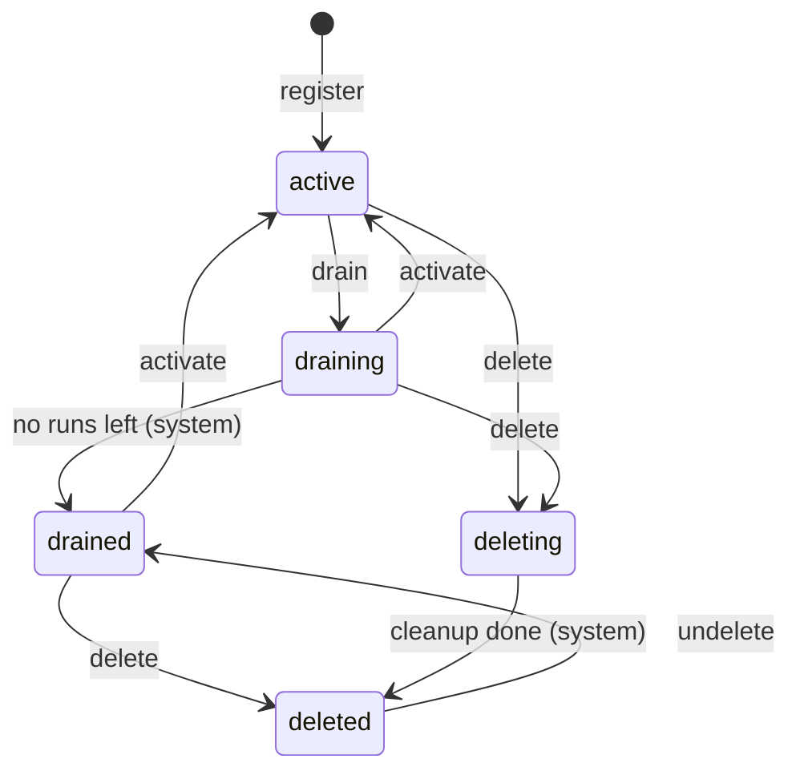

# Clusters

> [!NOTE] Requires the `flyteplugins-union` plugin
> The cluster CLI commands and Python objects on this page are provided by the
> `flyteplugins-union` package. Install it with `pip install flyteplugins-union`.
> Cluster draining and the `deleting` lifecycle state require version 0.9.0 or
> later; this page describes release 0.10.1.

A **cluster** is an execution cluster registered with .
Every cluster subscribes to exactly one [cluster pool](./cluster-pools), which
determines the data plane configuration (object store, secret store, container
registry) the cluster uses.

Creating a cluster record registers the cluster in the control plane. It does not
install Kubernetes resources or deploy the data plane itself. For self-managed
deployments, first provision and install the data plane using the appropriate
[Self-managed deployment](../../deployment/selfmanaged/_index) guide, then use
the commands or Python calls here to manage the control-plane record.

## Register a cluster

If you omit the pool, the cluster is registered into the `default` pool. To use a
custom pool, create that pool first. One edge case: if the `default` pool has
been [deleted](./cluster-pools#delete-a-pool), registering without a pool is
rejected rather than falling back to it — name a pool explicitly, or undelete
`default`.





```bash
# Register in the default pool.
flyte create cluster my-cluster

# Register in a specific pool.
flyte create cluster prod-us-east-1 --pool prod
```






```python
from flyteplugins.union.remote import Cluster

# Register in the default pool.
Cluster.create("my-cluster")

# Register in a specific pool.
Cluster.create("prod-us-east-1", cluster_pool_name="prod")
```





Registration itself does not validate the cluster against the pool: any cluster
is allowed to join. Validation happens asynchronously, once the cluster starts
reporting its real object store, secret store, and container registry to the
control plane. The control plane compares each reported value against the pool's
config and marks the cluster **unhealthy** on a mismatch. An unhealthy cluster
stops receiving new work from every queue that
[routes](./queues#how-a-queue-routes) to it, until it recovers. See
[How a pool's config is enforced](./cluster-pools#how-a-pools-config-is-enforced)
for the full mechanism.

This is what guarantees that any workload routed to the pool can run on any of
its healthy clusters — so after registering into a custom pool, confirm with
`flyte get cluster <name>` that the cluster settles healthy.

The name `default` is reserved and cannot be used for a cluster (it collides
with the org-wide `default` queue), and a cluster cannot share a name with an
existing queue — registration creates a queue named after the cluster, described
next.

### The co-named queue

Registering a cluster also creates an implicit **co-named queue**: a queue with
the same name as the cluster, in the cluster's pool, whose selector names that
one cluster explicitly — not the `*` wildcard. So `flyte create cluster
prod-us-east-1` also gives you a `prod-us-east-1` queue that routes only to
`prod-us-east-1`, and every cluster can be targeted by name from day one, with no
queue setup:

```python
flyte.with_runcontext(queue="prod-us-east-1").run(main)
```

Registration additionally ensures the org-wide `default` queue exists — unless
that queue has been deliberately [deleted](./queues#delete-a-queue): nothing
re-creates a soft-deleted `default` queue (or pool) implicitly; `flyte undelete`
is the only way back. The `default` queue lives in the `default` pool with the
`*` selector, so it routes to every healthy, enabled cluster in the `default`
pool: a cluster registered there joins it automatically, while a cluster in any
other pool never does.

Both are ordinary queues — they appear in `flyte get queue` (a co-named queue is
flagged there as **cluster-managed**), carry the same
concurrency, depth, priority, and fairness settings as any other, and are managed
the same way on the [Managing queues](./queues) page. What sets the co-named
queue apart is that its cluster selector and pool are managed by its cluster and
cannot be edited directly: it follows its cluster if the cluster is
[reassigned to another pool](#move-a-cluster-to-a-different-pool). It also
follows the cluster through the [lifecycle](#cluster-lifecycle): draining the
cluster drains it, activating the cluster activates it, and deleting the cluster
deletes it. A co-named queue that was deleted on its own stays deleted, and while
its cluster is `draining` or `drained` the queue cannot be activated on its own.
The system confirms the cluster and queue transitions separately, so they may
finish at slightly different times. See
[How the co-named queue follows its cluster](#how-the-co-named-queue-follows-its-cluster).

## Inspect clusters





```bash
# List all clusters (grouped by enabled / disabled)
flyte get cluster

# Inspect one cluster — cloud config, state, capacity, and bound queues
flyte get cluster prod-us-east-1

# Cap the number of results
flyte get cluster --limit 50
```






```python
from flyteplugins.union.remote import Cluster

for cluster in Cluster.listall(limit=100):
    print(cluster.name, cluster.pool, cluster.drain_state, cluster.health, cluster.capacity)

cluster = Cluster.get("prod-us-east-1")
print(cluster.name)
print(cluster.pool)
print(cluster.drain_state)
print(cluster.queues)
print(cluster.health, cluster.unhealthy_reasons)
print(cluster.capacity)
print(cluster.config_drift)
```





A cluster reports two different states, and both appear in the listing:

- **`state`** (`Cluster.state`) is what the data plane reports about itself:
  `enabled` or `disabled`. It is not something you set from the CLI.
- **`drain`** (`Cluster.drain_state`) is the control-plane
  [lifecycle state](#cluster-lifecycle): `active`, `draining`, `drained`,
  `deleting`, or `deleted`. This is the state that `--drain`, `--activate`,
  `delete`, and `undelete` move.

The detailed view additionally shows the drain **generation** (a counter that
increases on every lifecycle change), the per-workload drain progress for runs
and apps, available capacity, and the queues bound to the cluster.

`flyte get cluster <name>` and `Cluster.get` return a not-found error once the
cluster is `deleted`; list deleted clusters with `flyte get cluster --deleted`
or `Cluster.listall(deleted=True)` instead. A `deleting` cluster is still live
and is returned normally.

## Cluster lifecycle

A cluster is in one of five lifecycle states. The `drain`, `activate`, `delete`,
and `undelete` transitions are requested by you; the moves into `drained` and
`deleted` are written by the system once the leasor confirms the cluster holds
no more work.



- **`active`**: accepting new work. Every cluster starts here.
- **`draining`**: no new work; runs already on the cluster keep going. The
  system moves the cluster to `drained` once the leasor reports that no run or
  cleanup work remains on it.
- **`drained`**: confirmed idle. The only state from which a delete completes
  in one step, and the state a restored cluster comes back in.
- **`deleting`**: deletion requested while the cluster may still hold work. The
  leasor disconnects the cluster's workers, reschedules its runs on other
  clusters, and drops its cleanup work, then reports it `deleted`. The cluster
  stays listed meanwhile.
- **`deleted`**: soft-deleted. The record and name are kept; the cluster is
  hidden from listings and refuses heartbeats and status reports.

What each operation does from each state:

| Current state | `--drain` | `--activate` | `flyte delete cluster` | `flyte undelete cluster` |
|---|---|---|---|---|
| `active` | → `draining` | no change | → `deleting` | rejected |
| `draining` | no change | → `active` | → `deleting` | rejected |
| `drained` | rejected (already drained) | → `active` | → `deleted` | rejected |
| `deleting` | rejected | rejected | rejected | rejected |
| `deleted` | rejected | rejected | rejected | → `drained` |

Two rules follow from the table. Deletion cannot be canceled: once a cluster is
`deleting`, the only way forward is `deleted`, and only then can it be
undeleted. And `drained` and `deleted` are never requested directly; the leasor
writes them.

Every lifecycle request is fenced by the cluster's drain **generation**, shown
by `flyte get cluster <name>`. The Python client reads the current generation
before each request, so a request that races another change to the same cluster
is rejected with a generation mismatch rather than applied to a state you never
saw. Re-read the cluster and retry if the change still applies.

### How the co-named queue follows its cluster

The cluster's [co-named queue](#the-co-named-queue) moves with the cluster in
the same transaction:

| Cluster operation | Queue `active` | Queue `draining` | Queue `drained` | Queue `deleted` |
|---|---|---|---|---|
| drain | → `draining` | unchanged | unchanged | unchanged |
| activate | unchanged | → `active` | → `active` | unchanged |
| delete | → `deleting` | → `deleting` | → `deleted` | unchanged |
| undelete | — | — | — | → `drained` |

A queue that is already `deleting` is left alone by every cluster operation.
The leasor confirms the queue's `drained` and `deleted` transitions separately
from the cluster's, so the two can finish in either order.

The queue also has restrictions of its own while it is cluster-managed: it
cannot be activated on its own while its cluster is `draining` or `drained`
(`flyte update queue <name> --activate` is rejected), and it cannot be
undeleted on its own while its cluster is deleted. To keep a cluster from
receiving work through its own queue while the cluster stays active, drain and
then [delete the queue](./queues#delete-a-queue); activating the cluster does
not bring a deleted queue back.

## Drain and reactivate a cluster

Draining is the graceful way to take a cluster out of service: it stops new work
from reaching the cluster while runs already there finish. A `draining` cluster
drops out of every queue's routing, wildcard queues included. The cluster
becomes `drained` once the leasor confirms that no run or cleanup work remains.
You can reactivate it at any point while it is `draining` or after it is
`drained`; reactivation resets the drain progress.

A drain request is **rejected** while either of these holds:

- **An app is assigned to the cluster.** Apps have no drain step, so
  [stop or reassign them](../apps/serve-and-deploy-apps/_index) first. The error
  names the blocking apps.
- **Another live queue explicitly names the cluster** in its selector. Remove
  the cluster from that queue first. The error names the blocking queues.
  Wildcard (`*`) queues never block a drain.

Draining a cluster also drains its co-named queue, and reactivating the cluster
reactivates that queue; see
[How the co-named queue follows its cluster](#how-the-co-named-queue-follows-its-cluster).





```bash
flyte update cluster prod-us-east-1 --drain
flyte get cluster prod-us-east-1              # wait for drain: drained
flyte update cluster prod-us-east-1 --activate
```

`flyte update cluster` takes exactly one of `--drain`, `--activate`, or
`--pool`.






```python
import time

from flyteplugins.union.remote import Cluster

cluster = Cluster.drain("prod-us-east-1")
print(cluster.drain_state)                 # draining

# Poll until the leasor confirms the cluster is idle.
while Cluster.get("prod-us-east-1").drain_state != "drained":
    time.sleep(10)

Cluster.activate("prod-us-east-1")
```





A `deleting` or `deleted` cluster cannot be drained or activated. To remove a
cluster without waiting for its work to finish, [delete it](#delete-a-cluster).

## Move a cluster to a different pool

A cluster can be reassigned to another pool in place, without deleting and
re-registering it. The control plane enforces one precondition: the cluster's
[co-named queue](#the-co-named-queue) must be `drained`, because that queue
moves to the new pool with the cluster and a queue can only change pools when
it holds no work. The move does not check the cluster's own lifecycle state, so
the recommended way to satisfy the precondition is to
[drain the cluster](#drain-and-reactivate-a-cluster): that drains the co-named
queue and additionally guarantees that no runs remain on the cluster. The move
leaves the lifecycle state untouched, so a drained cluster stays `drained`
afterwards and you can verify its new pool configuration before reactivating it.

> [!WARNING] A pool move changes the cluster's data plane
> The destination pool can use a different object store, secret store, and
> container registry. Make the required data, images, and secrets available in
> that data plane before moving the cluster.





```bash
flyte update cluster prod-us-east-1 --pool prod
flyte update cluster prod-us-east-1 --pool prod --yes   # skip the confirmation prompt
```

Without `--yes`, the CLI warns that the operation is unsafe and asks you to
confirm.






```python
from flyteplugins.union.remote import Cluster

Cluster.update("prod-us-east-1", cluster_pool_name="prod")
```

There is no confirmation prompt on this path.





The destination pool must already exist — the move never creates one — and must
differ from the cluster's current pool.

### Before you move a cluster

1. **Repoint other queues.** Any queue other than the
   [co-named queue](#the-co-named-queue) that explicitly names the cluster must
   have it removed from its selector. Such a queue blocks both the cluster drain
   and the pool move. Wildcard (`*`) queues do not block either operation.
   `flyte get cluster <name>` lists the queues bound to the cluster.
2. **Stop apps and check for v1 executions.** A cluster does not only serve
   runs. [Apps](../apps/serve-and-deploy-apps/_index) assigned to the cluster
   block the drain: the drain request is rejected and names them, so stop or
   reassign them first. Legacy v1 executions, which 
   still supports today, are **not** tracked by the drain and do not block
   anything. Confirm out-of-band that none are running before continuing.
3. **Drain the cluster.** Run `flyte update cluster <name> --drain`. This also
   drains its co-named queue. Wait until `flyte get cluster <name>` reports the
   cluster as `drained` and `flyte get queue <name>` reports the queue as
   `drained`. The move is rejected while the queue is still `draining`.
4. **Make sure the configs match.** The destination pool's config must match
   what the cluster reports, or the cluster goes unhealthy shortly after the
   move — see below.

After the move, confirm the cluster is healthy, then run
`flyte update cluster <name> --activate`. Its co-named queue is activated with it.

### If the cluster goes unhealthy after the move

Pool config is validated asynchronously against what the cluster reports (see
[How a pool's config is enforced](./cluster-pools#how-a-pools-config-is-enforced)),
so a mismatch surfaces only after the move, as an unhealthy cluster that
[queues](./queues#how-a-queue-routes) will no longer route new work to.
`flyte get cluster <name>` shows the state, health, and unhealthy reasons. Fix
whichever side is wrong:

- **The cluster's config**: the reported values come from the deployed data
  plane, so change them where that deployment is defined (Terraform, Helm values,
  and so on) and redeploy the cluster. The control plane picks up the new values
  on the cluster's next status report.
- **The pool's config**: run `flyte update cluster-pool <pool>`, which opens the
  pool in your `$EDITOR`. See [Update a pool](./cluster-pools#update-a-pool).

## Delete a cluster

You can delete a cluster from any live state. What happens next depends on its
[lifecycle state](#cluster-lifecycle):

- A `drained` cluster becomes `deleted` immediately: the leasor has already
  confirmed it holds no work.
- An `active` or `draining` cluster becomes `deleting`. The leasor disconnects
  the cluster's workers, reschedules its run leases on other clusters, drops
  its cleanup work, and evicts any apps assigned to it, then reports the
  cluster `deleted`. A `deleting` cluster is still listed and rejects every
  further lifecycle request: it cannot be drained, activated, deleted again, or
  undeleted.

Deletion does not wait for running work and cannot be canceled. It also does not
remove Kubernetes pods that remain on the data plane. **You are responsible for
cleaning up those pods.** To let work finish normally, first
[drain the cluster](#drain-and-reactivate-a-cluster) and wait for `drained`, then
delete it.

The cluster's [co-named queue](#the-co-named-queue) enters deletion with the
cluster. A drained queue becomes `deleted` immediately; an active or draining
queue becomes `deleting` until its cleanup finishes. This cluster-driven cascade
is the only way an `active` queue ever enters `deleting`; `flyte delete queue`
itself rejects an active queue. The cluster and queue reach `deleted`
independently and may finish in either order. Any other live queue
that explicitly names the cluster blocks deletion; remove the cluster from its
selector first. Wildcard (`*`) queues do not block deletion.

A queue whose selector you empty this way stops routing work anywhere until you
point it at another cluster **in its pool** (or
[move it to another pool](./queues#move-work-to-another-pool) once drained).





```bash
flyte delete cluster prod-us-east-1
flyte delete cluster prod-us-east-1 --yes   # skip the confirmation prompt

# List deleted clusters, restore one
flyte get cluster --deleted
flyte undelete cluster prod-us-east-1
```






```python
from flyteplugins.union.remote import Cluster

Cluster.delete("prod-us-east-1")
Cluster.undelete("prod-us-east-1")   # restore a deleted cluster
```





The command returns after the cluster becomes either `deleting` or `deleted`,
and says which. A `deleting` cluster remains visible in normal listings while
teardown runs; watch it with `flyte get cluster <name>`. Once `deleted`, it
disappears from normal listings, `flyte get cluster <name>` reports it as not
found, and it stops accepting status reports and heartbeats. The record is
retained and its name stays reserved, so registering another cluster with the
same name is rejected. Find deleted clusters with `flyte get cluster --deleted`.

A `deleting` cluster cannot be restored; wait for deletion to finish. Then use
`flyte undelete cluster <name>`. The cluster and its co-named queue both return
in the `drained` state, even if the queue had been deleted on its own before the
cluster was. Undeleting the cluster is the only way to bring that queue back:
`flyte undelete queue` refuses it while the cluster is deleted. The cluster's
pool must itself be live; undelete the pool first if it was deleted. Run
`flyte update cluster <name> --activate` to reactivate cluster and queue
together.

## Next

Once your clusters are registered and healthy, [create queues](./queues) to route
and govern the workloads that run on them.
