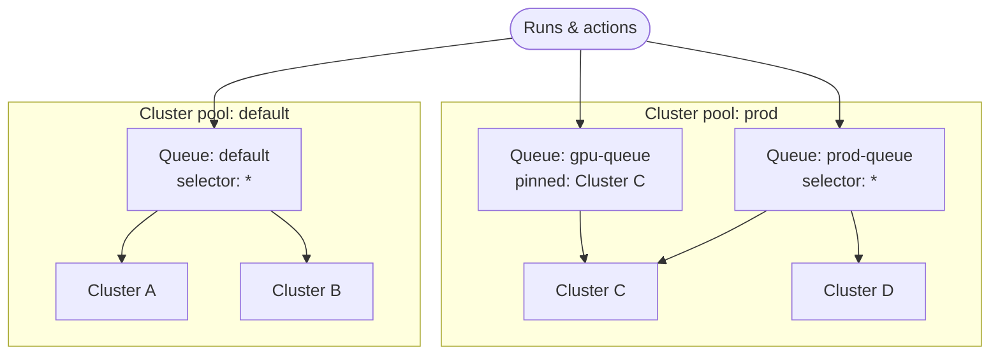

# Queues

> [!NOTE] Requires the `flyteplugins-union` plugin
> The queue CLI commands and Python objects on this page are provided by the
> `flyteplugins-union` package. Install it with `pip install flyteplugins-union`.

A **queue** is a named scheduling lane. It does two jobs at once: it **routes**
work to a [cluster pool](./cluster-pools) (and, optionally, specific clusters
within it), and it **governs** that work with concurrency, depth, priority, and
fairness limits.

This page covers creating and managing queues administratively, from either the
CLI or Python. For how workflow authors *target* a queue from task code, see
[Queues in Configure tasks](../task-configuration/queues).

## How a queue routes

A queue lives inside one **cluster pool** and routes work to one or more clusters
*within that pool*. By default (the `*` selector) it spreads across every healthy
cluster in the pool; you can also pin it to specific clusters. It can never reach a
cluster in another pool — pools are isolation boundaries.



Users submit to a **queue**, never to a pool or a cluster directly. Each queue sits
inside exactly one pool:

- **`default`** spreads across all clusters in the `default` pool.
- **`prod-queue`** spreads across all clusters in the `prod` pool.
- **`gpu-queue`** lives in the same `prod` pool but is pinned to a single cluster.

The selector (which clusters within the pool) is mutable. The pool a queue lives
in should be treated as fixed after creation. To move workloads to another pool,
create a replacement queue in that pool and update callers to target it after old
work has finished.

> [!NOTE] Queue scope
> Queues are currently organization-scoped. Some CLI and Python surfaces expose
> `project` and `domain` parameters for future scoped queues, but current
> deployments reject project/domain-scoped queue creation.

## Create a queue

`run_concurrency` and `action_concurrency` are required; everything else has a
sensible default. With no cluster selector, a queue spreads work across **all**
healthy clusters in its pool.




```python
from flyteplugins.union.remote import Queue

queue = Queue.create(
    "my-queue",
    run_concurrency=100,
    action_concurrency=1000,
)

print(queue.to_dict())
```

Create a higher-priority queue in a specific pool:

```python
queue = Queue.create(
    "gpu-queue",
    cluster_pool="prod",
    clusters=["prod-us-east-1"],
    run_concurrency=50,
    action_concurrency=500,
    depth=5000,
    priority="max",
    fairness="round_robin",
)
```




```bash
flyte create queue my-queue \
  --run-concurrency 100 \
  --action-concurrency 1000
```

Create a higher-priority queue in a specific pool:

```bash
flyte create queue gpu-queue \
  --cluster-pool prod \
  --cluster prod-us-east-1 \
  --run-concurrency 50 \
  --action-concurrency 500 \
  --depth 5000 \
  --priority max \
  --fairness round_robin
```




> [!NOTE] Queues are bound to a cluster pool
> Every queue is bound to a cluster pool, chosen at creation time with
> `cluster_pool` in Python or `--cluster-pool` in the CLI. If you omit it, the
> queue is bound to the `default` cluster pool.

### What each setting controls

- **`cluster_pool` / `--cluster-pool`** — the pool this queue lives in. A queue can
  only route to clusters in its own pool. Omit to bind the queue to the `default`
  pool.
- **`clusters` / `--cluster`** — pin the queue to one or more clusters in the pool.
  Omit to use all clusters in the pool. In the API, `["*"]` means all enabled and
  healthy clusters in the pool, and `*` must be the only entry if used.
- **`run_concurrency` / `--run-concurrency`** — maximum number of *runs* active on
  the queue at once. Children of an active run aren't counted; use this to stop a
  job from overlapping with a previous invocation of itself. `0` means no limit.
- **`action_concurrency` / `--action-concurrency`** — maximum number of *actions*
  (tasks) running at once. A cap of 1 serializes the queue; higher values bound
  the burst rate. `0` means no limit.
- **`depth` / `--depth`** — total in-flight plus waiting items the queue will hold
  (default `10000`). `0` means no limit.
- **`priority` / `--priority`** — `min`, `medium` (default), or `max`. Among queues
  contending for the same pool's capacity, higher-priority work is scheduled
  first. Under the hood these map to enum values 1, 50, and 100; use `max` for a
  priority higher than 50. Priority controls ordering, not preemption.
- **`fairness` / `--fairness`** — `round_robin` (default) or `shuffle_interleave`.
  This controls how actions from different projects sharing the queue are
  interleaved.

## Inspect queues




```python
from flyteplugins.union.remote import Queue

for queue in Queue.listall(limit=100):
    print(queue.name, queue.status, queue.priority, queue.cluster_pool, queue.clusters)

queue = Queue.get("gpu-queue")
print(queue.to_dict())

metrics = Queue.details("gpu-queue")
print(metrics)
```

To stream metrics:

```python
for metrics in Queue.watch("gpu-queue"):
    print(metrics)
```




```bash
# List all queues
flyte get queue

# Inspect one queue's settings and status
flyte get queue gpu-queue

# Stream live metrics — runs in-flight, actions in-flight, queue depth
flyte get queue gpu-queue --watch
```




`--watch` renders live progress bars for run concurrency, action concurrency, and
depth, so you can see a queue filling up or draining in real time.

## Change a queue's settings

You can update limits, priority, fairness, or cluster pinning. The update API
replaces the full queue spec; the Python wrapper handles this by reading the
current queue first, changing only the fields you pass, and writing the complete
spec back.




```python
from flyteplugins.union.remote import Queue

Queue.update(
    "gpu-queue",
    run_concurrency=75,
    action_concurrency=750,
    priority="max",
    clusters=["prod-us-east-1"],
)
```




```bash
flyte update queue gpu-queue --edit
```

This opens the queue in your `$EDITOR` so you can adjust the mutable settings.




Changing the **cluster selector within the same pool** (which clusters the queue
pins to) takes effect immediately because every cluster in the pool shares the
same data plane.

## Move work to another pool

Moving work to a different **pool** crosses an isolation boundary. In-flight runs
have already landed their data, containers, code, and secrets in the old pool's
data plane, and a different pool's clusters cannot read them.

Treat the queue's pool binding as creation-time configuration:

1. Create a new queue in the destination pool.
2. Update workflows, launch plans, triggers, or run overrides to target the new
   queue.
3. Let old work finish on the old queue.
4. Leave the old queue unused once nothing still submits to it.

> [!NOTE] Queue overrides stay within a pool
> A task can override its queue at runtime
> ([`task.override(queue=...)`](../task-configuration/queues#overriding-a-queue-at-runtime)),
> but only to another queue in the **same pool** as the run's original queue. A
> cross-pool override is rejected, for the same data plane reason that pool changes
> are handled as a migration.

## See also

- [Queues in Configure tasks](../task-configuration/queues) — routing work to a
  queue from task code, triggers, and per-run context.
- [Cluster pools](./cluster-pools) and [Clusters](./clusters) — the routing
  targets a queue points at.
