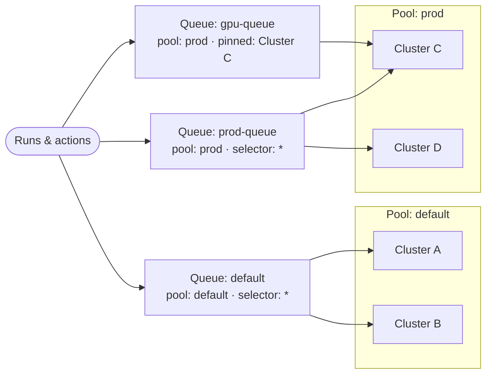

# Queues

A **queue** is a named scheduling lane. It does two jobs at once: it **routes**
work to a [cluster pool](./cluster-pools) (and, optionally, specific clusters
within it), and it **governs** that work with concurrency, depth, priority, and
fairness limits.

This page covers creating and managing queues from the CLI — the administrative
side. For how workflow authors *target* a queue from task code, see
[Queues in Configure tasks](../task-configuration/queues).

## How a queue routes

A queue always names one **pool**. Within that pool it can either spread work
across every healthy cluster (the default `*` selector) or pin to specific
clusters. It can never reach a cluster outside its pool.



- **`default`** spreads across all clusters in the `default` pool.
- **`prod-queue`** spreads across all clusters in the `prod` pool.
- **`gpu-queue`** targets the same `prod` pool but is pinned to a single cluster.

The selector (which clusters within the pool) is freely mutable; the pool itself
is not — changing it [requires a drain](#change-a-queues-pool--drain-first).

## Create a queue

```bash
flyte create queue my-queue \
  --cluster-pool prod \
  --run-concurrency 100 \
  --action-concurrency 1000
```

`--run-concurrency` and `--action-concurrency` are required; everything else has a
sensible default. A queue with no `--cluster-pool` routes to the `default` pool,
and with no `--cluster` it spreads work across **all** healthy clusters in that
pool.

Pin a queue to specific clusters within its pool, scope it to a project/domain, and
tune its limits:

```bash
flyte create queue gpu-queue \
  --cluster-pool prod \
  --cluster prod-us-east-1 \
  --run-concurrency 50 \
  --action-concurrency 500 \
  --depth 5000 \
  --priority max \
  --fairness round_robin \
  --project myproj \
  --domain production
```

### What each setting controls

- **`--cluster-pool`** — the pool this queue routes to. A queue can only route to
  clusters in its own pool. Defaults to `default`.
- **`--cluster`** — pin the queue to one or more clusters in the pool (repeat the
  flag for several). Omit to use all clusters in the pool.
- **`--run-concurrency`** — maximum number of *runs* active on the queue at once.
  Children of an active run aren't counted; use this to stop a job from overlapping
  with a previous invocation of itself.
- **`--action-concurrency`** — maximum number of *actions* (tasks) running at once.
  A cap of 1 serializes the queue; higher values bound the burst rate.
- **`--depth`** — total in-flight plus waiting items the queue will hold (default
  `10000`). When full, new submissions are rejected with `RESOURCE_EXHAUSTED` —
  back-pressure, not an unbounded backlog.
- **`--priority`** — `min`, `medium` (default), or `max`. Among queues contending
  for the same pool's capacity, higher-priority work is scheduled first. Priority
  controls ordering, not preemption.
- **`--fairness`** — `round_robin` (default) or `shuffle_interleave`. How actions
  from different projects sharing the queue are interleaved.
- **`--project` / `--domain`** — scope the queue so only that project/domain can
  route to it. Pools are org-level; queue *scope* is independent of the pool it
  targets.

## Inspect queues

```bash
# List all queues
flyte get queue

# Inspect one queue's settings and status
flyte get queue gpu-queue

# Stream live metrics — runs in-flight, actions in-flight, queue depth
flyte get queue gpu-queue --watch
```

`--watch` renders live progress bars for run concurrency, action concurrency, and
depth, so you can see a queue filling up or draining in real time.

## Change a queue's settings

Edit a queue's limits, priority, fairness, or cluster pinning interactively:

```bash
flyte update queue gpu-queue --edit
```

Changing the **cluster selector within the same pool** (which clusters the queue
pins to) takes effect immediately — no drain required, because every cluster in the
pool shares the same data plane.

## Change a queue's pool — drain first

Changing the **pool** a queue routes to is different. In-flight runs have already
uploaded their inputs, code, and secrets to the old pool's data plane, and a
different pool's clusters cannot read them. So you must drain the queue first:

```bash
# 1. Stop accepting new submissions; let in-flight work finish
flyte update queue gpu-queue --drain

# 2. Once drained, repoint the queue to the new pool
flyte update queue gpu-queue --edit   # set cluster_pool to the new pool

# 3. Start accepting work again
flyte update queue gpu-queue --activate
```

> [!NOTE] Queue overrides stay within a pool
> A task can override its queue at runtime
> ([`task.override(queue=...)`](../task-configuration/queues#overriding-a-queue-at-runtime)),
> but only to another queue in the **same pool** as the run's original queue. A
> cross-pool override is rejected, for the same data-plane reason that pool changes
> require a drain.

## Draining and reactivating

Draining is also how you take a queue out of rotation without losing in-flight work
— for maintenance, or before deleting the clusters behind it:

```bash
flyte update queue gpu-queue --drain      # stop new submissions, let current work finish
flyte update queue gpu-queue --activate   # accept work again
```

## See also

- [Queues in Configure tasks](../task-configuration/queues) — routing work to a
  queue from task code, triggers, and per-run context.
- [Cluster pools](./cluster-pools) and [Clusters](./clusters) — the routing
  targets a queue points at.
