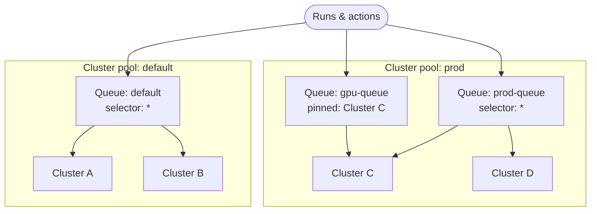
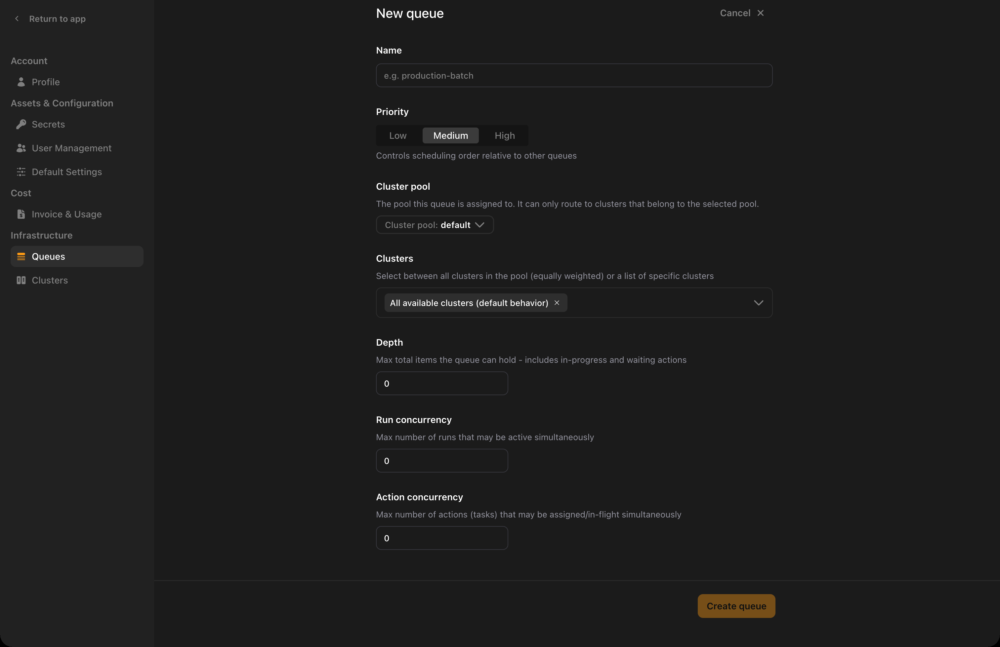
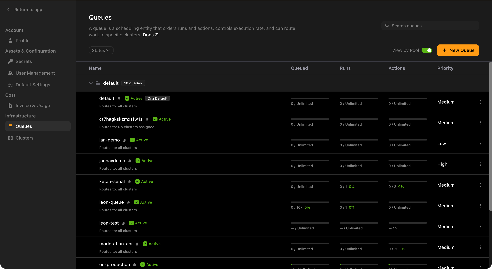
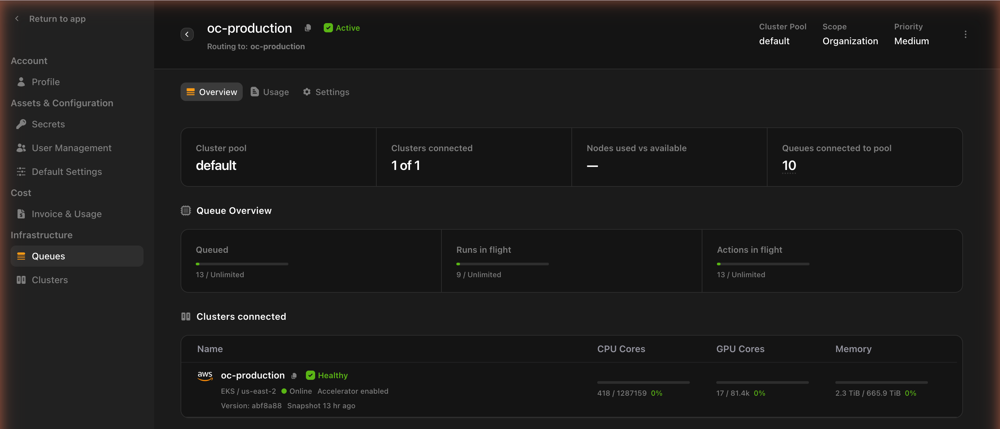
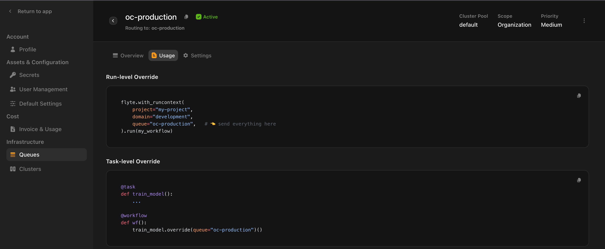
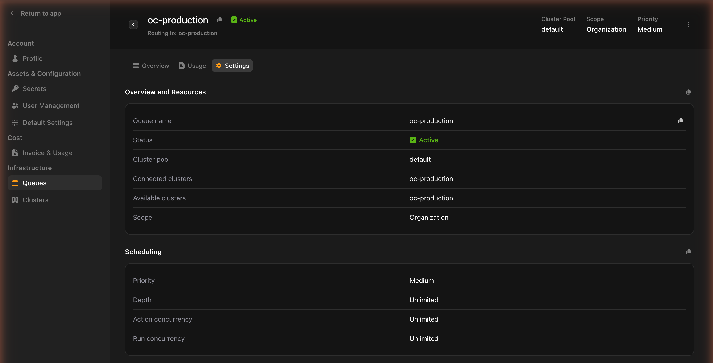

# Managing queues

> [!NOTE] Requires the `flyteplugins-union` plugin
> The queue CLI commands and Python objects on this page are provided by the
> `flyteplugins-union` package. Install it with `pip install flyteplugins-union`.

A **queue** is a named scheduling lane. It does two jobs at once: it **routes**
work to a [cluster pool](./cluster-pools) (and, optionally, specific clusters
within it), and it **governs** that work with concurrency, depth, priority, and
fairness limits.

This page covers creating and managing queues administratively, from either the
CLI or Python. For how workflow authors *target* a queue from task code, see
[Queues in Configure tasks](../tasks/task-configuration/queues).

## How a queue routes

A queue lives inside one **cluster pool** and routes work to one or more clusters
*within that pool*. By default (the `*` selector) it spreads across the pool's
healthy, enabled clusters; you can also pin it to specific clusters. It can never
reach a cluster in another pool: pools are isolation boundaries.


```mermaid
flowchart TD
    R(["Runs &amp; actions"])

    subgraph Pdef["Cluster pool: default"]
        direction TB
        QD["Queue: default<br/>selector: *"]
        CA["Cluster A"]
        CB["Cluster B"]
        QD --> CA
        QD --> CB
    end

    subgraph Pprod["Cluster pool: prod"]
        direction TB
        QP["Queue: prod-queue<br/>selector: *"]
        QG["Queue: gpu-queue<br/>pinned: Cluster C"]
        CC["Cluster C"]
        CD["Cluster D"]
        QP --> CC
        QP --> CD
        QG --> CC
    end

    R --> QD
    R --> QP
    R --> QG
```

Users submit to a **queue**, never to a pool or a cluster directly. Each queue sits
inside exactly one pool:

- **`default`** spreads across the eligible clusters in the `default` pool.
- **`prod-queue`** spreads across the eligible clusters in the `prod` pool.
- **`gpu-queue`** lives in the same `prod` pool but is pinned to a single cluster.

> [!NOTE] Routing skips unhealthy and disabled clusters
> A `*` selector does not mean *every* cluster in the pool — it means every
> cluster that is both **healthy** and **enabled**, evaluated against the pool's
> current state. Pinned selectors are filtered the same way: an unhealthy or
> disabled cluster receives no new work from *any* queue, wildcard or pinned.
> Say a pool holds two clusters and the second goes unhealthy for any reason,
> including a
> [config mismatch with the pool](./cluster-pools#how-a-pools-config-is-enforced):
> the queue routes new runs and actions to the first cluster only, and sends
> nothing to the second until it becomes healthy again. This governs the placement
> of new work; it does not move work that has already been dispatched. Check with
> `flyte get cluster <name>`, which reports each cluster's state, health, and
> unhealthy reasons.

### Queues you get for free

You don't have to create a queue to have one. Two exist without any action on
your part:

- The org-wide **`default`** queue, in the `default` pool with the `*` selector.
  Anything that doesn't explicitly target a queue goes here. (If the `default`
  queue is [drained](#drain-and-reactivate-a-queue) or
  [deleted](#delete-a-queue), untargeted submissions are rejected until it is
  reactivated or restored.)
- A **co-named queue** for every cluster: registering a cluster creates a queue
  with the *same name as the cluster*, in that cluster's pool, whose selector
  names that one cluster explicitly rather than using `*`. Register
  `prod-us-east-1` and you get a `prod-us-east-1` queue that routes only to
  `prod-us-east-1` — so any cluster can be targeted by name immediately, without
  setting up a queue for it. See
  [The co-named queue](./clusters#the-co-named-queue).

Both are ordinary queues: they show up in `flyte get queue` and take the same
settings and updates as queues you create yourself — with one exception. A
co-named queue's cluster selector and pool are managed by its cluster and cannot
be edited directly: the queue follows its cluster if the cluster is
[reassigned to another pool](./clusters#move-a-cluster-to-a-different-pool), and
is deleted with it. Its other settings (concurrency, depth, priority, fairness)
stay editable like any queue's. Listings make the distinction visible:
cluster-managed queues are flagged in the `flyte get queue` table
(`cluster_managed`, exposed as `Queue.cluster_managed` in Python), and
`flyte update queue --edit` says so at the top of the edit buffer.

The selector (which clusters within the pool) is mutable and can be changed at
any time. The pool a queue lives in can only change once the queue is fully
**drained**: a pool move on an `active` or `draining` queue is rejected, because
moving a queue that still holds work would cross an isolation boundary. See
[Move work to another pool](#move-work-to-another-pool).

> [!NOTE] Queues are organization-scoped
> Every queue is visible to the whole organization; a queue cannot yet be scoped
> to a project or a domain. Some CLI and Python surfaces already expose `project`
> and `domain` parameters, but project/domain-scoped queue creation is not
> implemented yet and is rejected. Support is coming soon.

## Create a queue

`run_concurrency` and `action_concurrency` are required; everything else has a
sensible default. With no cluster selector, a queue spreads work across **all**
healthy clusters in its pool. The name `default` is reserved, and a queue cannot
share a name with a cluster — every cluster already owns its
[co-named queue](./clusters#the-co-named-queue).





```bash
flyte create queue my-queue \
  --run-concurrency 100 \
  --action-concurrency 1000
```

Create a higher-priority queue in a specific pool:

```bash
flyte create queue gpu-queue \
  --cluster-pool prod \
  --cluster prod-us-east-1 \
  --run-concurrency 50 \
  --action-concurrency 500 \
  --depth 5000 \
  --priority max \
  --fairness round_robin
```






```python
from flyteplugins.union.remote import Queue

queue = Queue.create(
    "my-queue",
    run_concurrency=100,
    action_concurrency=1000,
)

print(queue.to_dict())
```

Create a higher-priority queue in a specific pool:

```python
queue = Queue.create(
    "gpu-queue",
    cluster_pool="prod",
    clusters=["prod-us-east-1"],
    run_concurrency=50,
    action_concurrency=500,
    depth=5000,
    priority="max",
    fairness="round_robin",
)
```






In the console, go to **Settings > Queues** and click **New Queue**. Fill in the
**New queue** form and click **Create queue**. The fields map to the same settings
the CLI and Python expose:



| Form field | Setting |
|---|---|
| **Name** | the queue name |
| **Priority** | `priority` (shown as Low / Medium / High, see below) |
| **Cluster pool** | `cluster_pool` / `--cluster-pool` |
| **Clusters** | `clusters` / `--cluster` ("All available clusters (default behavior)" routes to every cluster in the pool) |
| **Depth** | `depth` / `--depth` |
| **Run concurrency** | `run_concurrency` / `--run-concurrency` |
| **Action concurrency** | `action_concurrency` / `--action-concurrency` |

The console labels priority **Low**, **Medium**, and **High**; these are the same
levels the CLI and Python call `min`, `medium`, and `max`. **Fairness** is not in
the form, so set it from the CLI or Python if you need a value other than the
default.





> [!NOTE] Queues are bound to a cluster pool
> Every queue is bound to a cluster pool, chosen at creation time with
> `cluster_pool` in Python or `--cluster-pool` in the CLI. If you omit it, the
> queue is bound to the `default` cluster pool.

### What each setting controls

- **`cluster_pool` / `--cluster-pool`**: the pool this queue lives in. A queue can
  only route to clusters in its own pool. Omit to bind the queue to the `default`
  pool.
- **`clusters` / `--cluster`**: pin the queue to one or more clusters in the pool.
  Omit to use all clusters in the pool. In the API, `["*"]` means all enabled and
  healthy clusters in the pool (see
  [Wildcard routing](#how-a-queue-routes)), and `*` must be the only entry if
  used.
- **`run_concurrency` / `--run-concurrency`**: maximum number of *runs* active on
  the queue at once. Children of an active run aren't counted; use this to stop a
  job from overlapping with a previous invocation of itself. `0` means no limit.
- **`action_concurrency` / `--action-concurrency`**: maximum number of *actions*
  (tasks) running at once. A cap of 1 serializes the queue; higher values bound
  the burst rate. `0` means no limit.
- **`depth` / `--depth`**: total in-flight plus waiting items the queue will hold
  (default `10000`). `0` means no limit.
- **`priority` / `--priority`**: `min`, `medium` (default), or `max`. Among queues
  contending for the same pool's capacity, higher-priority work is scheduled
  first. Under the hood these map to enum values 1, 50, and 100; use `max` for a
  priority higher than 50. Priority controls ordering, not preemption.
- **`fairness` / `--fairness`**: `round_robin` (default) or `shuffle_interleave`.
  This controls how actions from different projects sharing the queue are
  interleaved.

## Inspect queues





```bash
# List all queues
flyte get queue

# List only queues in a given state: active, draining, or drained
flyte get queue --state active

# Inspect one queue's settings and status
flyte get queue gpu-queue

# Stream live metrics — runs in-flight, actions in-flight, queue depth
flyte get queue gpu-queue --watch

# List soft-deleted queues
flyte get queue --deleted
```

`--watch` renders live progress bars for run concurrency, action concurrency, and
depth, so you can see a queue filling up or draining in real time.

Fetching a queue **by name** works even after it has been
[deleted](#delete-a-queue): `flyte get queue <name>` returns the soft-deleted
queue carrying its deletion time instead of failing, so a queue that an old run
once targeted stays inspectable. Only the listing hides deleted queues, unless
you pass `--deleted`.






```python
from flyteplugins.union.remote import Queue

for queue in Queue.listall(limit=100):
    print(queue.name, queue.status, queue.priority, queue.cluster_pool, queue.clusters)

# Narrow the listing to one state: "active", "draining", or "drained"
for queue in Queue.listall(state="draining"):
    print(queue.name)

queue = Queue.get("gpu-queue")
print(queue.to_dict())
```

`Queue.get` works even on a [deleted](#delete-a-queue) queue: it returns the
soft-deleted queue carrying its deletion time instead of failing, while
`Queue.listall` hides deleted queues.

```python
metrics = Queue.details("gpu-queue")
print(metrics)
```

To stream metrics:

```python
for metrics in Queue.watch("gpu-queue"):
    print(metrics)
```






Go to **Settings > Queues** to see all your queues.



Queues are grouped by cluster pool (the **View by Pool** toggle), and each row
shows its status, priority, and live **Queued**, **Runs**, and **Actions** counts.
Use the **Status** filter or the search box to narrow the list.

Click a queue to open its detail view, which has three tabs.

**Overview** shows the queue's live state: its cluster pool, the clusters it is
connected to and their CPU, GPU, and memory capacity, and the in-flight **Queued**,
**Runs**, and **Actions** counts.



**Usage** gives ready-to-copy snippets for routing work to this queue, at run level
and per task, with the queue's name already filled in. These are the same routing
methods described in [Queues in Configure tasks](../tasks/task-configuration/queues).



**Settings** lists the queue's current configuration: its pool, connected clusters,
and scope, plus its priority, depth, and run and action concurrency limits.







## Change a queue's settings

You can update limits, priority, fairness, or cluster pinning. The update API
replaces the full queue spec; the Python wrapper handles this by reading the
current queue first, changing only the fields you pass, and writing the complete
spec back.





```bash
flyte update queue gpu-queue --edit
```

This opens the queue in your `$EDITOR` so you can adjust the mutable settings.





```python
from flyteplugins.union.remote import Queue

Queue.update(
    "gpu-queue",
    run_concurrency=75,
    action_concurrency=750,
    priority="max",
    clusters=["prod-us-east-1"],
)
```





Changing the **cluster selector within the same pool** (which clusters the queue
pins to) takes effect immediately because every cluster in the pool shares the
same data plane.

Changing the queue's **pool** (`cluster_pool` in the YAML or Python) is allowed
only when the queue is [drained](#drain-and-reactivate-a-queue), the destination
pool exists, and every cluster in the queue's selector is a member of the
destination pool — see [Move work to another pool](#move-work-to-another-pool).
A cluster's [co-named queue](./clusters#the-co-named-queue) rejects selector and
pool changes entirely: those are managed by its cluster.

## Drain and reactivate a queue

**Draining** takes a queue out of rotation without losing in-flight work: the
queue stops admitting new submissions, work already in flight runs to
completion, and once nothing is left the queue settles into the `drained` state.
Draining is how you quiesce a queue: before deleting the cluster behind it,
before maintenance, or as part of
[moving work to another pool](#move-work-to-another-pool).

A queue is in one of three states:

```
active --[drain]--> draining --[in-flight work completes]--> drained
  ^                    |                                        |
  +----[activate]------+----------------[activate]-------------+
```





```bash
flyte update queue gpu-queue --drain      # stop new submissions; let in-flight work finish
flyte update queue gpu-queue --activate   # put the queue back in rotation
```






```python
from flyteplugins.union.remote import Queue

Queue.drain("gpu-queue")     # stop new submissions; let in-flight work finish
Queue.activate("gpu-queue")  # put the queue back in rotation
```





To see where things stand across the organization, filter listings by state:
`flyte get queue --state draining` shows the queues still finishing in-flight
work, and `--state drained` the ones that are done.

Draining is the prerequisite for every disruptive queue operation: a queue must
be `drained` before it can be [deleted](#delete-a-queue) or
[moved to another pool](#move-work-to-another-pool), and a cluster's
[co-named queue](./clusters#the-co-named-queue) must be `drained` before its
cluster can be [deleted](./clusters#delete-a-cluster) or
[moved](./clusters#move-a-cluster-to-a-different-pool).

The `default` queue can be drained like any other — draining is how you stop
scheduling on it, and the prerequisite for [deleting it](#delete-a-queue). One
guard applies to any queue: a queue configured as the default run queue
(`run.default_queue`) in your organization's settings — at any scope — cannot
be drained or deleted until those settings are updated or unset.

## Delete a queue

A queue must be **drained** before it can be deleted; deleting an `active` or
`draining` queue is rejected. A queue referenced as the default run queue
(`run.default_queue`) in settings at any scope cannot be deleted until those
settings are updated or unset. A cluster's
[co-named queue](./clusters#the-co-named-queue) can be deleted on its own while
the cluster lives, and is deleted automatically when its
[cluster is deleted](./clusters#delete-a-cluster).

The `default` queue is no exception: drain it, then delete it, like any other
queue — deleting it is also how the `default` pool is emptied of live queues so
that [the pool itself can be deleted](./cluster-pools#delete-a-pool). While the
`default` queue is deleted, submissions that name no queue and have no
`run.default_queue` setting to fall back on are rejected at creation. Nothing
re-creates it implicitly; `flyte undelete queue default` brings it back.





```bash
flyte delete queue gpu-queue
flyte delete queue gpu-queue --yes   # skip the confirmation prompt

# List deleted queues, restore one
flyte get queue --deleted
flyte undelete queue gpu-queue
```






```python
from flyteplugins.union.remote import Queue

Queue.delete("gpu-queue")
Queue.undelete("gpu-queue")   # restore a deleted queue
```





Deletion is a **soft delete**: the queue disappears from the `flyte get queue`
listing and is no longer scheduled on, but its name stays reserved, and fetching
it by name still works — `flyte get queue <name>` and `Queue.get` return the
deleted queue carrying its deletion time (see [Inspect queues](#inspect-queues)).
Restore it with `flyte undelete queue <name>`. Undeleting requires the queue's
pool and its pinned clusters to still be live, and the restored queue comes back
`drained` — [reactivate it](#drain-and-reactivate-a-queue) to resume routing.

## Move work to another pool

Moving work to a different **pool** crosses an isolation boundary. In-flight runs
have already landed their data, containers, code, and secrets in the old pool's
data plane, and a different pool's clusters cannot read them. So work in flight
never moves: the migration is always drain-first, in one of two shapes.

**Move the queue itself.** A queue can change pools once it holds no work:

1. [Drain](#drain-and-reactivate-a-queue) the queue and wait for it to reach the
   `drained` state.
2. Update the queue's pool — `flyte update queue <name> --edit` and change
   `cluster_pool` in the YAML, or `Queue.update(name, cluster_pool=...)` — and
   set its cluster selector to clusters that are members of the destination pool
   (or `*`).
3. [Reactivate](#drain-and-reactivate-a-queue) the queue.

Anything targeting the queue by name follows it to the new pool. New submissions
made while it is drained are rejected, so coordinate the window with the queue's
users.

**Replace the queue.** Alternatively, keep the old queue's pool binding and
shift traffic over:

1. Create a new queue in the destination pool.
2. Update workflows, launch plans, triggers, or run overrides to target the new
   queue.
3. [Drain](#drain-and-reactivate-a-queue) the old queue to shut out straggler
   submissions and let in-flight work finish.
4. [Delete](#delete-a-queue) the drained queue, or leave it idle — an idle queue
   costs nothing.

> [!NOTE] Queue overrides stay within a pool
> A task can override its queue at runtime
> ([`task.override(queue=...)`](../tasks/task-configuration/queues#overriding-a-queue-at-runtime)),
> but only to another queue in the **same pool** as the run's original queue. A
> cross-pool override is rejected, for the same data plane reason that moving
> work between pools requires a drain-and-replace migration.

## See also

- [Queues in Configure tasks](../tasks/task-configuration/queues): routing work to a
  queue from task code, triggers, and per-run context.
- [Cluster pools](./cluster-pools) and [Clusters](./clusters): the routing
  targets a queue points at.
