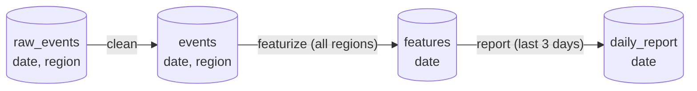

# Factories

> [!NOTE]
> Factories require `flyteplugins-union` 0.12.0 or later and flyte 2.10.0 or later: `pip install "flyteplugins-union>=0.12.0"`.

## Why factories

Three teams share one daily report. Ingest publishes `raw_events` every day for each region. The data team owns a `clean` task, the ML team owns `featurize`, which combines every region for a day, and the analytics team owns `report`, which reads the last three days of features.

On September 1, a bug fix lands in `clean`, and someone asks for the August reports to be regenerated. Now you have to work out:

* which days and regions of `raw_events` exist,
* which `events` partitions need to be rebuilt with the fixed code, and which `features` and reports depend on them,
* in what order to run 62 `clean` calls, 31 `featurize` calls, and 31 `report` calls, and
* how to pick up where you left off when day 17 fails.

[Artifact triggers](../triggers/artifact-triggers) don't help here. They push forward when a new version lands, but they can't answer "make the August reports exist." Usually someone ends up writing a one-off backfill script that knows the whole pipeline.

A factory replaces that script with a declaration. You describe once how each artifact is made from the others. Then you ask for the artifact you want:





```bash
flyte factory materialize analytics daily_report --partition date=2026-08-01..2026-08-31
```






```python
run = analytics.materialize(daily_report, date="2026-08-01..2026-08-31")
```





Union works backwards from `daily_report`. It reuses every partition that is still fresh, builds the rest in dependency order and in parallel, and publishes each result as an artifact version. Run the same command again and nothing is rebuilt. If day 17 failed, only day 17 and what depends on it run.

## What a factory is

A factory is a graph of [artifacts](../artifacts/_index). You ask it for data, and it works out which tasks to run.



It is made of three things:

* **Sources.** Artifacts made outside the factory, such as `raw_events` above. The factory finds them in the registry.
* **Builds.** One task call that makes one or more artifacts from other artifacts and constants. The tasks are ordinary deployed tasks. They take plain inputs and return plain outputs, and they don't know the factory exists.
* **Materializations.** A request to make one artifact for a partition or a range. A materialization is a single run: every partition that needs building becomes a child action, and a partition whose inputs and code haven't changed is a cache hit.

A factory is like a Makefile for data. A source is a file with no rule, a build is a rule, and materializing is `make <target>`. "Is it up to date?" is answered by the task cache.

## How factories connect the platform

Everything a factory produces is an ordinary, partitioned artifact version, published with the action that built it as its source. That makes the factory the piece that ties the rest of Union together:

| Piece | Role | With a factory |
|---|---|---|
| [Tasks](../tasks/_index) | The work | Each build is a task you already have, owned by whichever team wrote it |
| [Artifacts](../artifacts/_index) | Named, versioned, partitioned data | The nodes of the graph, and what you ask for |
| [Triggers](../triggers/_index) | Push: react when new data lands | Downstream `OnArtifact` triggers fire on the versions a factory publishes |
| [Apps](../apps/_index) | Serve models and data | Mount the artifacts a factory keeps up to date |
| [Lineage](../artifacts/lineage) | Where data came from | Every version points at the action that built it |

Triggers push work forward when data arrives. Factories pull: they make sure the data you need exists for the partitions you ask for.

## When to use one

Use a factory when your data is partitioned, when it passes through tasks owned by different teams, or when you need to backfill or rebuild ranges. If one task calls a few others and you never ask for historical partitions, plain task calls are simpler.




Describe how each artifact is made with sources and builds, map partitions between them, and name the outputs of multi-output tasks.



Deploy a factory, then build one partition or a whole range, preview the plan, rebuild after a code change, and resume a failed backfill.



