# Feature showcase

This example demonstrates a resilient agentic report generator that showcases
Flyte 2.0's advanced features for building production-grade AI workflows.

## What you'll build

An intelligent report generator that:
1. Generates an initial draft using an LLM
2. Iteratively critiques and refines the draft until it meets a quality threshold
3. Produces multiple output formats (Markdown, HTML, summary) in parallel

## Concepts covered

| Feature | Description |
|---------|-------------|
| `ReusePolicy` | Keep containers warm between tasks for cost efficiency |
| `@flyte.trace` | Checkpoint LLM calls for recovery and observability |
| `RetryStrategy` | Handle transient API failures gracefully |
| `flyte.group` | Organize agentic iterations in the UI |
| `asyncio.gather` | Run independent operations in parallel |
| Pydantic models | Structured LLM outputs |

## Architecture

```mermaid
flowchart TD
    A[Topic Input] --> B

    B["generate_initial_draft<br/><i>RetryStrategy + @flyte.trace</i>"]
    B --> C

    subgraph C ["refinement_loop"]
        direction TB
        D[critique_content] -->|score >= threshold| E[exit loop]
        D -->|score < threshold| F[revise_content]
        F --> D
    end
    C --> H

    H["format_outputs<br/><i>asyncio.gather (parallel)</i><br/>• Markdown, HTML, Summary"]
    H --> I[Output: Dir with formatted docs]
```



## Prerequisites

- A  account with an active project
- An OpenAI API key stored as a secret named `openai-api-key`

To create the secret:

```bash
flyte secret create openai-api-key
```

## Parts

1. **[Resilient generation](resilient-generation)**: Set up reusable environments, traced LLM calls, and retry strategies
2. **[Agentic refinement](agentic-refinement)**: Build the iterative critique-and-revise loop
3. **[Parallel outputs](parallel-outputs)**: Generate multiple formats concurrently
4. **[Serving app](serving-app)**: Deploy an interactive UI for report generation

## Key takeaways

1. **Reusable environments**: `ReusePolicy` keeps containers warm, reducing cold start
   latency and improving cost efficiency for bursty LLM workloads.

2. **Checkpointed LLM calls**: `@flyte.trace` provides automatic checkpointing at the
   function level, enabling recovery without re-running expensive API calls.

3. **Agentic patterns**: The generate-critique-revise loop demonstrates how to build
   self-improving AI workflows with clear observability through `flyte.group`.

4. **Parallel execution**: `asyncio.gather` runs independent operations concurrently,
   maximizing throughput when generating multiple output formats.
