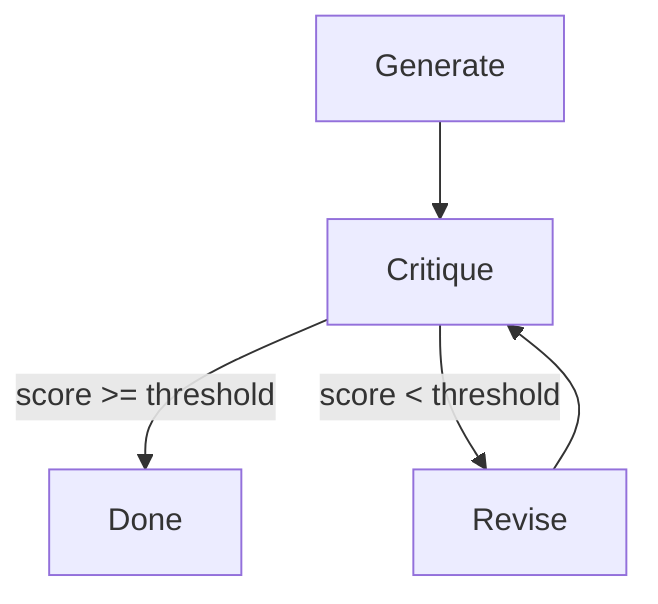

# Agentic refinement

The core of this example is an agentic refinement loop: generate content, critique
it, revise based on feedback, and repeat until quality meets a threshold. This
pattern is fundamental to building self-improving AI systems.

## The agentic pattern

Traditional pipelines are linear: input → process → output. Agentic workflows
are iterative: they evaluate their own output and improve it through multiple
cycles.



## Critique task

The critique task evaluates the current draft and returns structured feedback:



Key points:
- Uses `json_mode=True` to ensure the LLM returns valid JSON
- Parses the response into a Pydantic `Critique` model
- Returns a typed object for reliable downstream processing

## Revise task

The revise task takes the current draft and specific improvements to address:



The prompt includes:
1. The list of improvements from the critique
2. The current draft to revise

This focused approach helps the LLM make targeted changes rather than rewriting
from scratch.

## The refinement loop

The `refine_report` task orchestrates the iterative refinement:



### How it works

1. **Generate initial draft**: Creates the first version of the report
2. **Enter refinement loop**: Iterates up to `max_iterations` times
3. **Critique**: Evaluates the current draft and assigns a score
4. **Check threshold**: If score meets `quality_threshold`, exit early
5. **Revise**: If below threshold, revise based on improvements
6. **Repeat**: Continue until threshold met or iterations exhausted

### Early exit

The `if critique.score >= quality_threshold: break` pattern enables early exit
when quality is sufficient. This saves compute costs and time—no need to run
all iterations if the first draft is already good.

## Grouping iterations with flyte.group

Each refinement iteration is wrapped in `flyte.group`:

```python
for i in range(max_iterations):
    with flyte.group(f"refinement_{i + 1}"):
        critique = await critique_content(draft)
        # ...
```

### Why use flyte.group?

Groups provide hierarchical organization in the Flyte UI:

```
report_pipeline
├── generate_initial_draft
├── refinement_1
│   ├── critique_content
│   └── revise_content
├── refinement_2
│   ├── critique_content
│   └── revise_content
└── format_outputs
```

Benefits:
- **Clarity**: See exactly how many iterations occurred
- **Debugging**: Quickly find which iteration had issues
- **Observability**: Track time spent in each refinement cycle

### Group context

Groups are implemented as context managers. All traced calls and nested groups
within the `with flyte.group(...)` block are associated with that group.

## Configuring the loop

The refinement loop accepts parameters to tune its behavior:

| Parameter | Default | Description |
|-----------|---------|-------------|
| `max_iterations` | 3 | Upper bound on refinement cycles |
| `quality_threshold` | 8 | Minimum score (1-10) to accept |

### Choosing thresholds

- **Higher threshold** (9-10): More refinement cycles, higher quality, more API costs
- **Lower threshold** (6-7): Faster completion, may accept lower quality
- **More iterations**: Safety net for difficult topics
- **Fewer iterations**: Cost control, faster turnaround

A good starting point is `quality_threshold=8` with `max_iterations=3`. Adjust
based on your quality requirements and budget.

## Best practices for agentic loops

1. **Always set max iterations**: Prevent infinite loops if the quality threshold
   is never reached.

2. **Use structured critiques**: Pydantic models ensure you can reliably extract
   the score and improvements from LLM responses.

3. **Log iteration progress**: Print statements help debug when reviewing logs:
   ```python
   print(f"Iteration {i + 1}: score={critique.score}")
   ```

4. **Consider diminishing returns**: After 3-4 iterations, improvements often
   become marginal. Set `max_iterations` accordingly.

5. **Use groups for observability**: `flyte.group` makes the iterative nature
   visible in the UI, essential for debugging and monitoring.

## Next steps

With the agentic refinement loop complete, learn how to
[generate multiple outputs in parallel](parallel-outputs).
