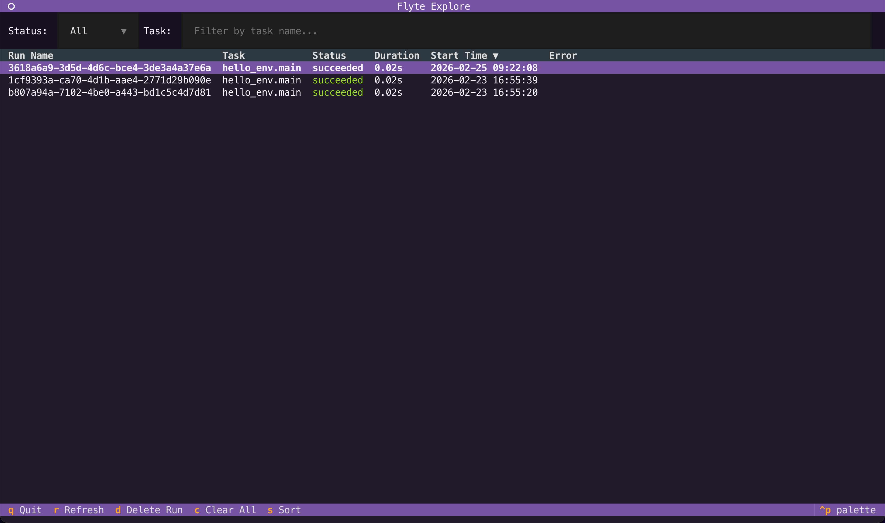
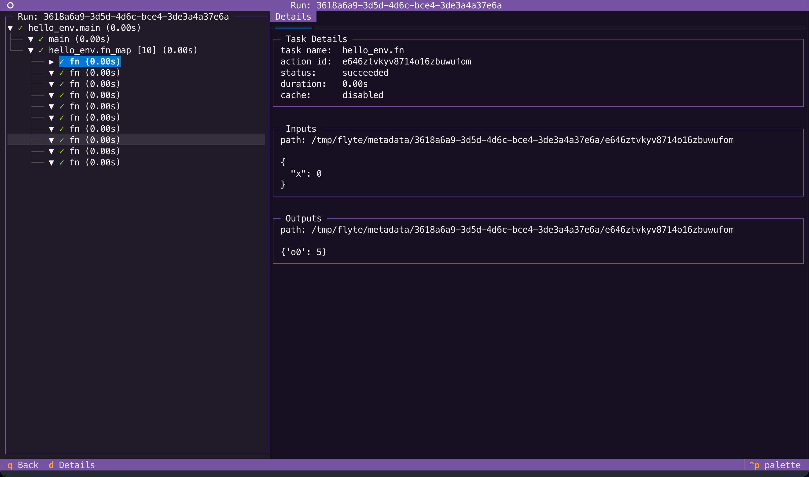

# Quickstart

> [!NOTE] Try it in your browser
> Prefer not to install anything? Follow along with this quickstart in Google Colab.
>
> [](https://colab.research.google.com/github/unionai/unionai-examples/blob/main/v2/user-guide/getting-started/ten_minutes_to_flyte.ipynb)

Let's get you up and running with your first workflow on your local machine.


## What you'll need

- Python 3.10+ in a virtual environment

## Install the SDK

Install the `flyte` package:

```bash
pip install 'flyte[tui]'
```


We also install the `tui` extra to enable the terminal user interface.


Verify it worked:

```bash
flyte --version
```

Output:

```bash
Flyte SDK version: 2.*.*
```


If you have [`uv`](https://docs.astral.sh/uv/) installed, you can run the `flyte` CLI directly with `uvx`, without installing the package into your environment:

```bash
uvx flyte --version
uvx flyte get run
```



## Configure

Create a config file for local execution. Runs will be persisted locally in a SQLite database.

```bash
flyte create config --local-persistence
```

This creates `.flyte/config.yaml` in your current directory.


See [Setting up a configuration file](./run-modes/running-devbox#configure) for more options when connecting to a cluster.




See [Setting up a configuration file](./run-modes/running-remote#configuration-file) for more options.




Run `flyte get config` to check which configuration is currently active.


## Write your first workflow

> [!TIP] Author workflows with an AI assistant
> [`flyte-agent-plugins`](https://github.com/flyteorg/flyte-agent-plugins) — a
> portable agent harness plugin for Claude Code, Codex, OpenCode, and other
> harnesses — adds skills that scaffold projects and generate tasks, workflows,
> apps, and tests for you, plus MCP servers that ground the agent in the Flyte SDK
> and docs. See [Flyte agent plugins](../../api-reference/agent-plugins) to get started.

Create `hello.py`:



Here's what's happening:

- **`TaskEnvironment`** specifies configuration for your tasks (container image, resources, etc.)
- **`@env.task`** turns Python functions into tasks that run remotely
- Both tasks share the same `env`, so they'll have identical configurations

## Run it

Create a project directory and place your files there:

```
.
├── hello.py
└── .flyte
    └── config.yaml
```

> [!WARNING]
> Do not run `flyte run` from your home directory. Flyte packages the current directory when running remotely, so running from `$HOME` would attempt to bundle your entire home folder. Always work from a dedicated project directory.

Run the workflow:

```bash
flyte run --local hello.py main
```

This executes the workflow locally on your machine.

## See the results

You can see the run in the TUI by running:

```bash
flyte start tui
```

The TUI will open into the explorer view



To navigate to the run details, double-click it or press `Enter` to view the run details.



## Next steps

Now that you've run your first workflow:




- [**Core concepts**](./core-concepts/_index): Understand the core concepts of Flyte programming
- [**Run locally**](./run-modes/running-locally): Learn about the TUI, caching, and other features that work locally
- [**Run on the devbox**](./run-modes/running-devbox): Learn about the devbox cluster and how to run workflows on it






- [**Core concepts**](./core-concepts/_index): Understand the core concepts of Flyte programming
- [**Run locally**](./run-modes/running-locally): Learn about the TUI, caching, and other features that work locally
- [**Run on the devbox**](./run-modes/running-devbox): Learn about the devbox cluster and how to run workflows on it
- [**Run on a remote cluster**](./run-modes/running-remote): Configure your environment for remote execution


