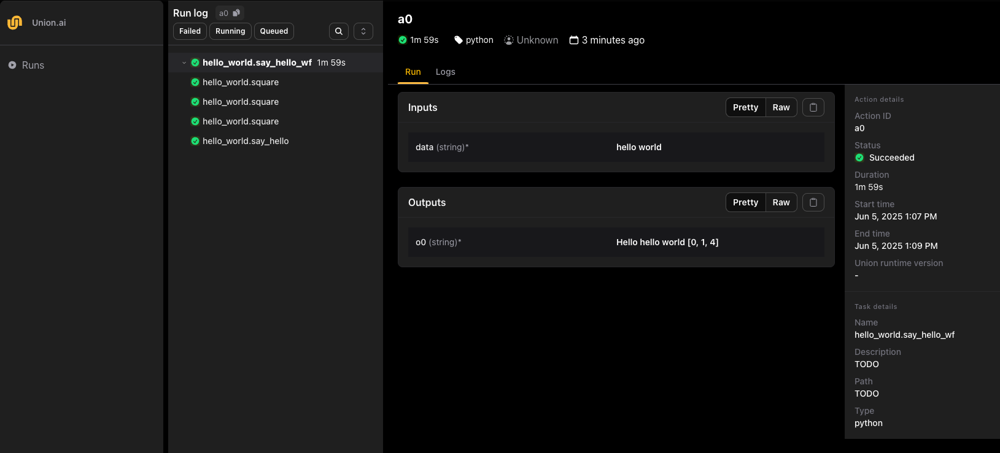

# Getting started

This section gives you a quick introduction to writing and running workflows on Union and Flyte v2.

## Configuration setup

First, make sure you are in a Python virtual environment, then install the v2 SDK.
For example, you can use the [`uv` package manager](https://docs.astral.sh/uv/) to create a virtual environment and install the `flyte` package like this:

```shell
uv venv
source .venv/bin/activate
uv pip install --no-cache --prerelease=allow --upgrade flyte
```

Next, create a `config.yaml` file in the same directory as your `hello.py` file that points to your Union instance using the [flyte create config](../api-reference/flyte-cli#flyte-create-config) command:

```shell
flyte create config \
    --endpoint <your-union-endpoint> \
    --project <default-project> \
    --domain <default-domain>
```

For example, your config file might look like:

```shell
flyte create config \
    --endpoint demo.hosted.unionai.cloud \
    --project flytesnacks \
    --domain development
```

Note that [the configuration](./configuring-and-running#setting-up-a-configuration-file) includes a default project (`<default-project>`) and domain (`<default-domain>`).
The default project and domain will be used when you deploy your workflows without specifying a project or domain explicitly.

A quick way to get your Union endpoint is to go to the UI and copy the first part of the URL.


## Hello world

We'll start with a "Hello world" example.

Create a file called `hello.py` with the following content:



## Running remotely

Now, simply run the script:

```shell
python hello.py
```

You can also run using the CLI:

```shell
flyte run hello.py main --x_list '[0, 1, 2, 3, 4, 5, 6, 7, 8, 9]'
```

You should see an output like this:

```shell
$ python hello.py
cg9s54pksbjsdxlz2gmc
https://playground.canary.unionai.cloud/v2/runs/project/flytesnacks/domain/development/cg9s54pksbjsdxlz2gmc
Run 'a0' completed successfully.
```

Click the link to go to your Union instance and see the run in the UI:



