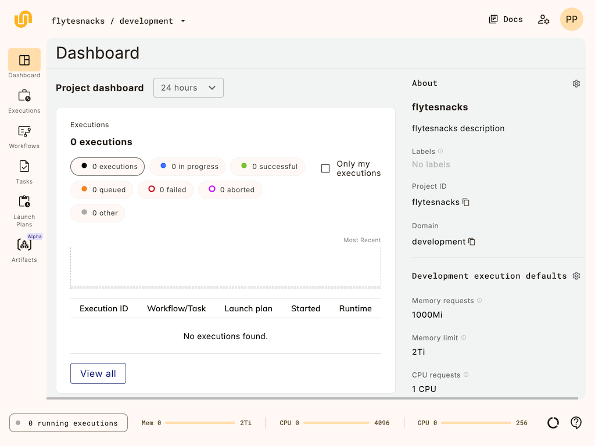

# Getting started



This section gives you a quick introduction to writing and running  workflows.




## Gather your credentials

After your administrator has onboarded you to  (see [Deployment](../../deployment)), you should have the following at hand:

- Your  credentials.
- The URL of your  instance. We will refer to this as `<union-host-url>` below.

## Log into 

Navigate to the UI at `<union-host-url>` and log in with your credentials.
Once you have logged in you should see the  UI.

To get started, try selecting the default project, called ``, from the list of projects.
This will take you to `` project dashboard:

This dashboard gives you an overview of the workflows and tasks in your project.
Since you are just starting out, it will be empty.
To build and deploy your first workflow, the first step is to [set up your local environment](./local-setup).






## Try Flyte on your local machine

You can also install Flyte's SDK (called `flytekit`) and a local Flyte cluster to run workflows on your local machine.

To get started, follow the instructions on the next page, [Local setup](./local-setup).



