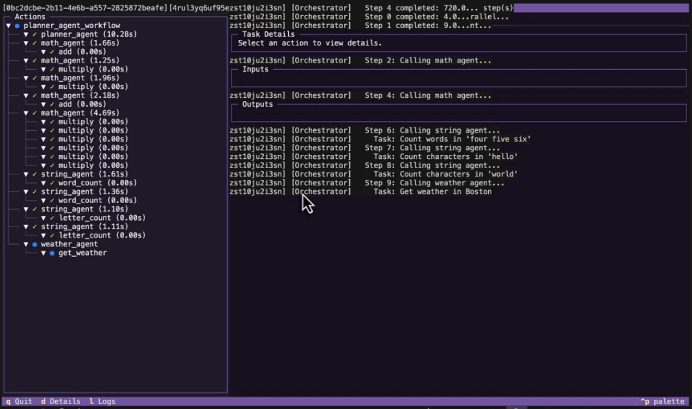

# Local AI Development with Flyte

Flyte gives you a local development toolkit for ML pipelines and AI agents. Cache expensive operations, generate HTML reports, perform lightweight experiment tracking, trace sub-task execution, and serve models, all from `pip install flyte`. No Flyte cluster or Docker needed.

When you're ready to scale, the same code runs on a remote Flyte cluster with GPUs. No rewrites.



---

## Getting Started

To run the terminal user interface (TUI) you'll also need an additional Python package installed along with the Flyte SDK.

```bash
pip install "flyte[tui]>=2.0"    
```

To enable run persistence so you can browse past runs, set local persistence to true in the Flyte config:

```yaml
# .flyte/config.yaml
local:
  persistence: true
```

That's it. Every feature below works with just these two steps.

---

## Features at a Glance

| Feature | What You Get | Key API |
|---------|-------------|---------|
| [TUI](#terminal-ui) | Live terminal dashboard with task tree, logs, and details | `--tui` flag |
| [Tracing](#tracing) | Sub-task visibility in the TUI | `@flyte.trace` |
| [Caching](#caching) | Skip recomputation on repeated inputs | `cache="auto"` |
| [Reports](#reports) | HTML and markdown dashboards generated from tasks | `report=True` |
| [Serving](#serving) | Run tasks as local API endpoints or apps | `flyte.with_servecontext()` |
| [Plugins](#plugins) | Integrate external tools like Weights & Biases | `@wandb_init` |

---

## TaskEnvironment

Even when running locally, every Flyte task must be defined within a [`TaskEnvironment`](../core-concepts/task-environment). This is what enables local features like caching, reporting, and the TUI. Without it, Flyte has no context to manage your task execution. Locally, settings like image, compute resources, and secrets are ignored and tasks run in your local Python environment.

```python
import flyte

env = flyte.TaskEnvironment(name="my_env")

@env.task
async def double(x: int) -> int:
    return x * 2

@env.task
async def add_one(x: int) -> int:
    return x + 1

@env.workflow
async def my_pipeline(x: int) -> int:
    doubled = await double(x=x)
    return await add_one(x=doubled)
```

Tasks can be composed into workflows by chaining them together with `@env.workflow`. Each task runs independently and Flyte manages the data flow between them.

When you're ready to run on a remote cluster, the same `TaskEnvironment` can be expanded to configure container images, compute resources, and secrets. See [`TaskEnvironment`](../core-concepts/task-environment) for details.

---

## Running tasks

Once you have a task defined within a `TaskEnvironment`, you can run it locally using the `flyte run` CLI. The `--local` flag tells Flyte to execute the task in your local Python environment rather than on a remote cluster. You can also add `--tui` to launch the interactive Terminal UI for real-time monitoring.

```bash
# Basic execution
flyte run --local my_pipeline.py my_task --arg value

# With the interactive TUI (see more in next section)
flyte run --local --tui my_pipeline.py my_task --arg value
```

You can also run tasks programmatically using the Python SDK with `flyte.run()`. See [Run and deploy tasks](../task-deployment/_index) for details.

Drop `--local` to run on a remote cluster if one is configured:

```bash
flyte run my_pipeline.py my_task --arg value
```

---

## Terminal UI

The TUI is an interactive split-screen dashboard. Task tree on the left, details and logs on the right.

```bash
flyte run --local --tui my_pipeline.py pipeline --epochs 5
```

This is useful for tracking ML training pipelines and AI agents with a lot of tool calls and sub-agents.


What you see:

- **Task tree** with live status: `●` running, `✓` done, `✗` failed
- **Cache indicators**: `$` cache hit, `~` cache enabled but missed
- **Live logs**: `print()` output streams in real time
- **Details panel**: inputs, outputs, timing, report paths
- **Traced sub-tasks**: child nodes for `@flyte.trace` decorated functions

Flyte persists the inputs and outputs of every task run locally, so you can always go back and inspect what a task received and produced. Combined with [Reports](#reports), which generate HTML summaries of metrics, charts, and results, this gives you a lightweight experiment management system.

**Keyboard shortcuts:**

| Key | Action |
|-----|--------|
| `q` | Quit |
| `d` | Details tab |
| `l` | Logs tab |

### Exploring past runs

You can also launch the TUI on its own to browse past runs, compare inputs and outputs, and review reports:

```bash
flyte start tui
```

### Tracing

Unlike `@env.task`, which defines an independent unit of work that Flyte schedules, caches, and tracks on its own, [`@flyte.trace`](../task-programming/traces) is for functions that run *inside* a task. A traced function must be called from within a task and can't run on its own. It gives you visibility into the internal steps of a task without the overhead of making each step a separate task.

Traced functions show up as child nodes under their parent task in the TUI, each with their own timing, inputs, and outputs.

```python
@flyte.trace
async def search(query: str) -> str:
    """Shows up as a child node under the parent task."""
    return await do_search(query)

@env.task
async def agent(request: str) -> str:
    results = await search(request)    # Traced, visible in TUI
    answer = await summarize(results)   # Also traced if decorated
    return answer
```

This is particularly useful for AI agents where you want to see exactly which tools were called, and for ML pipelines where you want to trace preprocessing or feature engineering steps within a larger task.

---

## Caching

Add `cache="auto"` to any task and Flyte stores its outputs in a local SQLite database, keyed on task name and inputs. Same inputs means instant results with no recomputation.

This speeds up your development loop significantly. Instead of re-running your entire pipeline on every change, only the tasks that actually changed will re-execute. Use it to skip re-downloading data, avoid replaying earlier steps in agentic chains, or bypass any expensive computation while you iterate.


```python
@env.task(cache="auto")
async def load_data(data_dir: str = "./data") -> str:
    """Downloads once, then returns instantly on subsequent runs."""
    # ... expensive download ...
    return data_dir
```

```bash
# First run: downloads data, trains model
flyte run --local --tui my_pipeline.py pipeline --epochs 5

# Second run: load_data cached ($), only training re-runs
flyte run --local --tui my_pipeline.py pipeline --epochs 10
```

On a remote cluster, the same `cache="auto"` uses the cluster's distributed cache store with no code changes.

Flyte also supports `cache="override"` for explicit version control over cache keys, and `cache="disable"` (the default) for tasks that should always re-run. You can also set caching at the `TaskEnvironment` level to apply a default across all tasks. See [Caching](../task-configuration/caching) for the full configuration options.

---

## Reports

Add `report=True` to a task and it can generate an HTML report (charts, tables, images, or any HTML content) saved alongside the task output. Reports give you a human-readable view of what a task produced, without digging through logs or raw data.

Combined with [caching](#caching) and the persisted inputs/outputs from each run, reports act as lightweight experiment tracking. Each run produces a self-contained HTML file you can open in a browser, compare across runs, and share with your team. No external experiment tracking tools needed.

See [Reports](../task-programming/reports) for the full API.

```python
import flyte.report

@env.task(report=True)
async def evaluate(model_file: File, test_data: str) -> str:
    # ... run evaluation ...

    await flyte.report.replace.aio(
        f"<h2>Training Report</h2>"
        f"<h3>Training Curves</h3>{charts_html}"
        f"<h3>Test Results</h3>"
        f"<p>Accuracy: {accuracy:.4f}</p>"
    )
    await flyte.report.flush.aio()

    return f"Accuracy: {accuracy:.4f}"
```

Locally, reports are saved as HTML files and the TUI shows the path. On a cluster, they render in the Flyte UI.

---

## Serving

Flyte's app framework lets you serve tasks as local API endpoints or interactive UIs during development, then deploy the same code to a remote cluster with no changes. See [Serve and deploy apps](../serve-and-deploy-apps/_index) for the full guide.

### FastAPI (model serving)

A common ML pattern: train a model with a Flyte pipeline, then serve predictions from it. During local development, the app loads the model from a local file (e.g. `model.pt` saved by your training pipeline). When deployed remotely, Flyte's `Parameter` system automatically resolves the model from the latest training run output.

```python
from contextlib import asynccontextmanager
from pathlib import Path
import os

from fastapi import FastAPI
import flyte
from flyte.app import Parameter, RunOutput
from flyte.app.extras import FastAPIAppEnvironment

MODEL_PATH_ENV = "MODEL_PATH"

@asynccontextmanager
async def lifespan(app: FastAPI):
    """Load model on startup, either local file or remote run output."""
    model_path = Path(os.environ.get(MODEL_PATH_ENV, "model.pt"))
    model = load_model(model_path)
    app.state.model = model
    yield

app = FastAPI(title="MNIST Predictor", lifespan=lifespan)

serving_env = FastAPIAppEnvironment(
    name="mnist-predictor",
    app=app,
    parameters=[
        # Remote: resolves model from the latest train run and sets MODEL_PATH
        Parameter(
            name="model",
            value=RunOutput(task_name="ml_pipeline.pipeline", type="file", getter=(1,)),
            download=True,
            env_var=MODEL_PATH_ENV,
        ),
    ],
    image=flyte.Image.from_debian_base(python_version=(3, 12)).with_pip_packages(
        "fastapi", "uvicorn", "torch", "torchvision",
    ),
    resources=flyte.Resources(cpu=1, memory="4Gi"),
)

@app.get("/predict")
async def predict(index: int = 0) -> dict:
    return {"prediction": app.state.model(index)}

if __name__ == "__main__":
    # Local: skip RunOutput resolution, lifespan falls back to local model.pt
    serving_env.parameters = []
    local_app = flyte.with_servecontext(mode="local").serve(serving_env)
    local_app.activate(wait=True)
```

```bash
# Local: loads model.pt from disk
python serve_model.py

# Remote: resolves model from latest training run
flyte deploy serve_model.py serving_env
```

### Gradio (agent UI)

For AI agents, a Gradio app lets you build an interactive UI that kicks off agent runs. The app uses `flyte.with_runcontext()` to run the agent task either locally or on a remote cluster, controlled by an environment variable.

```python
import os
import flyte
import flyte.app
from research_agent import agent

RUN_MODE = os.getenv("RUN_MODE", "remote")

serving_env = flyte.app.AppEnvironment(
    name="research-agent-ui",
    image=flyte.Image.from_debian_base(python_version=(3, 12)).with_pip_packages(
        "gradio", "langchain-core", "langchain-openai", "langgraph",
    ),
    secrets=flyte.Secret(key="OPENAI_API_KEY", as_env_var="OPENAI_API_KEY"),
    port=7860,
)

def run_query(request: str):
    """Kick off the agent as a Flyte task."""
    result = flyte.with_runcontext(mode=RUN_MODE).run(agent, request=request)
    result.wait()
    return result.outputs()[0]

@serving_env.server
def app_server():
    create_demo().launch(server_name="0.0.0.0", server_port=7860)

if __name__ == "__main__":
    create_demo().launch()
```

The `RUN_MODE` variable gives you a smooth development progression:

1. **Fully local**: `RUN_MODE=local python agent_app.py`. Everything runs in your local Python environment, great for rapid iteration.
2. **Local app, remote task**: `python agent_app.py`. The UI runs locally but the agent executes on the cluster with full compute resources.
3. **Full remote**: `flyte deploy agent_app.py serving_env`. Both the UI and agent run on the cluster.

---

## Plugins

Flyte's plugin system integrates external tools directly into your tasks. Plugins add decorators and context functions that work in both local and remote execution. Install a package, add a decorator, and you're set. See the full list at [Integrations](../../integrations/_index).

### Weights & Biases

The `flyteplugins-wandb` package adds W&B experiment tracking with a single decorator:

```python
from flyteplugins.wandb import wandb_init, get_wandb_run

@wandb_init(project="my-project")
@env.task
async def train(epochs: int = 5) -> str:
    run = get_wandb_run()
    for epoch in range(epochs):
        # ... training ...
        if run:
            run.log({"loss": epoch_loss, "acc": epoch_acc})
    return "done"
```

Key features:

- `@wandb_init` on the parent task creates a W&B run
- Child tasks with `@wandb_init` automatically share the parent's run
- `get_wandb_run()` returns the active run for logging
- `flyte.Secret(key="wandb_api_key", as_env_var="WANDB_API_KEY")` for authentication

```bash
# Local
WANDB_API_KEY=your-key flyte run --local --tui wandb_pipeline.py pipeline

# Remote
flyte create secret wandb_api_key <your-key>
flyte run wandb_pipeline.py pipeline
```

### OpenAI

The `flyteplugins-openai` package provides a drop-in replacement for the OpenAI SDK that adds observability and caching to LLM calls. See [OpenAI integration](../../integrations/openai/_index) for details.

### Distributed compute

When you're ready to scale beyond your local machine, Flyte plugins can provision ephemeral compute clusters on demand:

- **[Spark](../../integrations/spark/_index)**: large-scale data processing and ETL (`flyteplugins-spark`)
- **[Ray](../../integrations/ray/_index)**: distributed Python, ML training, and hyperparameter tuning (`flyteplugins-ray`)
- **[Dask](../../integrations/dask/_index)**: parallel Python workloads and dataframe operations (`flyteplugins-dask`)
- **[PyTorch](../../integrations/pytorch/_index)**: distributed training with elastic launch (`flyteplugins-pytorch`)

---

## A note on secrets

Most AI development involves API keys and credentials. Locally, Flyte reads secrets from your environment. Use a `.env` file or export them directly:

```bash
# .env
OPENAI_API_KEY=sk-...
WANDB_API_KEY=...
```

When you move to a cluster, define secrets in your `TaskEnvironment` with `flyte.Secret` and Flyte manages them for you. The same code works in both environments. See [Secrets](../task-configuration/secrets) for full details.

---

## Local to remote

The same code runs in both environments. Here's what changes:

| Feature | Local | Remote |
|---------|-------|--------|
| **Run pipeline** | `flyte run --local` | `flyte run` |
| **TUI** | `--tui` flag | Dashboard in Flyte UI |
| **Caching** | `cache="auto"`, local SQLite | `cache="auto"`, cluster cache |
| **Reports** | `report=True`, local HTML file | `report=True`, in Flyte UI |
| **Serving** | `python serve.py` | `flyte deploy serve.py env` |
| **Model loading in app2** | Falls back to local file | `RunOutput` resolves from pipeline |
| **Secrets** | `.env` / environment variables | `flyte create secret` / `flyte.Secret` |
| **W&B plugin** | `@wandb_init` + env var | `@wandb_init` + `flyte.Secret` |
| **Compute** | Your CPU/GPU | `Resources(cpu=2, memory="4Gi", gpu=1)` |

The [`TaskEnvironment`](../core-concepts/task-environment) is the bridge. Locally, image and resources are ignored. On the cluster, Flyte builds containers and allocates compute from the same definition.

---

## Next steps

When you're ready to run on a remote Flyte cluster, see [Local setup](../local-setup) to configure the CLI and SDK to connect to your cluster.
