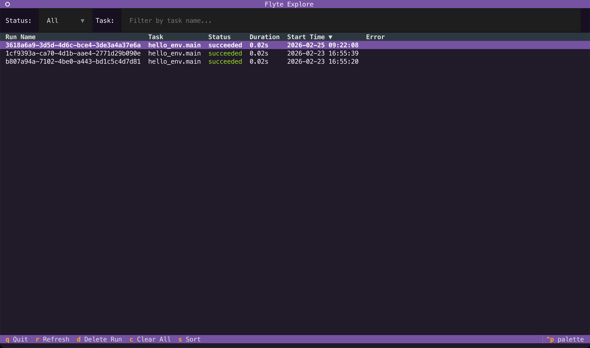
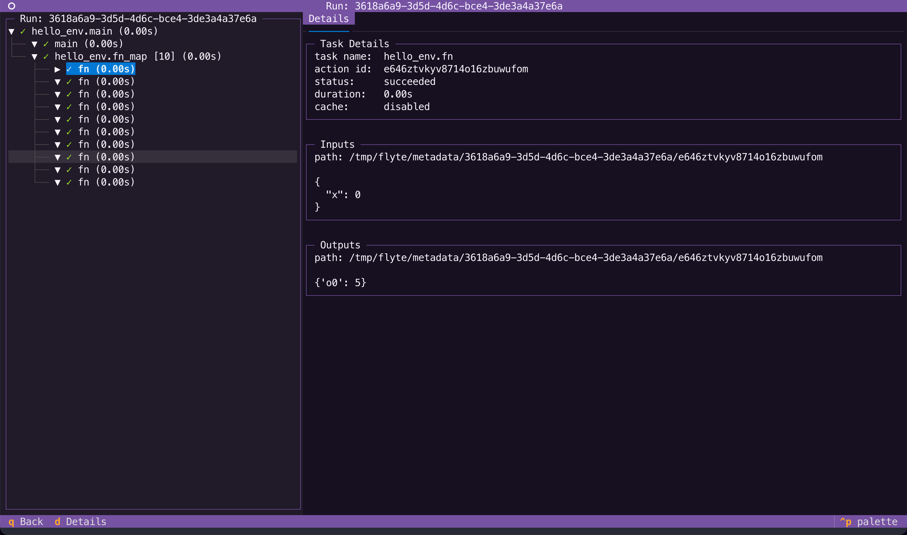

# Quickstart

Let's get you up and running with your first workflow on your local machine.


Want to try Flyte without installing anything? [Try Flyte 2 in your browser](https://flyte2intro.apps.demo.hosted.unionai.cloud/).


## What you'll need

- Python 3.10+ in a virtual environment

## Install the SDK

Install the `flyte` package:

```shell
pip install 'flyte[tui]'
```

We also install the `tui` extra to enable the terminal user interface.


Verify it worked:

```shell
flyte --version
```

Output:

```
Flyte SDK version: 2.*.*
```

## Configure

Create a config file for local execution. Runs will be persisted locally in a SQLite database.

```shell
flyte create config --local-persistence
```

This creates `.flyte/config.yaml` in your current directory. See [Setting up a configuration file](./connecting-to-a-cluster#configuration-file) for more options.


Run `flyte get config` to check which configuration is currently active.


## Write your first workflow

Create `hello.py`:



Here's what's happening:

- **`TaskEnvironment`** specifies configuration for your tasks (container image, resources, etc.)
- **`@env.task`** turns Python functions into tasks that run remotely
- Both tasks share the same `env`, so they'll have identical configurations

## Run it

With your config file in place:

```
.
├── hello.py
└── .flyte
    └── config.yaml
```

Run the workflow:

```shell
flyte run --local hello.py main
```

This executes the workflow locally on your machine.

## See the results

You can see the run in the TUI by running:

```shell
flyte start tui
```

The TUI will open into the explorer view



To navigate to the run details, double-click it or press `Enter` to view the run details.



## Next steps

Now that you've run your first workflow:

- [**Core concepts**](./core-concepts/_index): Understand the core concepts of Flyte programming
- [**Running locally**](./running-locally): Learn about the TUI, caching, and other features that work locally
- [**Connecting to a cluster**](./connecting-to-a-cluster): Configure your environment for remote execution
