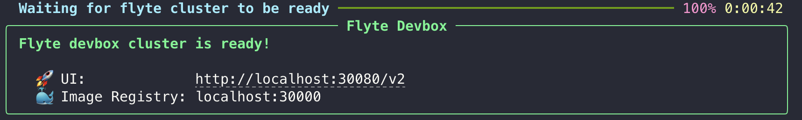
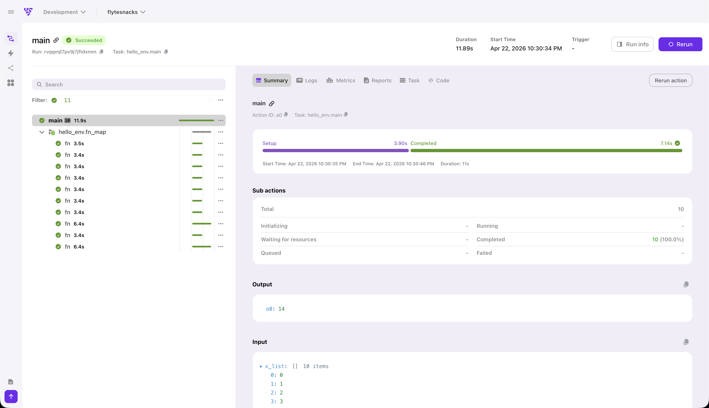

# Running on the devbox

The Flyte devbox is a lightweight local cluster that runs on your machine with Docker. It gives you a full Flyte environment — including the UI, scheduler, and object store — so you can test remote execution without deploying to a real cluster.

## What you'll need

- Python 3.10+ in a virtual environment
- [Docker](https://docs.docker.com/get-docker/) installed and running

## Install the SDK

If you haven't already, install the `flyte` package:

```bash
pip install flyte
```

## Start the devbox

Launch the local cluster:




```bash
flyte start devbox
```





```bash
flyte start devbox --gpu
```



The `--gpu` flag requires an NVIDIA-enabled host. It currently *does not* support Apple Silicon or AMD GPUs.







This pulls the necessary containers and starts a local Flyte instance. Once ready, the Flyte UI is available at `http://localhost:30080`.


The first start may take a few minutes while Docker images are downloaded.


## Configure

Create a config file that points to the devbox:

```bash
flyte create config \
    --endpoint localhost:30080 \
    --project flytesnacks \
    --domain development \
    --builder local \
    --insecure
```

This creates `.flyte/config.yaml` configured to talk to your local devbox cluster.

## Run a workflow on the devbox

Using the same `hello.py` from the [Quickstart](../quickstart):



Run it on the devbox:

```bash
flyte run hello.py main
```

Without the `--local` flag, the workflow runs on the devbox cluster rather than in your local Python process. Tasks execute inside containers, just like they would on a remote cluster.

## View results in the UI

Open `http://localhost:30080` to see your workflow execution in the Flyte UI. You can inspect task inputs, outputs, logs, and execution timelines.



## Stop the devbox

When you're done, shut down the cluster:

```bash
flyte stop devbox
```

## Inline configuration

Skip the config file entirely by passing parameters directly.




Use [`flyte.init`](../../api-reference/flyte-sdk/packages/flyte/_index#init):

```python
flyte.init(
    endpoint="localhost:30080",
    project="flytesnacks",
    domain="development",
    insecure=True,
)
```




Some parameters go after `flyte`, others after the subcommand:

```bash
flyte \
    --endpoint localhost:30080 \
    --insecure \
    --builder local \
    run \
    --domain development \
    --project flytesnacks \
    hello.py \
    main
```

See the [CLI reference](../../api-reference/flyte-cli) for details.





## Delete the devbox

```bash
flyte delete devbox  # add the --volume flag to delete the Docker volume
```

## Using a CUDA-enabled GPU host

If you started the devbox with `flyte start devbox --gpu`, you can use GPUs in your workflows.

```python
import flyte

env = flyte.TaskEnvironment(
    name="gpu_env",
    resources=flyte.Resources(gpu=1),
)

@env.task
def gpu_task() -> bool:
    return torch.cuda.is_available()  # returns True if CUDA (provided by a GPU) is available
```

## Next steps




With your environment fully configured, you're ready to build:

- [**Core concepts**](../core-concepts/_index): Understand `TaskEnvironment`s, tasks, runs, and actions through working examples.







When you're ready to run on a remote Flyte cluster, see [Running on a remote cluster](./running-remote) to configure the CLI and SDK.



