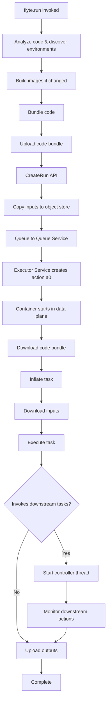
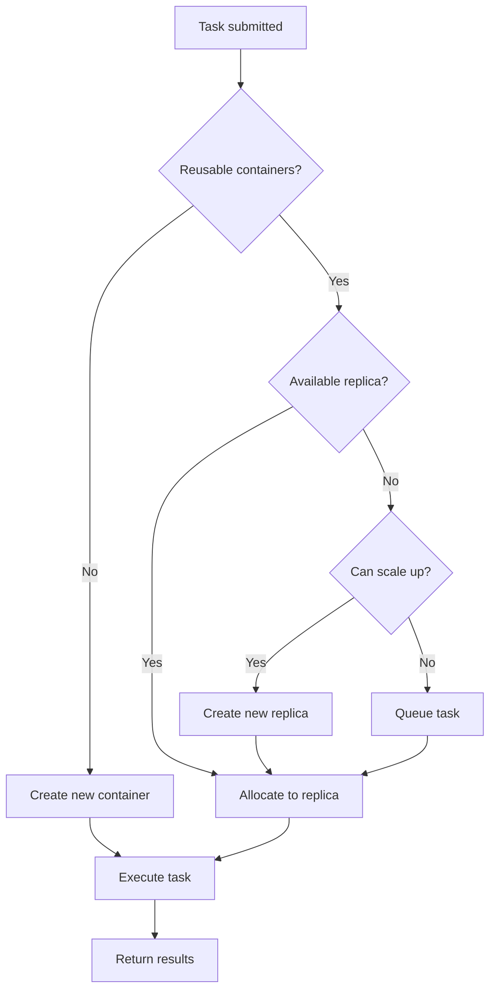

# Life of a run

Understanding what happens when you invoke `flyte.run()` is crucial for optimizing workflow performance and debugging issues. This guide walks through each phase of task execution from submission to completion.

## Overview

When you execute `flyte.run()`, the system goes through several phases:

1. **Code analysis and preparation**: Discover environments and images
2. **Image building**: Build container images if changes are detected
3. **Code bundling**: Package your Python code
4. **Upload**: Transfer the code bundle to object storage
5. **Run creation**: Submit the run to the backend
6. **Task execution**: Execute the task in the data plane
7. **State management**: Track and persist execution state

## Phase 1: Code analysis and preparation

When `flyte.run()` is invoked:

1. **Environment discovery**: Flyte analyzes your code and finds all relevant `flyte.TaskEnvironment` instances by walking the `depends_on` hierarchy.
2. **Image identification**: Discovers unique `flyte.Image` instances used across all environments.
3. **Image building**: Starts the image building process. Images are only built if a change is detected.

> [!NOTE]
> If you invoke `flyte.run()` multiple times within the same Python process without changing code (such as in a notebook or script), the code bundling and image building steps are done only once. This can dramatically speed up iteration.

## Phase 2: Image building

Container images provide the runtime environment for your tasks:

- **Change detection**: Images are only rebuilt if changes are detected in dependencies or configuration.
- **Caching**: Previously built images are reused when possible.
- **Parallel builds**: Multiple images can be built concurrently.

For more details on container images, see [Container Images](../task-configuration/container-images).

## Phase 3: Code bundling

After images are built, your project files are bundled:

### Default: `copy_style="loaded_modules"`

By default, all Python modules referenced by the invoked tasks through module-level import statements are automatically copied. This provides a good balance between completeness and efficiency.

### Alternative: `copy_style="none"`

Skip bundling by setting `copy_style="none"` in `flyte.with_runcontext()` and adding all code into `flyte.Image`:

```python
# Add code to image
image = flyte.Image().with_source_code("/path/to/code")

# Or use Dockerfile
image = flyte.Image.from_dockerfile("Dockerfile")

# Skip bundling
run = flyte.with_runcontext(copy_style="none").run(my_task, input_data=data)
```

For more details on code packaging, see [Packaging](../task-deployment/packaging).

## Phase 4: Upload code bundle

Once the code bundle is created:

1. **Negotiate signed URL**: The SDK requests a signed URL from the backend.
2. **Upload**: The code bundle is uploaded to the signed URL location in object storage.
3. **Reference stored**: The backend stores a reference to the uploaded bundle.

## Phase 5: Run creation and queuing

The `CreateRun` API is invoked:

1. **Copy inputs**: Input data is copied to the object store.
2. **Queue run**: The run is queued into the Queue Service.
3. **Hand off to executor**: Queue Service hands the task to the Executor Service in your data plane.
4. **Create action**: The parent task action (called `a0`) is created.

## Phase 6: Task execution in data plane

### Container startup

1. **Container starts**: The task container starts in your data plane.
2. **Download code bundle**: The Flyte runtime downloads the code bundle from object storage.
3. **Inflate task**: The task is inflated from the code bundle.
4. **Download inputs**: Inline inputs are downloaded from the object store.
5. **Execute task**: The task is executed with context and inputs.

### Invoking downstream tasks

If the task invokes other tasks:

1. **Controller thread**: A controller thread starts to communicate with the backend Queue Service.
2. **Monitor status**: The controller monitors the status of downstream actions.
3. **Crash recovery**: If the task crashes, the action identifier is deterministic, allowing the task to resurrect its state from Queue Service.
4. **Replay**: The controller efficiently replays state (even at 100k scale) to find missing completions and resume monitoring.

### Execution flow diagram



## Action identifiers and crash recovery

Flyte uses deterministic action identifiers to enable robust crash recovery:

- **Consistent identifiers**: Action identifiers are consistently computed based on task and invocation context.
- **Re-run identical**: In any re-run, the action identifier is identical for the same invocation.
- **Multiple invocations**: Multiple invocations of the same task receive unique identifiers.
- **Efficient resurrection**: On crash, the `a0` action resurrects its state from Queue Service efficiently, even with 100k actions.
- **Replay and resume**: The controller replays execution until it finds missing completions and starts watching them.

## Downstream task execution

When downstream tasks are invoked:

1. **Action creation**: Downstream actions are created with unique identifiers.
2. **Queue assignment**: Actions are handed to an executor, which can be selected using a queue or from the general pool.
3. **Parallel execution**: Multiple downstream tasks can execute in parallel.
4. **Result aggregation**: Results are aggregated and returned to the parent task.

## Reusable containers

When using [reusable containers](../task-configuration/reusable-containers), the execution model changes:

1. **Environment spin-up**: The container environment is first spun up with configured replicas.
2. **Task allocation**: Tasks are allocated to available replicas in the environment.
3. **Scaling**: If all replicas are busy, new replicas are spun up (up to the configured maximum), or tasks are backlogged in queues.
4. **Container reuse**: The same container handles multiple task executions, reducing startup overhead.
5. **Lifecycle management**: Containers are managed according to `ReusePolicy` settings (`idle_ttl`, `scaledown_ttl`, etc.).

### Reusable container execution flow



## State replication and visualization

### Queue Service to Run Service

1. **Reliable replication**: Queue Service reliably replicates execution state back to Run Service.
2. **Eventual consistency**: The Run Service may be slightly behind the actual execution state.
3. **Visualization**: Run Service paints the entire run onto the UI.

### UI limitations

- **Current limit**: The UI is currently limited to displaying 50k actions per run.
- **Future improvements**: This limit will be increased in future releases. Contact the Union team if you need higher limits.

## Optimization opportunities

Understanding the life of a run reveals several optimization opportunities:

1. **Reuse Python process**: Run `flyte.run()` multiple times in the same process to avoid re-bundling code.
2. **Skip bundling**: Use `copy_style="none"` and bake code into images for faster startup.
3. **Reusable containers**: Use reusable containers to eliminate container startup overhead.
4. **Parallel execution**: Invoke multiple downstream tasks concurrently using `flyte.map()` or `asyncio`.
5. **Efficient data flow**: Minimize data transfer by using reference types (files, directories) instead of inline data.
6. **Caching**: Enable task caching to avoid redundant computation.

For detailed performance tuning guidance, see [Scale your workflows](performance).
