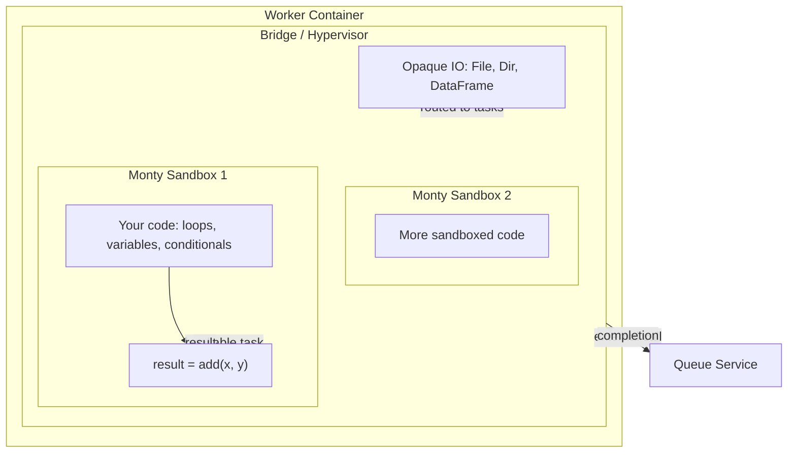

# Workflow sandboxing in Flyte

Flyte provides a sandboxed orchestrator that lets you run pure Python control flow in a secure sandbox while dispatching heavy work to full container tasks.
This enables patterns where LLMs generate orchestration code dynamically, and Flyte executes it safely with full durability and observability.

## Why workflow sandboxing?

Three properties of Flyte make it a natural fit for sandboxed code execution:

1. **Infrastructure on demand**: Flyte spins up containers with specific permissions, secrets, and resources for each task.
2. **LLMs are great at Python**: Models trained on billions of lines of code can reliably generate Python orchestration logic.
3. **Microsecond startup**: The sandbox is powered by [Monty](https://github.com/pydantic/pydantic-monty) (Pydantic's Rust-based Python interpreter), which starts in microseconds without the overhead of VMs or containers.

The result: LLMs generate the orchestration code (control flow, conditionals, loops), and Flyte tasks handle the heavy lifting (data access, computation, external APIs) in full containers.

## How it works

Your generated code runs inside one or more **Monty sandboxes** — lightweight Python interpreters embedded within a **worker container**. Each sandbox can execute pure Python (variables, loops, conditionals, function calls) but has no access to the filesystem, network, imports, or OS. A **bridge layer** acts as a hypervisor between the worker container and the sandboxes, handling opaque IO and routing callable tasks. When your code calls an external task, the bridge dispatches it — either as a method in the outer Python process or as a durable remote call through the Flyte controller (via the Queue Service):



Each sandbox sees external tasks as opaque function calls. When your code hits one, Monty **pauses**, and the bridge layer dispatches the task — either directly in the outer Python process or as a remote durable call through the Flyte controller system (Queue Service). Once the call completes, Monty **resumes** with the result. Your code never knows the difference — it just looks like a regular function call that returns a value. Multiple Monty sandboxes can run within the same worker container, each isolated like a lightweight VM.

**Opaque IO types** like `File`, `Dir`, and `DataFrame` are managed by the bridge layer and pass through the sandbox without inspection. Your code can route them between tasks but cannot read or modify their contents.

## Example: sandboxed orchestrator

Use `@env.sandbox.orchestrator` to define a sandboxed task that calls regular worker tasks.
The orchestrator contains only pure Python control flow — all heavy computation runs in worker containers.

```python
import flyte

env = flyte.TaskEnvironment(name="sandboxed-demo")


# Worker tasks — run in their own containers
@env.task
def add(x: int, y: int) -> int:
    return x + y


@env.task
def multiply(x: int, y: int) -> int:
    return x * y


@env.task
def fib(n: int) -> int:
    """Compute the nth Fibonacci number iteratively."""
    a, b = 0, 1
    for _ in range(n):
        a, b = b, a + b
    return a


# Sandboxed orchestrator — pure Python control flow
@env.sandbox.orchestrator
def pipeline(n: int) -> dict[str, int]:
    fib_result = fib(n)
    linear_result = add(multiply(n, 2), 5)
    total = add(fib_result, linear_result)

    return {
        "fib": fib_result,
        "linear": linear_result,
        "total": total,
    }
```

When `pipeline` runs, Monty executes the control flow in the sandbox. Each call to `fib`, `multiply`, and `add` pauses the sandbox, runs the worker task in a container, and resumes with the result.

Both `def` and `async def` orchestrators are supported — Monty natively handles `await` expressions.

## Example: dynamic code execution

For cases where the code itself is generated at runtime — from templates, user input, or LLM output — use `orchestrator_from_str()` and `orchestrate_local()`.

### Reusable task from a code string

`orchestrator_from_str()` creates a reusable task template from a Python code string.
The value of the **last expression** becomes the return value.

```python
import flyte
import flyte.sandbox

env = flyte.TaskEnvironment(name="code-string-demo")


@env.task
def add(x: int, y: int) -> int:
    return x + y


@env.task
def multiply(x: int, y: int) -> int:
    return x * y


# Create a reusable task from a code string
compute_pipeline = flyte.sandbox.orchestrator_from_str(
    """
    partial = add(x, y)
    multiply(partial, scale)
    """,
    inputs={"x": int, "y": int, "scale": int},
    output=int,
    tasks=[add, multiply],
    name="compute-pipeline",
)
# flyte.run(compute_pipeline, x=2, y=3, scale=4)  → 20
```

### One-shot local execution

`orchestrate_local()` executes a code string and returns the result directly — no task template, no controller.
Use it for quick one-off computations.

```python
result = await flyte.sandbox.orchestrate_local(
    "add(x, y) * 2",
    inputs={"x": 1, "y": 2},
    tasks=[add],
)
# result → 6
```

### Parameterized code generation

Because the code is a string, you can generate it programmatically:

```python
def make_reducer(operation: str) -> flyte.sandbox.CodeTaskTemplate:
    """Create a sandboxed task that reduces a list using the given operation."""
    if operation == "sum":
        body = """
            acc = 0
            for v in values:
                acc = acc + v
            acc
        """
    elif operation == "product":
        body = """
            acc = 1
            for v in values:
                acc = acc * v
            acc
        """
    else:
        raise ValueError(f"Unknown operation: {operation}")

    return flyte.sandbox.orchestrator_from_str(
        body,
        inputs={"values": list},
        output=int,
        name=f"reduce-{operation}",
    )


sum_task = make_reducer("sum")
product_task = make_reducer("product")
```

## Building agents with programmatic tool calling

The sandboxed orchestrator and `orchestrate_local()` are the foundation for building agents that use **programmatic tool calling** — systems where an LLM generates Python orchestration code, and the sandbox executes it with registered tools.

Because `orchestrate_local()` accepts a plain code string and a list of tool functions, you can wire it into an LLM generate-execute-retry loop: the model writes code, the sandbox runs it, and on failure the error feeds back to the model for correction.

See [Programmatic tool calling for agents](./code-mode) for the full concept, agent implementation patterns, and end-to-end examples.

## Syntax restrictions

Monty enforces strict syntax restrictions to guarantee sandbox safety.
These restrictions are a feature, not a limitation — they ensure that sandboxed code is deterministic and side-effect free.

### Allowed

| Feature | Notes |
|---------|-------|
| Variables and assignment | `x = 1` |
| Arithmetic and comparisons | `x + y`, `x > y` |
| String operations | Concatenation, formatting |
| `if`/`elif`/`else` | Conditional logic |
| `for` loops | Iteration over lists, ranges, dicts |
| `while` loops | Condition-based loops |
| Function definitions (`def`) | Local helper functions |
| `async def` and `await` | Async orchestrators |
| List/dict/tuple literals | `[1, 2, 3]`, `{"key": "value"}` |
| List comprehensions | `[x * 2 for x in items]` |
| `.append()` on lists | Building lists incrementally |
| Subscript reading | `x = d["key"]`, `x = l[0]` |
| External task calls | Calling registered `@env.task` workers |
| `raise` | Raising exceptions |

### Not allowed

| Feature | Workaround |
|---------|------------|
| `import` | All available functions are provided directly |
| Subscript assignment (`d[k] = v`, `l[i] = v`) | Build dicts as literals; use `.append()` for lists |
| Augmented assignment (`x += 1`) | Use `x = x + 1` |
| `class` definitions | Use dicts or tuples |
| `with` statements | Not needed — no resource management in sandbox |
| `try`/`except` | Errors propagate to the controller |
| Walrus operator (`:=`) | Use separate assignment |
| `yield`/`yield from` | Not supported |
| `global`/`nonlocal` | Not supported |
| Set literals/comprehensions | Use lists |
| `del` statements | Not supported |
| `assert` statements | Use `if` + `raise` |

### Type restrictions

- **Primitive types**: `int`, `float`, `str`, `bool`, `bytes`, `None`
- **Collection types**: `list`, `dict`, `tuple` (including generic forms like `list[int]`, `dict[str, float]`)
- **Opaque IO handles**: `File`, `Dir`, `DataFrame` — pass-through only, cannot be inspected in the sandbox
- **Union types**: `Optional[T]` and `Union` of allowed types
- **Not allowed**: Custom classes, dataclasses, Pydantic models, or any user-defined types

## Security model

The sandboxed orchestrator provides security through restriction, not trust:

- **No filesystem access**: Cannot read, write, or list files
- **No network access**: Cannot make HTTP requests, open sockets, or resolve DNS
- **No OS access**: Cannot spawn processes, read environment variables, or access system resources
- **No imports**: Cannot load any Python modules
- **Opaque IO**: `File`, `Dir`, and `DataFrame` values pass through the sandbox without inspection — the sandbox can route them between tasks but cannot read their contents
- **Type-checked boundaries**: Inputs and outputs are validated against declared types at the sandbox boundary
- **Deterministic execution**: The same inputs always produce the same outputs (excluding external task results)

The sandbox runs untrusted code safely because dangerous operations are not just discouraged — they are structurally impossible in the Monty runtime.
