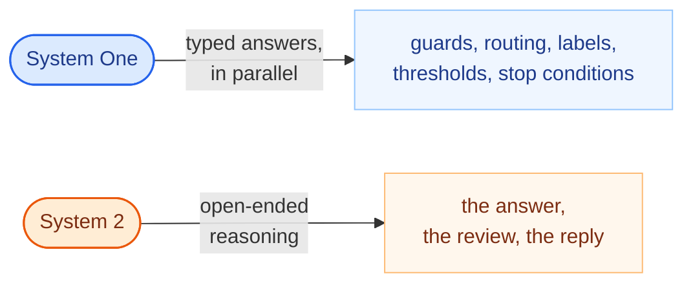
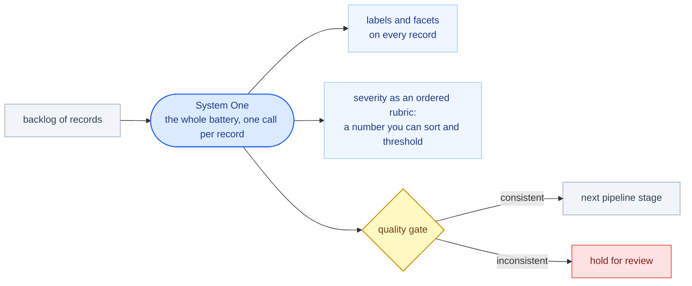
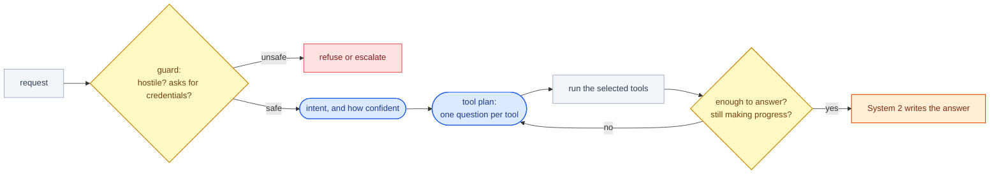
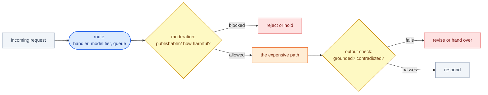

# System one datatypes

Most of what a program asks a model is not open-ended. "Is this request hostile?", "which of these five intents is it?", "does this record mention a deadline?", "is there enough information to answer yet?" — a knowledgeable person answers each of those in a couple of seconds, and none of them need prose.

A **System One model** is built for exactly that shape. You give it some state and a set of typed questions; it answers them in parallel, in isolation from each other, and attaches a calibrated probability to every answer. It never writes text.

The property worth designing around is that **adding questions barely changes the response time**. The eleventh question costs almost nothing, so the right move is to ask everything at once — including the questions you will not branch on — and compose the result in ordinary Python.

## The datatypes

Those answers arrive as three datatypes, each carrying its value *and* the model's calibrated confidence in it. They are ordinary Python objects: you declare them in a dataclass, get real instances back, and branch on them directly.

| Datatype | Holds | You branch with |
|---|---|---|
| `Choice[SomeEnum]` | the picked enum member, plus the whole probability distribution | `.certain(threshold)` |
| `Score[SomeIntEnum]` | the picked rung of an ordered rubric, plus where on the scale it actually landed | `.at_least(rung)` |
| `Noul` | truthfulness in 0..1 | `.at(threshold)` |

They register with Flyte's type engine, so they also work as task inputs and outputs — a classification step can be its own cached, retryable task. [Typed decisions with Jev](./typed-decisions-with-jev) covers all three in full.

## Two models, two jobs

A generative model is the System 2 half: open-ended reasoning, and prose a person reads. It is expensive, sequential, and has to emit every field one token at a time. Pointing it at a yes/no question means paying for a generation plus a parser to get the answer back out.

Splitting them along that line usually does three things at once: the decisions get cheaper and faster, they get *reproducible* — the same input yields the same typed answer, where free-text classification drifts between runs — and the expensive half runs less often, because a confident abstention means no generation happens at all.

## Where it fits

This is not only an agent technique. Anywhere a program currently asks a generative model a narrow question and parses the answer back out, a typed call does the same job for less.

### In a data pipeline

| Use case | The questions |
|---|---|
| **Labeling and enrichment at volume** | Twenty facets of one record, at once. Per-item latency barely moves as the battery grows, so scoring a whole backlog stays affordable. |
| **Quality gates between stages** | Is this row internally consistent? Does the extracted field match the source text? A gate that costs a generation is a gate you will be tempted to skip. |
| **Triage and prioritization** | Severity as an ordered rubric, plus the symptoms behind it — so the queue is sorted on a number you can threshold, not a sentence you have to read. |

### In an agent loop

| Use case | The questions |
|---|---|
| **Input guard** | Is this hostile? Does it ask for credentials? Does it contain instructions aimed at the assistant? |
| **Intent routing** | Which of these N intents is it, and how confident? The answer is an enum member you branch on, not a string a typo breaks. |
| **Tool selection** | One question per tool: would this one help here? Because each tool gets its own question, one request can select several. |
| **Loop control** | Is there enough to answer? Did the last step add anything? Is this action safe? "Did the loop stop making progress" is otherwise the failure you discover from the bill. |

### In an app or service

| Use case | The questions |
|---|---|
| **Request routing** | Which handler, which model tier, which queue — decided in milliseconds, before the expensive path is chosen. |
| **Moderation** | Is this publishable? How harmful, on an ordered scale? Directed at a specific person? |
| **Output checks** | Is the draft grounded in the retrieved context? Does anything contradict it? A cheap gate between generating an answer and returning it. |

## The discipline that makes it work

Three rules, and they matter more than which model you use:

**Ask about symptoms, not conclusions.** Do not ask for the verdict. Ask one question per observable fact, each answered in isolation, and derive the verdict yourself. A System One model is for judgments a knowledgeable person makes in seconds — not for weighing eighteen facts against each other.

**Compose in code, not in a prompt.** Because the composition is a function, it is unit-testable against hand-labelled cases, reviewable in a pull request, and changeable without re-validating a model's behavior. Changing what your team considers blocking becomes a diff.

**Gate on confidence, and let it abstain.** Every answer carries calibrated confidence, which gives routing a second axis beyond the answer itself. Make the lowest tier a real abstention — stop, hand over to a human, and never spend a generative call on a decision the pipeline is not sure about. Thresholds should scale with risk: a support reply can gate at 0.70; a merge, a refund, or a signature should gate at 0.85 or higher.

## When not to reach for one

- **The answer is genuinely open-ended.** Writing the reply, summarizing a document, producing code — that is what a generative model is for. Use both: typed answers to decide, prose to deliver.
- **The judgment needs multi-factor reasoning that no decomposition captures.** If a question needs a chain of inference, either break it into symptoms and compose, or hand it to System 2.
- **You have exactly one yes/no question and no plans to add more.** The fan-out is where the advantage lives; a single question is just a cheap classifier.

## Implementations




Coerce unstructured state into a typed Python object with TypeSafe's System One model, and branch on the result.




## Worked example

Everything on this page — the battery, the composition rule, the confidence gate — wired together three ways and measured against a one-shot generative baseline.




Interleave a System One model with a generative one — typed guards, tool fan-out, a durable loop, and an A/B that prices both arms.




## Related

- [TypeSafe AI integration](../../integrations/typesafe-ai/_index): installation, the full API, and how answer types are serialized.
- [Typed decisions for agentic pipelines](../../tutorials/agents/system-one-agents/_index): three pipelines and a measured A/B against a one-shot generative baseline.
- [Agents](../agents/_index): the loop these decisions most often sit inside.
- [Tasks](../tasks/_index): the unit each call runs in.
