# Retries and timeouts

Retries and timeouts are the two primary controls for handling failure on a Flyte task.
Long-running tasks fail and stall in many ways: a transient network blip, a flaky third-party
API, a slow scheduler, a runaway loop, a hung container. Retries decide *whether to try again*;
timeouts decide *how long to wait before giving up*. Used together they keep your workflows
reliable in the face of transient failures while preventing a single stuck attempt from
burning resources indefinitely.

Both can be configured in the `@env.task` decorator or supplied per-call with `override`.
Neither can be set on the `TaskEnvironment` definition itself.

## The action lifecycle

Every attempt of a task moves through a sequence of phases. Knowing the phases makes the
timeout controls obvious, because each timeout bounds a specific stretch of this timeline:

| Phase | What's happening |
| --- | --- |
| **Queued** | The action has been accepted and is waiting to be scheduled onto the cluster. |
| **Waiting for resources** | Scheduled, but waiting for compute (pods, GPUs, quota) to become available. |
| **Initializing** | Resources are in hand; the pod is starting (image pull, init containers, sidecars). |
| **Running** | Your code is actively executing. |
| **Succeeded / Failed / Timed out / Aborted** | Terminal phases. |

The diagram below shows one attempt, plus a second attempt after a retry, and which control
governs each part of the timeline:

```mermaid
gantt
    title Which control covers which part of the timeline
    dateFormat X
    axisFormat %Ss

    section Attempt 1
    Queued                  :q1, 0, 2
    Waiting for resources   :w1, 2, 5
    Initializing            :i1, 5, 6
    Running (your code)     :r1, 6, 11

    section Per-attempt bounds
    max_queued_time         :crit, 0, 5
    max_runtime             :active, 6, 11

    section Attempt 2 (after a retry + backoff)
    Queued -> Running       :q2, 14, 25

    section Across all attempts
    deadline                :done, 0, 27
```

In short:

- **`max_queued_time`** bounds the time spent *waiting to run* (Queued + Waiting for resources). It resets on every attempt.
- **`max_runtime`** bounds the time spent *running your code*. It resets on every attempt.
- **`deadline`** bounds the *total* wall-clock from the first time the action was queued until it reaches a terminal phase: across every attempt, user retries and platform retries alike.

(The brief *Initializing* phase is charged to neither per-attempt bound.)

## Retries

A retry is a fresh attempt at executing a failed action. Each retry runs in a brand-new pod,
so nothing from the failed attempt (local files, in-memory state) carries over.

The code for the retry examples below can be found on
[GitHub](https://github.com/unionai/unionai-examples/blob/main/v2/user-guide/task-configuration/retries-and-timeouts/retries.py).

First we import the required modules and set up a task environment:



### Retry count

The simplest form passes an integer. A "retry" is any attempt after the first, so `retries=3`
means up to **4 attempts** in total (1 original + 3 retries):



This is the right default for genuinely transient failures (a dropped connection, a brief
`503` from a dependency) where simply trying again is likely to succeed.

### Retries with exponential backoff

Retrying immediately is exactly the wrong thing to do against a downstream that is *already
struggling*: back-to-back retries pile load onto a service that needs room to recover.
A `flyte.RetryStrategy` with a `flyte.Backoff` policy inserts a growing delay between attempts
so a recovering dependency gets breathing room:



The delay before the n-th retry (0-indexed) is `min(base * factor**n, cap)`. With the values
above the delays are 10s, 20s, 40s, 80s, then capped at 5m. The `cap` is what keeps an
aggressive `factor` from growing into hours; it is required whenever `factor > 1`.

### Skip retries for failures that can't be fixed

Some failures will never succeed no matter how many times you try: an invalid input, a
malformed config, a permission that was never granted. Retrying them just wastes the budget
(and the wall-clock) before the inevitable failure. Raise
`flyte.errors.NonRecoverableError` to signal that a failure is terminal: the action fails on
the spot, on attempt #1, with no retries consumed even when `retries` is set:



Finally, configure Flyte and run:



### System retries

`retries=N` covers failures of *your task*: exceptions, non-zero exits, timeouts you've configured.
Failures caused by the underlying infrastructure (a node disappearing, ephemeral storage running out, a spot instance getting preempted, and so on) are handled separately. The platform retries these on its own and they do not consume your `retries=N` budget. They **do**, however, count against the `deadline` (see below), because the deadline is an absolute bound on total wall-clock regardless of who triggered the retry.

The platform does eventually give up, but only after many retries: a persistent infrastructure problem can churn for a while before the run is terminated. If you spot a task repeatedly failing on the same infrastructure error, abort it manually rather than waiting for the system to give up on its own. You don't configure the system retry budget from Python; it's a platform-level concern.

For workloads on spot/preemptible compute, see also [Spot to on-demand fallback](./interruptible-tasks-and-queues#spot-to-on-demand-fallback), which describes how interruptible tasks transition to on-demand on their final attempt.

## Timeouts

A timeout is a wall-clock bound that, when exceeded, terminates the action with phase
**Timed out**. Without one, a stuck attempt has no natural end: a task waiting on a hung socket
or starved for a GPU that never frees up can sit there for hours. The `timeout` parameter takes
a `flyte.Timeout` value carrying any combination of three independent bounds, each optional: an
unspecified bound is unlimited.

The code for the timeout examples below can be found on
[GitHub](https://github.com/unionai/unionai-examples/blob/main/v2/user-guide/task-configuration/retries-and-timeouts/timeouts.py).

First, the imports and environment:



### `max_runtime`: bound a single attempt's execution

`max_runtime` caps the time an attempt spends in the **Running** phase. It's the answer to
"how long should one run of this code take?" Use it to reap a hung container so a retry can
take over instead of letting a wedged process run forever. It is per-attempt and resets on
each retry.



### `max_queued_time`: fail fast when capacity isn't available

`max_queued_time` caps the time an attempt spends *waiting to run* (the **Queued** and
**Waiting for resources** phases) before execution begins. It answers "how long am I willing
to wait for this to even start?" When a task asks for a scarce resource (a specific GPU, a
large node) that the cluster can't currently supply, this bound makes it fail fast instead of
stalling indefinitely. It is per-attempt and resets on each retry.



### `deadline`: bound the total wall-clock

`deadline` is the strongest of the three: an absolute budget on total wall-clock, measured from
the first time the action was queued to the moment it reaches a terminal phase: across **all**
attempts, including platform-driven system retries. It answers "what is the total time budget
for this work, no matter what?" Use it when a downstream consumer needs a definite outcome by a
certain time: with `retries=5` and `max_runtime=1h` alone, an action could legally consume six
hours plus queue time before giving up. A `deadline` puts a hard ceiling on that.



When the `deadline` fires mid-attempt, the action terminates immediately as **Timed out**,
regardless of remaining retry budget or per-attempt timer state.

### Combining the bounds

The three bounds are orthogonal and can be set together. A common shape is a per-attempt
runtime cap, a queue-wait cap, and an absolute ceiling on the whole thing:



For backward compatibility, a bare `int` (seconds) or `timedelta` passed to `timeout` is
interpreted as `max_runtime`:



## Combining retries and timeouts

Retries and timeouts compose, and the per-attempt versus absolute distinction is what makes the
combination expressive. Because `max_runtime` and `max_queued_time` are per-attempt, they retry
normally: each timed-out attempt counts as a failure and the next attempt gets a fresh budget.
Because `deadline` is absolute, it overrides retries entirely: once it fires, no further
attempts run.

| Timeout | With `retries` set | Without `retries` |
| --- | --- | --- |
| `max_runtime` | Each attempt is reaped at the budget and retried until retries are exhausted. | First timeout is final. |
| `max_queued_time` | Each attempt is reaped pre-Running and retried until retries are exhausted. | First timeout is final. |
| `deadline` | Retries continue until the budget is exhausted **or** the deadline fires, whichever comes first. | Action terminates at the deadline. |

The most useful pattern combines backoff-paced retries with an absolute deadline: keep retrying
a flaky dependency, but never spend more than a fixed total budget on it.



Finally, configure Flyte and run:



Together, these controls let your workflows absorb transient failures gracefully while
guaranteeing that broken or starved work is reaped on a schedule you choose rather than left to
run unbounded.
