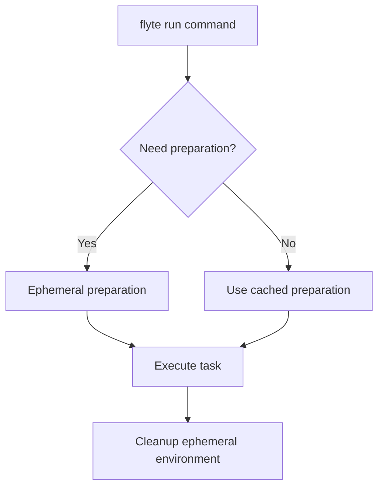

# How task run works

The `flyte run` command and `flyte.run()` SDK function support three primary execution modes:

1. **Ephemeral deployment + run**: Automatically prepare task environments ephemerally and execute tasks (development shortcut)
2. **Run deployed task**: Execute permanently deployed tasks without redeployment
3. **Local execution**: Run tasks on your local machine for development and testing

Additionally, you can run deployed tasks through the Flyte/Union UI for interactive execution and monitoring.

## Ephemeral deployment + run: The development shortcut

The most common development pattern combines ephemeral task preparation and execution in a single command, automatically handling the temporary deployment process when needed.

### CLI: Ephemeral deployment and execution

```bash
# Basic deploy + run
flyte run my_example.py my_task --name "World"

# With explicit project and domain
flyte run --project my-project --domain development my_example.py my_task --name "World

# With deployment options
flyte run --version v1.0.0 --copy-style all my_example.py my_task --name "World"
```

**How it works:**
1. **Environment discovery**: Flyte loads the specified Python file and identifies task environments
2. **Ephemeral preparation**: Temporarily prepares the task environment for execution (similar to deployment but not persistent)
3. **Task execution**: Immediately runs the specified task with provided arguments in the ephemeral environment
4. **Result return**: Returns execution results and monitoring URL
5. **Cleanup**: The ephemeral environment is not stored permanently in the backend

### SDK: Programmatic ephemeral deployment + run

```python
import flyte

env = flyte.TaskEnvironment(name="my_env")

@env.task
async def my_task(name: str) -> str:
    return f"Hello, {name}!"

if __name__ == "__main__":
    flyte.init_from_config()

    # Deploy and run in one step
    result = flyte.run(my_task, name="World")
    print(f"Result: {result}")
    print(f"Execution URL: {result.url}")
```

**Benefits of ephemeral deployment + run:**
- **Development efficiency**: No separate permanent deployment step required
- **Always current**: Uses your latest code changes without polluting the backend
- **Clean development**: Ephemeral environments don't clutter your task registry
- **Integrated workflow**: Single command for complete development cycle

## Running deployed tasks

For production workflows or when you want to use stable deployed versions, you can run tasks that have been **permanently deployed** with `flyte deploy` without triggering any deployment process.

### CLI: Running deployed tasks

```bash
# Run a previously deployed task
flyte run deployed-task my_env.my_task --name "World"

# With specific project/domain
flyte run --project prod --domain production deployed-task my_env.my_task --batch_size 1000
```

**Task reference format:** `{environment_name}.{task_name}`
- `environment_name`: The `name` property of your `TaskEnvironment`
- `task_name`: The function name of your task

>[!NOTE]
> Recall that when you deploy a task environment with `flyte deploy`, you specify the `TaskEnvironment` using the variable to which it is assigned.
> In contrast, once it is deployed, you refer to the environment by its `name` property.

### SDK: Running deployed tasks

```python
import flyte

flyte.init_from_config()

# Method 1: Direct reference by string
result = flyte.run("my_env.my_task", name="World")

# Method 2: Using remote task reference
deployed_task = flyte.remote.Task.get("my_env.my_task", version="v1.0.0")
result = flyte.run(deployed_task, name="World")

# Method 3: Get latest version
deployed_task = flyte.remote.Task.get("my_env.my_task", auto_version="latest")
result = flyte.run(deployed_task, name="World")
```

**Benefits of running deployed tasks:**
- **Performance**: No deployment overhead, faster execution startup
- **Stability**: Uses tested, stable versions of your code
- **Production safety**: Isolated from local development changes
- **Version control**: Explicit control over which code version runs

## Local execution

For development, debugging, and testing, you can run tasks locally on your machine without any backend interaction.

### CLI: Local execution

```bash
# Run locally with --local flag
flyte run --local my_example.py my_task --name "World"

# Local execution with development data
flyte run --local data_pipeline.py process_data --input_path "/local/data" --debug true
```

### SDK: Local execution

```python
import flyte

env = flyte.TaskEnvironment(name="my_env")

@env.task
async def my_task(name: str) -> str:
    return f"Hello, {name}!"

# Method 1: No client configured (defaults to local)
result = flyte.run(my_task, name="World")

# Method 2: Explicit local mode
flyte.init_from_config()  # Client configured
result = flyte.with_runcontext(mode="local").run(my_task, name="World")
```

**Benefits of local execution:**
- **Rapid development**: Instant feedback without network latency
- **Debugging**: Full access to local debugging tools
- **Offline development**: Works without backend connectivity
- **Resource efficiency**: Uses local compute resources

## Running tasks through the Union UI

If you are running your Flyte code on a Union backend, the UI provides an interactive way to run deployed tasks with form-based input and real-time monitoring.

### Accessing task execution in the Union UI

1. **Navigate to tasks**: Go to your project → domain → Tasks section
2. **Select task**: Choose the task environment and specific task
3. **Launch execution**: Click "Launch" to open the execution form
4. **Provide inputs**: Fill in task parameters through the web interface
5. **Monitor progress**: Watch real-time execution progress and logs

**UI execution benefits:**
- **User-friendly**: No command-line expertise required
- **Visual monitoring**: Real-time progress visualization
- **Input validation**: Built-in parameter validation and type checking
- **Execution history**: Easy access to previous runs and results
- **Sharing**: Shareable execution URLs for collaboration

Here is a short video demonstrating task execution through the Union UI:



## Execution flow and architecture

### Fast registration architecture

Flyte v2 uses "fast registration" to enable rapid development cycles:

#### How it works

1. **Container images** contain the runtime environment and dependencies
2. **Code bundles** contain your Python source code (stored separately)
3. **At runtime**: Code bundles are downloaded and injected into running containers

#### Benefits

- **Rapid iteration**: Update code without rebuilding images
- **Resource efficiency**: Share images across multiple deployments
- **Version flexibility**: Run different code versions with same base image
- **Caching optimization**: Separate caching for images vs. code

#### When code gets injected

At task execution time, the fast registration process follows these steps:

1. **Container starts** with the base image containing runtime environment and dependencies
2. **Code bundle download**: The Flyte agent downloads your Python code bundle from storage
3. **Code extraction**: The code bundle is extracted and mounted into the running container
4. **Task execution**: Your task function executes with the injected code

### Ephemeral preparation logic

When using ephemeral deploy + run mode, Flyte determines whether temporary preparation is needed:



### Execution modes comparison

| Mode | Deployment | Performance | Use Case | Code Version |
|------|------------|-------------|-----------|--------------|
| Ephemeral Deploy + Run | Ephemeral (temporary) | Medium | Development, testing | Latest local |
| Run Deployed | None (uses permanent deployment) | Fast | Production, stable runs | Deployed version |
| Local | None | Variable | Development, debugging | Local |
| UI | None | Fast | Interactive, collaboration | Deployed version |
