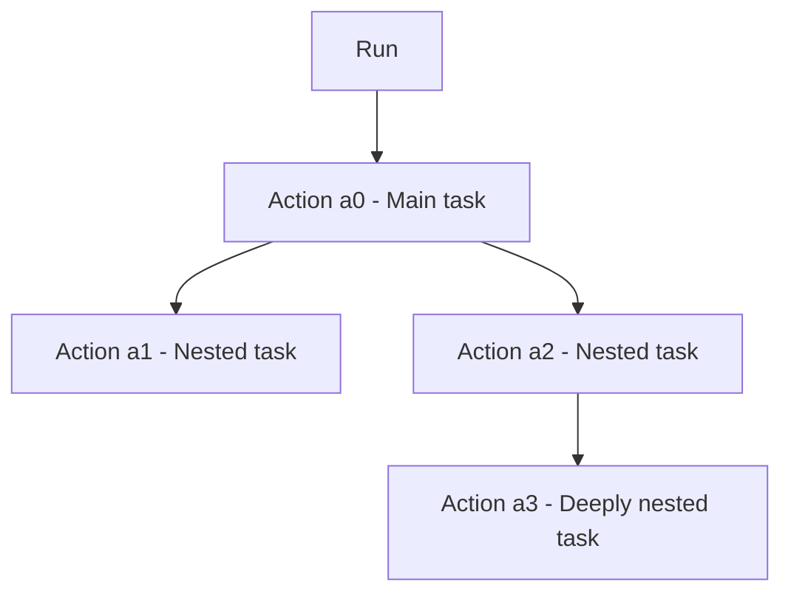

# Interact with runs and actions

When a task is launched, the resulting execution is called a **run**.
Because tasks typically call other tasks, a run will almost always involve multiple sub-task executions. Each such execution is called an **action**.

Through the Flyte SDK and CLI, you can interact with the run and its actions to monitor progress, retrieve results, and access data. This guide explains how to work with runs and actions programmatically and through the CLI.

## Understanding runs and actions

Runs are not declared explicitly in the code of the entry point task.
Instead, they are simply a result of the task being invoked in a specific way:
* User with `flyte run`
* User via the UI
* Other code calling `flyte.run()`
* [Trigger](../task-configuration/triggers)

When a task is invoked in one of these ways, it creates a run to represent the execution of that task and all its nested tasks, considered together.
Each task execution within that run is represented by an **action**.
The entry point task execution is represented by the main action (usually called `a0`), and then every nested call of one task from another creates an additional action.



Because what constitutes a run depends only on how a task is invoked, the same task can execute as a deeply nested action in one run and the main action in another run.
Unlike Flyte 1, there is no explicit `@workflow` construct in Flyte 2; instead, "workflows" are defined implicitly by the structure of task composition and the entry point chosen at runtime.

> [!NOTE]
> Despite there being no explicit `@workflow` decorator, you'll often see the assemblage of tasks referred to as a "workflow" in documentation and discussions. The top-most task in a run is sometimes referred to as the "parent", "driver", or "entry point" task of the "workflow".
> In these docs we will sometime use "workflow" informally to refer to the collection of tasks (considered statically) involved in a run.

### Key concepts

- **Attempts**: Each action can have multiple attempts due to retries. Retries occur for two reasons:
  - User-configured retries for handling transient failures
  - Automatic system retries for infrastructure issues

- **Phases**: Both runs and actions progress through phases (e.g., QUEUED, RUNNING, SUCCEEDED, FAILED) until reaching a terminal state

- **Durability**: Flyte is a durable execution engine, so every input, output, failure, and attempt is recorded for each action. All data is persisted, allowing you to retrieve information about runs and actions even after completion

## Working with runs

Runs are created when you execute tasks using `flyte run` or `flyte.run()`. For details on running tasks, see [how task run works](how-task-run-works). To learn about running previously deployed remote tasks, see [remote tasks](../task-programming/remote-tasks).

### Retrieving a run

Use `flyte.remote.Run.get()` to retrieve information about a run:

```python
import flyte

flyte.init_from_config()

# Get a run by name
run = flyte.remote.Run.get("my_run_name")

# Access basic information
print(run.url)        # UI URL for the run
print(run.action.phase)  # Phase of the main action
```

### CLI: Get run information

```bash
# Get a specific run
flyte get run my_run_name

# List all runs
flyte get run
```

For all available options, see the [CLI reference](../../api-reference/flyte-cli#flyte-get-run).

### Watching run progress

Monitor a run as it progresses through phases:

```python
# Wait for run to complete
run = flyte.run(my_task, input_data="test")
run.wait()  # Blocks until terminal state

# Check if done
if run.action.done():
    print("Run completed!")
```

### Getting detailed run information

Use `flyte.remote.RunDetails` for comprehensive information including nested actions and metadata:

```python
run_details = flyte.remote.RunDetails.get(name="my_run_name")

# Access detailed information
print(run_details.pb2)  # Full protobuf representation
```

## Working with actions

Actions represent individual task executions within a run. Each action has a unique identifier within its parent run.

### Retrieving an action

```python
# Get a specific action by run name and action name
action = flyte.remote.Action.get(
    run_name="my_run_name",
    name="a0"  # Main action
)

# Access action information
print(action.phase)       # Current phase
print(action.task_name)   # Task being executed
print(action.start_time)  # Execution start time
```

### CLI: Get action information

```bash
# Get a specific action
flyte get action my_run_name a0

# List all actions for a run
flyte get action my_run_name
```

For all available options, see the [CLI reference](../../api-reference/flyte-cli#flyte-get-action).

### Nested actions

Deeply nested actions are uniquely identified by their path under the run:

```python
# Get a nested action
nested_action = flyte.remote.Action.get(
    run_name="my_run_name",
    name="a1"  # Nested action identifier
)
```

### Getting detailed action information

Use `flyte.remote.ActionDetails` for comprehensive action information:

```python
action_details = flyte.remote.ActionDetails.get(
    run_name="my_run_name",
    name="a0"
)

# Access detailed information
print(action_details.pb2)  # Full protobuf representation
```

## Retrieving inputs and outputs

### Programmatic access

Both `Run` and `Action` objects provide methods to retrieve inputs and outputs:

```python
run = flyte.remote.Run.get("my_run_name")

# Get inputs - returns ActionInputs (dict-like)
inputs = run.inputs()
print(inputs)  # {"param_name": value, ...}

# Get outputs - returns tuple
outputs = run.outputs()
print(outputs)  # (result1, result2, ...)

# Single output
single_output = outputs[0]

# No outputs are represented as (None,)
```

**Important notes:**

- **Inputs**: Returned as `flyte.remote.ActionInputs`, a dictionary with parameter names as keys and values as the actual data passed in
- **Outputs**: Always returned as `flyte.remote.ActionOutputs` tuple, even for single outputs or no outputs
- **No outputs**: Represented as `(None,)`
- **Availability**: Outputs are only available if the action completed successfully
- **Type safety**: Flyte's rich type system converts data to an intermediate representation, allowing retrieval even without the original dependencies installed

### CLI: Get inputs and outputs

```bash
# Get both inputs and outputs for a run
flyte get io my_run_name

# Get inputs and outputs for a specific action
flyte get io my_run_name a1
```

For all available options, see the [CLI reference](../../api-reference/flyte-cli#flyte-get-io).

### Handling failures

If an action fails, outputs are not available, but you can retrieve error information:

```python
action = flyte.remote.Action.get(run_name="my_run_name", name="a0")

if action.phase == flyte.models.ActionPhase.FAILED:
    # Outputs will raise an error
    try:
        outputs = action.outputs()
    except RuntimeError as e:
        print("Action failed, outputs not available")

    # Get error details instead
    action_details = flyte.remote.ActionDetails.get(
        run_name="my_run_name",
        name="a0"
    )
    print(action_details.pb2.error_info)
```

## Understanding data storage

Flyte handles different types of data differently, as explained in [data flow](../run-scaling/data-flow):

- **Parameterized data** (primitives, small objects): Returned directly in inputs/outputs
- **Large data** (files, directories, DataFrames, models): Stored in cloud storage (S3, GCS, Azure Blob Storage)

When you retrieve outputs containing large data, Flyte returns references rather than the actual data. To access the actual raw data, you need proper cloud storage permissions and configuration.

## Accessing large data from cloud storage

To download and work with files, directories, and DataFrames stored in cloud object storage, you must configure storage access with appropriate credentials.

### S3 storage access

To access data stored in Amazon S3:

**1. Set environment variables:**

```bash
export FLYTE_AWS_ACCESS_KEY_ID="your-access-key-id"
export FLYTE_AWS_SECRET_ACCESS_KEY="your-secret-access-key"
```

These are standard AWS credential environment variables that Flyte recognizes.

**2. Initialize Flyte with S3 storage configuration:**

```python
import flyte
import flyte.storage

# Auto-configure from environment variables
flyte.init_from_config(
    storage=flyte.storage.S3.auto(region="us-east-2")
)

# Or provide credentials explicitly
flyte.init_from_config(
    storage=flyte.storage.S3(
        access_key_id="your-access-key-id",
        secret_access_key="your-secret-access-key",
        region="us-east-2"
    )
)
```

**3. Access data from outputs:**

```python
run = flyte.remote.Run.get("my_run_name")
outputs = run.outputs()

# Outputs containing files, dataframes, etc. can now be downloaded
dataframe = outputs[0]
df = await dataframe.open(pd.DataFrame).all()
```

### GCS storage access

To access data stored in Google Cloud Storage:

**1. Set environment variables:**

```bash
export GOOGLE_APPLICATION_CREDENTIALS="/path/to/service-account-key.json"
```

This is the standard Google Cloud authentication method using service account credentials.

**2. Initialize Flyte with GCS storage configuration:**

```python
import flyte
import flyte.storage

# Auto-configure from environment
flyte.init_from_config(
    storage=flyte.storage.GCS.auto()
)

# Or configure explicitly
flyte.init_from_config(
    storage=flyte.storage.GCS()
)
```

**3. Access data from outputs:**

```python
run = flyte.remote.Run.get("my_run_name")
outputs = run.outputs()

# Download data as needed
file_output = outputs[0]
# Work with file output
```

### Azure Blob Storage access

To access data stored in Azure Blob Storage (ABFS):

**1. Set environment variables:**

For storage account key authentication:
```bash
export AZURE_STORAGE_ACCOUNT_NAME="your-storage-account"
export AZURE_STORAGE_ACCOUNT_KEY="your-account-key"
```

For service principal authentication:
```bash
export AZURE_TENANT_ID="your-tenant-id"
export AZURE_CLIENT_ID="your-client-id"
export AZURE_CLIENT_SECRET="your-client-secret"
export AZURE_STORAGE_ACCOUNT_NAME="your-storage-account"
```

**2. Initialize Flyte with Azure storage configuration:**

```python
import flyte
import flyte.storage

# Auto-configure from environment variables
flyte.init_from_config(
    storage=flyte.storage.ABFS.auto()
)

# Or provide credentials explicitly
flyte.init_from_config(
    storage=flyte.storage.ABFS(
        account_name="your-storage-account",
        account_key="your-account-key"
    )
)

# Or use service principal
flyte.init_from_config(
    storage=flyte.storage.ABFS(
        account_name="your-storage-account",
        tenant_id="your-tenant-id",
        client_id="your-client-id",
        client_secret="your-client-secret"
    )
)
```

**3. Access data from outputs:**

```python
run = flyte.remote.Run.get("my_run_name")
outputs = run.outputs()

# Download data as needed
directory_output = outputs[0]
# Work with directory output
```

## Complete example

Here's a complete example showing how to launch a run and interact with it:

```python
import flyte
import flyte.storage

# Initialize with storage access
flyte.init_from_config(
    storage=flyte.storage.S3.auto(region="us-east-2")
)

# Define and run a task
env = flyte.TaskEnvironment(name="data_processing")

@env.task
async def process_data(input_value: str) -> str:
    return f"Processed: {input_value}"

# Launch the run
run = flyte.run(process_data, input_value="test_data")

# Monitor progress
print(f"Run URL: {run.url}")
run.wait()

# Check status
if run.action.done():
    print(f"Run completed with phase: {run.action.phase}")

    # Get inputs and outputs
    inputs = run.inputs()
    print(f"Inputs: {inputs}")

    outputs = run.outputs()
    print(f"Outputs: {outputs}")

    # Access the result
    result = outputs[0]
    print(f"Result: {result}")
```

## API reference

### Key classes

- `flyte.remote.Run` - Represents a run with basic information
- `flyte.remote.RunDetails` - Detailed run information including all actions
- `flyte.remote.Action` - Represents an action with basic information
- `flyte.remote.ActionDetails` - Detailed action information including error details
- `flyte.remote.ActionInputs` - Dictionary-like object containing action inputs
- `flyte.remote.ActionOutputs` - Tuple containing action outputs

### CLI commands

For complete CLI documentation and all available options, see the [Flyte CLI reference](../../api-reference/flyte-cli):
- [`flyte get run`](../../api-reference/flyte-cli#flyte-get-run) - Get run information
- [`flyte get action`](../../api-reference/flyte-cli#flyte-get-action) - Get action information
- [`flyte get io`](../../api-reference/flyte-cli#flyte-get-io) - Get inputs and outputs
- [`flyte get logs`](../../api-reference/flyte-cli#flyte-get-logs) - Get action logs

### Storage configuration

- `flyte.storage.S3` - Amazon S3 configuration
- `flyte.storage.GCS` - Google Cloud Storage configuration
- `flyte.storage.ABFS` - Azure Blob Storage configuration

For more details on data flow and storage, see [data flow](../run-scaling/data-flow).
