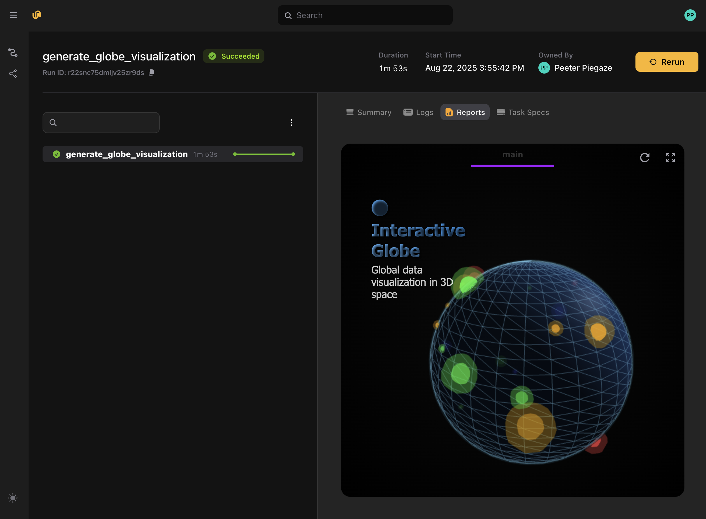
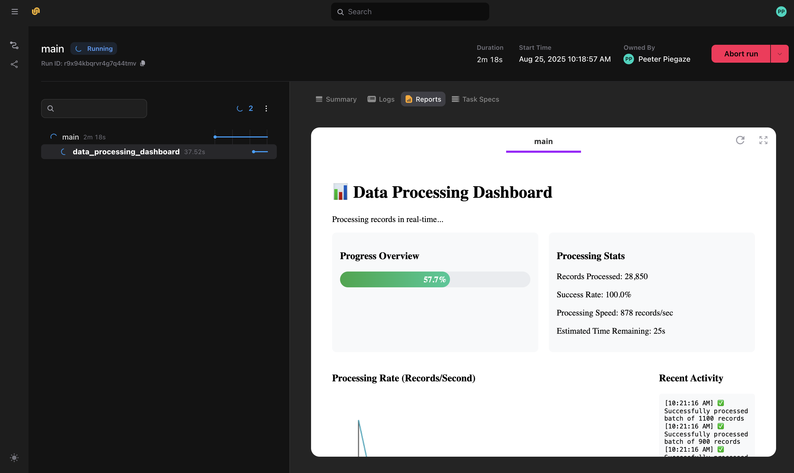

# Reports

The reports feature allows you to display and update custom output in the UI during task execution.


Reports are the Flyte 2 successor to **Decks** in Flyte 1. Where Flyte 1 used `enable_deck=True` and the `flytekit.Deck` API, Flyte 2 uses `report=True` and the `flyte.report` API described below.


First, you set the `report=True` flag in the task decorator. This enables the reporting feature for that task.
Within a task with reporting enabled, a `flyte.report.Report` object is created automatically.

> [!NOTE] Import `flyte.report` explicitly
> `flyte.report` is a submodule that `import flyte` does **not** import automatically.
> You must import it explicitly:
>
> ```python
> import flyte.report
> ```
>
> Without this, calls like `flyte.report.replace()` or `flyte.report.flush()` raise
> `AttributeError: module 'flyte' has no attribute 'report'` — most commonly hit in local or
> notebook runs. This applies to all `flyte.*` submodules: import the specific submodule you use,
> not just the top-level `flyte` package.

A `Report` object contains one or more tabs, each of which contains HTML.
You can write HTML to an existing tab and create new tabs to organize your content.
Initially, the `Report` object has one tab (the default tab) with no content.

To write content:

- `flyte.report.log()` appends HTML content directly to the default tab.
- `flyte.report.replace()` replaces the content of the default tab with new HTML.

To get or create a new tab:

- `flyte.report.get_tab()` allows you to specify a unique name for the tab, and it will return the existing tab if it already exists or create a new one if it doesn't.
  It returns a `flyte.report._report.Tab`

You can `log()` or `replace()` HTML on the `Tab` object just as you can directly on the `Report` object.

Finally, you send the report to the Flyte server and make it visible in the UI:

- `flyte.report.flush()` dispatches the report.
  **It is important to call this method to ensure that the data is sent**.

<!-- TODO:
Check (test) if implicit flush is performed at the end of the task execution.
-->

## A simple example



Here we define a task `task1` that logs some HTML content to the default tab and creates a new tab named "Tab 2" where it logs additional HTML content.
The `flush` method is called to send the report to the backend.

## A more complex example

Here is another example.
We import the necessary modules, set up the task environment, define the main task with reporting enabled and define the data generation function:



We then define the HTML content for the report:

```python
def get_html_content():
    data_points = generate_globe_data()

    html_content = f"""
    <!DOCTYPE html>
    <html lang="en">
    ...
    </html>
    return html_content
"""
```

(We exclude it here due to length. You can find it in the [source file](https://github.com/unionai/unionai-examples/blob/main/v2/user-guide/task-programming/reports/globe_visualization.py)).

Finally, we run the workflow:



When the workflow runs, the report will be visible in the UI:



## Streaming example

Above we demonstrated reports that are sent to the UI once, at the end of the task execution.
But, you can also stream updates to the report during task execution and see the display update in real-time.

You do this by calling `flyte.report.flush()` (or specifying `do_flush=True` in `flyte.report.log()`) periodically during the task execution, instead of just at the end of the task execution

> [!NOTE]
> In the above examples we explicitly call `flyte.report.flush()` to send the report to the UI.
> In fact, this is optional since flush will be called automatically at the end of the task execution.
> For streaming reports, on the other hand, calling `flush()` periodically (or specifying `do_flush=True`
> in `flyte.report.log()`) is necessary to display the updates.

First we import the necessary modules, and set up the task environment:



Next we define the HTML content for the report:

```python
DATA_PROCESSING_DASHBOARD_HTML = """
...
"""
```

(We exclude it here due to length. You can find it in the [source file](
https://github.com/unionai/unionai-examples/blob/main/v2/user-guide/task-programming/reports/streaming_reports.py)).

Finally, we define the task that renders the report (`data_processing_dashboard`), the driver task of the workflow (`main`), and the run logic:



The key to the live update ability is the `while` loop that appends Javascript to the report. The Javascript calls execute on append to the document and update it.

When the workflow runs, you can see the report updating in real-time in the UI:



## Rendering a custom type

The examples above build report HTML by hand. When you have a **custom type** — or a DataFrame, or a `StructuredDataset` — that you render the same way in many places, you can define a reusable **renderer** for the type and attach it to the type, instead of repeating the HTML-building logic at every call site.

A renderer is any class that satisfies the `flyte.types.Renderable` protocol: it implements a single `to_html(self, value) -> str` method that returns an HTML fragment for a value of your type.

```python
from flyte.types import Renderable

class Molecule:
    def __init__(self, name: str, smiles: str):
        self.name = name
        self.smiles = smiles

class MoleculeRenderer(Renderable):
    """A Renderable for the Molecule type."""

    def to_html(self, mol: Molecule) -> str:
        return f"<h2>{mol.name}</h2><pre>{mol.smiles}</pre>"
```

You attach the renderer to the type with `typing.Annotated`, then dispatch a value through its attached renderer with `flyte.types.TypeEngine.to_html()`. Log the resulting HTML to the report just like any other content:

```python
from typing import Annotated

import flyte
import flyte.report
from flyte.types import TypeEngine

env = flyte.TaskEnvironment(name="custom_renderer")

# Attaching the renderer to the type is the "registration".
RenderedMolecule = Annotated[Molecule, MoleculeRenderer()]

@env.task(report=True)
async def show_molecule() -> Molecule:
    mol = Molecule("caffeine", "CN1C=NC2=C1C(=O)N(C(=O)N2C)C")

    # Dispatch the value through the renderer attached to RenderedMolecule.
    html = TypeEngine.to_html(mol, RenderedMolecule)
    await flyte.report.log.aio(html)
    await flyte.report.flush.aio()

    return mol

if __name__ == "__main__":
    flyte.init_from_config()
    print(flyte.run(show_molecule).url)
```

`TypeEngine.to_html()` finds the `Renderable` attached to the type via `Annotated`, calls its `to_html()`, and returns the HTML string — which you then send to the report with `flyte.report.log()` (or `replace()`). The same pattern works for a DataFrame or `StructuredDataset`: annotate the type with a renderer that turns the frame into an HTML table.

> [!NOTE]
> The report contains only what you explicitly `log()` or `replace()`. Returning a value whose type has a renderer attached does **not** by itself add it to the report — render the value and log the HTML, as shown above.

Flyte's SDK also implements a few renderers of this kind internally — for pandas and PyArrow DataFrames and for Markdown strings. These aren't exposed as public API (only the `flyte.types.Renderable` protocol is), so treat them as examples of the same pattern rather than importable helpers.
