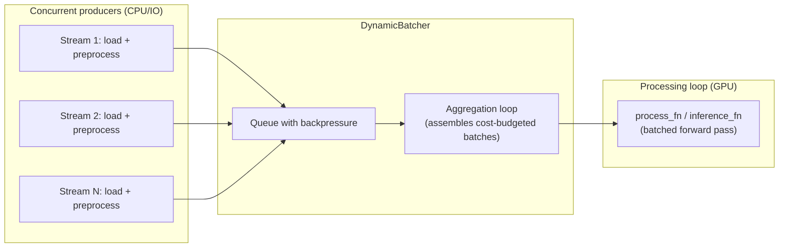
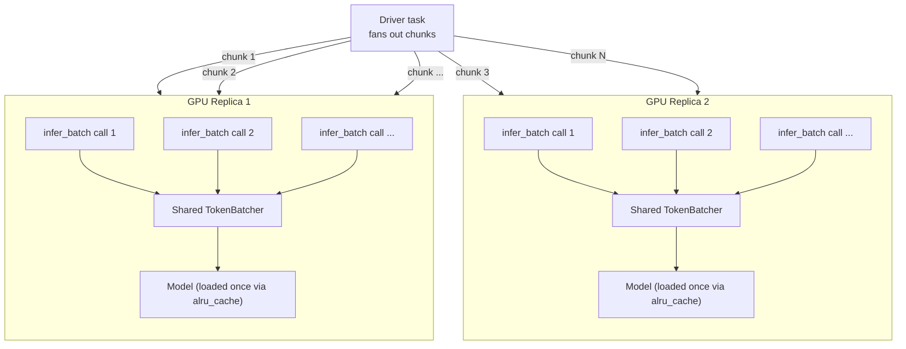

# Maximize GPU utilization for batch inference

GPUs are expensive. When running batch inference, the single biggest cost driver is **idle GPU time** — cycles where the GPU sits waiting with nothing to do. Understanding why this happens and how to fix it is the key to cost-effective batch inference.

## Why GPU utilization drops

A typical inference task does three things:

1. **Load data** — read from storage, deserialize, preprocess (CPU/IO-bound)
2. **Run inference** — forward pass through the model (GPU-bound)
3. **Post-process** — format results, write outputs (CPU/IO-bound)

When these steps run sequentially, the GPU is idle during steps 1 and 3. For many workloads, data loading and preprocessing dominate wall-clock time, leaving the GPU busy for only a fraction of the total:

```mermaid
gantt
    title Sequential execution — GPU idle during CPU/IO work
    dateFormat X
    axisFormat %s

    section Task 1
    Load data (CPU/IO)     :a1, 0, 3
    Inference (GPU)        :a2, after a1, 2
    Post-process (CPU/IO)  :a3, after a2, 1

    section Task 2
    Load data (CPU/IO)     :b1, after a3, 3
    Inference (GPU)        :b2, after b1, 2
    Post-process (CPU/IO)  :b3, after b2, 1

    section GPU
    Idle                   :crit, g1, 0, 3
    Busy                   :active, g2, 3, 5
    Idle                   :crit, g3, 5, 9
    Busy                   :active, g4, 9, 11
    Idle                   :crit, g5, 11, 12
```



In this example, the GPU is busy for only 4 out of 12 time units — **33% utilization**. The rest is wasted waiting for CPU and IO operations.

## Serving vs in-process batch inference

There are two common approaches to batch inference: sending requests to a **hosted model server** (serving), or running the model **in-process** alongside data loading. Each has distinct trade-offs:

| | Hosted serving | In-process (Flyte) |
|---|---|---|
| **Architecture** | Separate inference server (e.g. Triton, vLLM server, TGI) accessed over the network | Model loaded directly in the task process, inference via `DynamicBatcher` |
| **Data transfer** | Every request serialized over the network; large payloads add latency | Zero-copy — data stays in-process, no serialization overhead |
| **Backpressure** | Hard to implement; push-based architecture can overwhelm the server or drop requests | Two levels: `DynamicBatcher` queue blocks producers when full, and Flyte's task scheduling automatically queues new inference tasks when replicas are busy — backpressure propagates end-to-end without any extra code |
| **Utilization** | Servers are often over-provisioned to maintain availability, leading to low average utilization | Batcher continuously fills the GPU with work from concurrent producers |
| **Multi-model** | Each model needs its own serving deployment, load balancer, and scaling config | Multiple models can time-share the same GPU — when one model finishes, the next is loaded automatically via reusable containers, no container orchestration required |
| **Scaling** | Requires separate infrastructure for the serving layer (load balancers, autoscalers, health checks) | Scales with Flyte — replicas auto-scale based on demand |
| **Cost** | Pay for always-on serving infrastructure even during low-traffic periods | Pay only for the duration of the batch job |
| **Fault tolerance** | Need retries, circuit breakers, and timeout handling for network failures | Failures are local; Flyte handles retries and recovery at the task level |
| **Best for** | Real-time / low-latency serving with unpredictable request patterns | Large-scale batch processing with known datasets |

For batch workloads, in-process inference eliminates the network overhead and infrastructure complexity of a serving layer while achieving higher GPU utilization through intelligent batching.

## Solution: `DynamicBatcher`

`DynamicBatcher` from `flyte.extras` solves the utilization problem by **separating data loading from inference** and running them concurrently. Multiple async producers load and preprocess data while a single consumer feeds the GPU in optimally-sized batches:



The batcher runs two internal loops:

1. **Aggregation loop** — drains the submission queue and assembles batches that respect a cost budget (`target_batch_cost`), a maximum size (`max_batch_size`), and a timeout (`batch_timeout_s`). This ensures the GPU always receives optimally-sized batches.
2. **Processing loop** — pulls assembled batches and calls your processing function, resolving each record's future with its result.

This pipelining means the GPU is processing batch N while data for batch N+1 is being loaded and assembled — **eliminating idle time**.

### Basic usage

```python
from flyte.extras import DynamicBatcher

async def process(batch: list[dict]) -> list[str]:
    """Your batch processing function. Must return results in the same order as the input."""
    return [heavy_computation(item) for item in batch]

async with DynamicBatcher(
    process_fn=process,
    target_batch_cost=1000,   # cost budget per batch
    max_batch_size=64,        # hard cap on records per batch
    batch_timeout_s=0.05,     # max wait time before dispatching a partial batch
    max_queue_size=5_000,     # queue size for backpressure
) as batcher:
    futures = []
    for record in my_records:
        future = await batcher.submit(record, estimated_cost=10)
        futures.append(future)
    results = await asyncio.gather(*futures)
```

Each call to `submit()` is non-blocking — it enqueues the record and immediately returns a `Future`. When the queue is full, `submit()` awaits until space is available, providing natural backpressure to prevent producers from overwhelming the GPU.

### Cost estimation

The batcher uses cost estimates to decide how many records to group into each batch. You can provide costs in several ways (checked in order of precedence):

1. **Explicit** — pass `estimated_cost` to `submit()`
2. **Estimator function** — pass `cost_estimator` to the constructor
3. **Protocol** — implement `estimate_cost()` on your record type
4. **Default** — falls back to `default_cost` (default: 1)

## `TokenBatcher` for LLM inference

For LLM workloads, `TokenBatcher` is a convenience subclass that uses token-aware parameter names:

```python
from dataclasses import dataclass
from flyte.extras import TokenBatcher

@dataclass
class Prompt:
    text: str

    def estimate_tokens(self) -> int:
        """Rough token estimate (~4 chars per token)."""
        return len(self.text) // 4 + 1

async def inference(batch: list[Prompt]) -> list[str]:
    """Run batched inference through your model."""
    texts = [p.text for p in batch]
    outputs = model.generate(texts, sampling_params)
    return [o.outputs[0].text for o in outputs]

async with TokenBatcher(
    inference_fn=inference,
    target_batch_tokens=32_000,  # token budget per batch
    max_batch_size=256,
) as batcher:
    future = await batcher.submit(Prompt(text="What is 2+2?"))
    result = await future
```

`TokenBatcher` checks the `TokenEstimator` protocol (`estimate_tokens()`) in addition to `CostEstimator` (`estimate_cost()`), making it natural to work with prompt types.




## Combining with reusable containers

`DynamicBatcher` on its own improves utilization within a single task. When combined with [reusable containers](../configuring/reusable-containers), it becomes significantly more powerful:

- **Amortized model loading** — the model is loaded once per container and reused across many task invocations, avoiding repeated download and initialization costs
- **Cross-task batching** — with `ReusePolicy(concurrency=N)`, multiple task invocations run concurrently on the same replica, all feeding records into the **same shared batcher**. This means the GPU always has a full queue of work.
- **Automatic scaling** — replicas scale between min and max based on demand, and each replica maintains its own model + batcher



The key technique is using `@alru_cache` to create **process-level singletons** — the model and batcher are initialized on the first task invocation and reused by all subsequent invocations on that replica.

### Example: batch LLM inference with vLLM

This example loads math problems from HuggingFace's gsm8k dataset and solves them using batched vLLM inference across GPU replicas.

#### 1. Define the environment

```python
import flyte
from flyte.extras import TokenBatcher

image = (
    flyte.Image.from_debian_base()
    .with_pip_packages("vllm", "hf-transfer", "unionai-reuse")
    .with_env_vars({"HF_HUB_ENABLE_HF_TRANSFER": "1"})
)

gpu_env = flyte.TaskEnvironment(
    name="gpu_worker",
    resources=flyte.Resources(cpu=4, memory="16Gi", gpu="A10G:1"),
    image=image,
    reusable=flyte.ReusePolicy(
        replicas=2,        # 2 GPU replicas
        concurrency=10,    # 10 concurrent tasks per replica
    ),
)

driver_env = flyte.TaskEnvironment(
    name="driver",
    resources=flyte.Resources(cpu=2, memory="2Gi"),
    image=image,
    depends_on=[gpu_env],
)
```

With `replicas=2` and `concurrency=10`, up to 20 `infer_batch` calls run simultaneously across 2 GPUs, all sharing their replica's model and batcher.

#### 2. Create process-level singletons

```python
from async_lru import alru_cache
from dataclasses import dataclass

@dataclass
class Prompt:
    task_id: str
    index: int
    text: str

    def estimate_tokens(self) -> int:
        return len(self.text) // 4 + 1

@alru_cache(maxsize=1)
async def get_inference_fn():
    """Load the model once per container lifetime."""
    from vllm import LLM, SamplingParams
    llm = LLM(model="Qwen/Qwen2.5-7B-Instruct", gpu_memory_utilization=0.9, max_model_len=4096)
    params = SamplingParams(temperature=0.7, max_tokens=512)

    async def inference(batch: list[Prompt]) -> list[str]:
        texts = [p.text for p in batch]
        outputs = llm.generate(texts, params)
        return [o.outputs[0].text for o in outputs]

    return inference

@alru_cache(maxsize=1)
async def get_batcher() -> TokenBatcher[Prompt, str]:
    """Create a single batcher per container — shared across all concurrent tasks."""
    inference_fn = await get_inference_fn()
    batcher = TokenBatcher[Prompt, str](
        inference_fn=inference_fn,
        target_batch_tokens=32_000,
        max_batch_size=256,
        batch_timeout_s=0.05,
        max_queue_size=5_000,
    )
    await batcher.start()
    return batcher
```

#### 3. Define the GPU worker task

```python
import asyncio
import logging

logger = logging.getLogger(__name__)

@gpu_env.task
async def infer_batch(prompts: list[str], task_id: str) -> list[str]:
    """Submit prompts to the shared batcher and return completions."""
    batcher = await get_batcher()

    futures: list[asyncio.Future[str]] = []
    for idx, text in enumerate(prompts):
        record = Prompt(task_id=task_id, index=idx, text=text)
        future = await batcher.submit(record)
        futures.append(future)

    results = await asyncio.gather(*futures)
    logger.info(
        "[%s] completed %d records | utilization: %.1f%% | batches: %d",
        task_id,
        len(results),
        batcher.stats.utilization * 100,
        batcher.stats.total_batches,
    )
    return list(results)
```

Every concurrent `infer_batch` call on the same replica feeds into the same batcher. The batcher continuously assembles token-budgeted batches from all concurrent callers, keeping the GPU saturated.

#### 4. Define the driver task

```python
@driver_env.task
async def main(num_questions: int = 500, chunk_size: int = 50) -> dict[str, list[str]]:
    """Fetch questions and fan out across GPU replicas."""
    questions = await fetch_questions(num_questions)

    chunks = [questions[i:i + chunk_size] for i in range(0, len(questions), chunk_size)]
    task_ids = [f"chunk_{i:03d}" for i in range(len(chunks))]

    all_results = await asyncio.gather(
        *(infer_batch(chunk, tid) for chunk, tid in zip(chunks, task_ids))
    )
    return dict(zip(task_ids, all_results))
```




## Monitoring utilization

`DynamicBatcher` exposes a `stats` property with real-time metrics:

```python
stats = batcher.stats
print(f"Utilization: {stats.utilization:.1%}")         # fraction of time spent processing
print(f"Records processed: {stats.total_completed}")
print(f"Batches dispatched: {stats.total_batches}")
print(f"Avg batch size: {stats.avg_batch_size:.1f}")
print(f"Busy time: {stats.busy_time_s:.1f}s")
print(f"Idle time: {stats.idle_time_s:.1f}s")
```

| Metric | Description |
|---|---|
| `utilization` | Fraction of wall-clock time spent inside `process_fn` (0.0–1.0). Target: > 0.9. |
| `total_submitted` | Total records submitted via `submit()` |
| `total_completed` | Total records whose futures have been resolved |
| `total_batches` | Number of batches dispatched to `process_fn` |
| `avg_batch_size` | Running average records per batch |
| `avg_batch_cost` | Running average cost per batch |
| `busy_time_s` | Cumulative seconds spent inside `process_fn` |
| `idle_time_s` | Cumulative seconds the processing loop waited for batches |

If utilization is low, consider:
- **Increasing concurrency** — more concurrent producers means the batcher has more records to assemble into batches
- **Reducing `batch_timeout_s`** — dispatch partial batches faster instead of waiting
- **Increasing `max_queue_size`** — allow more records to be buffered ahead of the GPU
- **Adding more data streams** — ensure the GPU always has work queued up
