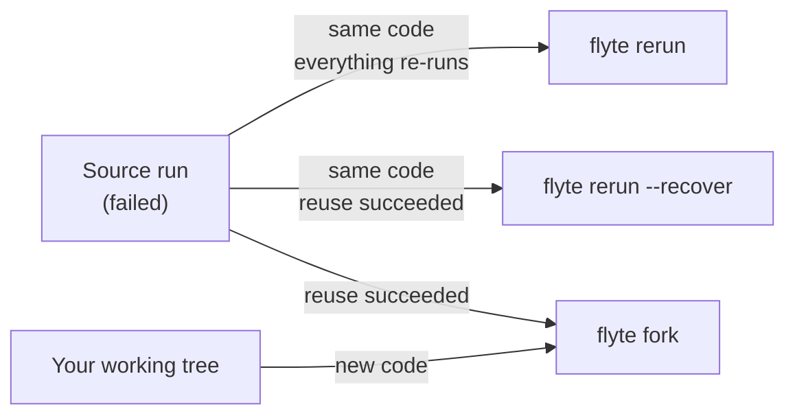
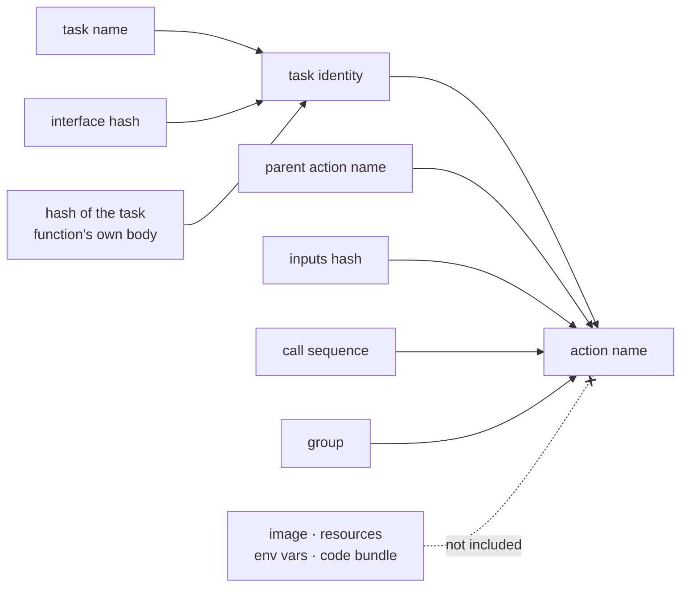

# Fork a run

Forking replays a prior run with the code and inputs you have **now**: the actions that succeeded
are reused, and the ones you changed re-execute. It is time-travel debugging for a pipeline. Go
back to a run, change a task or an input, and re-run only what that change actually affects.

```bash
flyte fork <run-name> main.py main
```

A fresh code bundle is built from your working tree, so nothing about the source run's code is
replayed except where it is unchanged.

> [!NOTE] Availability
> `flyte fork` ships in `flyteplugins-union` 0.8.1 and later (`pip install flyteplugins-union`),
> alongside `flyte` 2.6.5. It is remote-only: forking a run has no local equivalent.

## How it relates to rerun and recover

[Recovery](./recover-runs) deliberately refuses to substitute your code, because it exists to
survive infrastructure failures rather than to patch a run. Fork is the verb that does substitute
it, and the three form a progression:

| Command | Code | Actions |
|---|---|---|
| `flyte rerun <run>` | the source run's | everything re-executes |
| `flyte rerun <run> --recover` | the source run's | succeeded actions reused |
| `flyte fork <run> <file> <task>` | **yours** | succeeded actions reused |



Fork can also change the root action's inputs. In Python the substitute code is optional too:
`fork(run, threshold=0.9)` with no `task_template` replays the source run's task spec against new
inputs, which makes fork the way to recover a run with different inputs. On the CLI the file and
task are always given, since the command is built from them.

## Fork from the CLI

`flyte fork` takes the run first, then the file and task. `flyte run`'s options (image, copy
style, service account, env, labels, queue) come before the run name:

```bash
flyte fork <run-name> main.py main
flyte fork --name fix-1 --env LOG_LEVEL=debug <run-name> main.py main
```

`--force-rerun-action` forces an action to re-execute even though it succeeded in the source run:

```bash
flyte fork --force-rerun-action a3 <run-name> main.py main
```

List action names with `flyte get action <run-name>`. A listed parent re-enqueues its children, so
list those too to force a whole subtree; unknown names are ignored.

### Changing inputs

The task's inputs become options, built from the signature in your local code. They are optional
and carry no defaults: an input you leave out keeps the source run's value, so changing one input
of a five-input task is one flag rather than five. Booleans take `--x/--no-x` so either value stays
expressible, and unknown input names are rejected up front.

```bash
flyte fork <run-name> main.py main --threshold 0.9
```

> [!WARNING] Recovered actions keep their original outputs
> An action reused from the source run keeps the output it produced under the **original** inputs.
> Fork does not recompute it against the new ones. Name the actions that must re-execute in
> `--force-rerun-action`.

When the inputs you pass cover the whole interface, the source run's inputs are never fetched, so a
run whose inputs have been cleaned up from storage can still be forked.

## Fork programmatically

```python
from flyteplugins.union import fork, with_forkcontext

fork("<run-name>", task_template=main)                          # new code
fork("<run-name>", task_template=main, threshold=0.9)           # new code and inputs
fork("<run-name>", threshold=0.9)                               # source code, new inputs
fork("<run-name>", task_template=main, force_rerun_actions=["a3"])
```

`with_forkcontext()` accepts the same keyword arguments as `flyte.with_runcontext()` and returns a
runner that can also `fork()`:

```python
with_forkcontext(name="fix-1", env_vars={"LOG_LEVEL": "debug"}).fork("<run-name>", task_template=main)
```

## What re-executes

A fork reuses an action when its **action name** matches one that succeeded in the source run, and
action names are computed rather than assigned:



Two properties follow, and they explain nearly everything about what a fork re-runs:

- **Deployment details are excluded on purpose.** Changing a task's resources or image does not
  rename its action, so the rest of the run stays reusable. Raising the memory on a task that hit
  `flyte.errors.OOMError` and forking does exactly what you would hope: the successful upstream is
  reused, and the failed task re-executes with its new limit.
- **Matching follows the data.** Because a child's name folds in its inputs hash, an upstream task
  that re-executes but produces *identical* outputs leaves its downstream actions matchable, and
  they are still reused.

### What a code change re-runs

| You change | On fork |
|---|---|
| A task's function body | that task re-runs |
| A task's signature | that task re-runs |
| A task's docstring | that task re-runs |
| The task function's name | that task re-runs |
| The `flyte.TaskEnvironment` name | every task in it re-runs |
| Comments inside a task | reused |
| Formatting or whitespace | reused |
| `flyte.Resources` (cpu, memory) | reused |
| The image, or added packages | reused |
| A module-level constant a task reads | reused (see below) |
| A helper function a task calls | reused (see below) |

> [!WARNING] Identity is the function body, and only the function body
> A task's identity hashes only the decorated function's own source. If you edit a module-level
> constant it reads, or a helper function it calls, the action name does not change, so a task
> that already succeeded is reused and your change has no effect on it. Nothing warns you.
>
> Use `--force-rerun-action` to re-execute those actions explicitly, or move the changed logic
> into the task body.

The same rule governs `flyte.trace` functions: a traced function hashes its own body, so editing it
causes it to re-execute instead of replaying its recorded result. A helper it calls still does not
count as a change.

Runs launched from a notebook or with a pickled code bundle behave differently: they version on the
bundle itself, so any code change renames every action and nothing is reused.

## Related

- [Recover a failed run](./recover-runs): replay a failed run with its original code, reusing what succeeded.
- [Re-run a run](./rerun-runs): launch a fresh run from a previous one, without reusing its actions.
- [Debug a run](./debug-runs): inspect a failure before deciding how to fork it.
- [Interact with runs and actions](./interacting-with-runs): retrieve, monitor, and inspect runs and actions.
