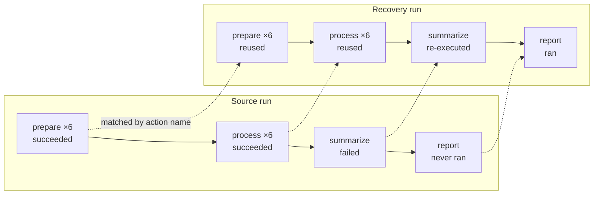

# Recover a failed run

When a run fails partway through, most of its work is usually still good. **Recovery** launches a
new run that reuses the successful actions from a previous one and re-executes only what failed.
A reused action is not executed again at all: its recorded output is handed straight to whatever
consumes it.

This is the difference between recovery and a plain [re-run](./rerun-runs): a re-run starts the
whole run over from the beginning, while a recovery picks up where the failure left off.

Recovery is one of two behaviours of the same verb, `flyte rerun`. It is remote-only: rerun and
recover are not supported in local mode.

## What a recovery reuses

Given a run whose `summarize` task failed, leaving its downstream `report` task unreached:



The parent task that issues these calls always re-executes, since it is the code that re-drives
the graph. Its children are then matched one at a time as it calls them.

## How this differs from caching

Caching and recovery both skip work that has already been done, but they are keyed on different
things, and they are not alternatives to one another.

Caching is **content-addressed**. A task's cache key comes from its inputs, name, interface, and
cache version, so a hit can be served to any run at any time, subject to the lookup scope. You opt
in per task, in code, and `flyte.TaskEnvironment` defaults to caching disabled.

Recovery is **scoped to a single run**. It reuses what one named run produced, at the position in
the graph where that run produced it. You opt in per run, at launch, and no task has to be marked
as anything beforehand.

| | Caching | Recovery |
|---|---|---|
| Keyed on | inputs and task version | the source run, plus the action's position within it |
| Reuse comes from | any prior run in the lookup scope | the one run you name |
| Enabled | per task, in code (off by default) | per run, at launch |
| Two identical calls in one run | the second is a cache hit | both remain distinct actions |

Three practical consequences follow:

- **Recovery needs no preparation.** A task that was never marked cacheable is recovered anyway,
  which is usually the situation you are in when a long run fails.
- **Each one makes a different claim.** Marking a task cached asserts that it is a pure function of
  its inputs, for every future run. Recovery asserts only that one run's result at one point is
  still good, so it can reuse output from tasks that would not be safe to cache at all.
- **They are independent.** Caching applies on any run, including a recovery run; recovery covers
  the actions caching does not. A recovered action is reported in its own terminal phase, distinct
  from an action that succeeded by executing.

## One verb, two behaviours

`flyte rerun` fetches the prior run's task spec and inputs from the platform. No local code is
involved, and nothing you edit locally is picked up.

| Call | What happens |
|---|---|
| `flyte rerun <run>` | A whole new run with the same inputs. Every action executes again, subject to global caching. |
| `flyte rerun <run> --recover` | A whole new run, but actions that already succeeded are reused as-is. Only what failed or never ran executes. |

Recovery always replays the source run's **code** as-is. It is durability against intermittent
failures, not a way to patch a run.




To replay a prior run with code you have changed, see [Fork a run](./fork-runs).




## Recover from the CLI

```bash
flyte rerun <run-name> --recover --follow
```

| Option | Description |
|---|---|
| `--recover` | Reuse the prior run's succeeded actions, re-running only what failed or never ran. |
| `--action-name <action>` | Re-run only this action, rooted at its task with the inputs it received. Cannot be combined with `--recover`. |
| `--force-rerun-action <action>` | With `--recover`, re-execute an action even though it succeeded in the source run. Repeatable. |
| `--allow-missing-outputs` | Proceed when the source run's outputs have been cleaned up from storage. |
| `-e`, `--env KEY=VALUE` | Set an environment variable on the new run. Repeatable. |

Action names are deterministic hashes rather than positions, so list them with
`flyte get action <run-name>` and copy the one you want. A listed parent re-enqueues its children,
so list those too to force a whole subtree; unknown names are ignored.

Reused actions land in the `RECOVERED` phase, which is terminal and success-equivalent, so
`flyte get action <run-name>` tells you exactly what recovery skipped.

### Changing inputs

The source task's inputs become options on `flyte rerun`, read off the run itself rather than from
local code. Every one is optional: an input you leave out keeps the prior run's value, so changing
one input of a five-input task is one flag rather than five.

```bash
flyte rerun <run-name> --threshold 0.9
flyte rerun <run-name> --recover --threshold 0.9
```

> [!WARNING] Recovered actions keep their original outputs
> An action reused from the source run keeps the output it produced under the **original** inputs.
> Recovery does not recompute it against the new ones. Name the actions that must re-execute in
> `--force-rerun-action`.

When the inputs you pass cover the task's whole interface, the source run's inputs are never read,
which makes `--allow-missing-outputs` irrelevant in that case.

Because recovery matches succeeded actions by name, and a run rooted at a single action has a
different action tree, `--action-name` cannot be combined with `--recover`.

## Recover programmatically

`flyte.rerun()` takes the same arguments the CLI exposes:

```python
import flyte

flyte.init_from_config()

# Re-run everything with the prior run's inputs:
flyte.rerun("<run-name>")

# Reuse the succeeded actions, re-running only what failed or never ran:
flyte.rerun("<run-name>", recover=True)

# Force specific actions to re-execute even though they succeeded:
flyte.rerun("<run-name>", recover=True, force_rerun_actions=["a3", "a7"])

# Change inputs, keeping the ones you leave out, and still reuse succeeded actions:
flyte.rerun("<run-name>", recover=True, threshold=0.9)

# Re-run a single action, rooted at its task with the inputs it received:
flyte.rerun("<run-name>", action_name="a3")
```

`allow_missing_source_outputs=True` is the programmatic equivalent of `--allow-missing-outputs`.
Launch settings still come from `flyte.with_runcontext()`:

```python
flyte.with_runcontext(name="retry-1", env_vars={"LOG_LEVEL": "20"}).rerun("<run-name>", recover=True)
```

Task inputs share the keyword namespace with those arguments, so a task input named `run_name`,
`action_name`, `recover`, `force_rerun_actions` or `allow_missing_source_outputs` cannot be passed
this way.

## Related

- [Re-run a run](./rerun-runs): launch a fresh run from a previous one, without reusing its actions.
- [Interact with runs and actions](./interacting-with-runs): retrieve, monitor, and inspect runs and actions.
- [Run command options](./run-command-options): the full set of `flyte run` options.



- [Fork a run](./fork-runs): replay a prior run with code you have changed.
- [Debug a run](./debug-runs): inspect a failure before deciding how to recover from it.


