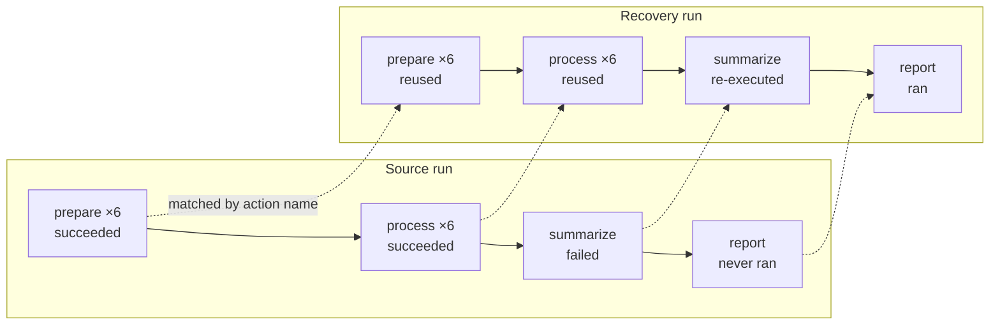
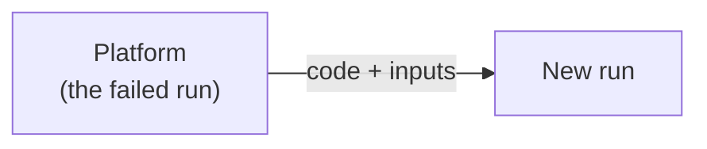
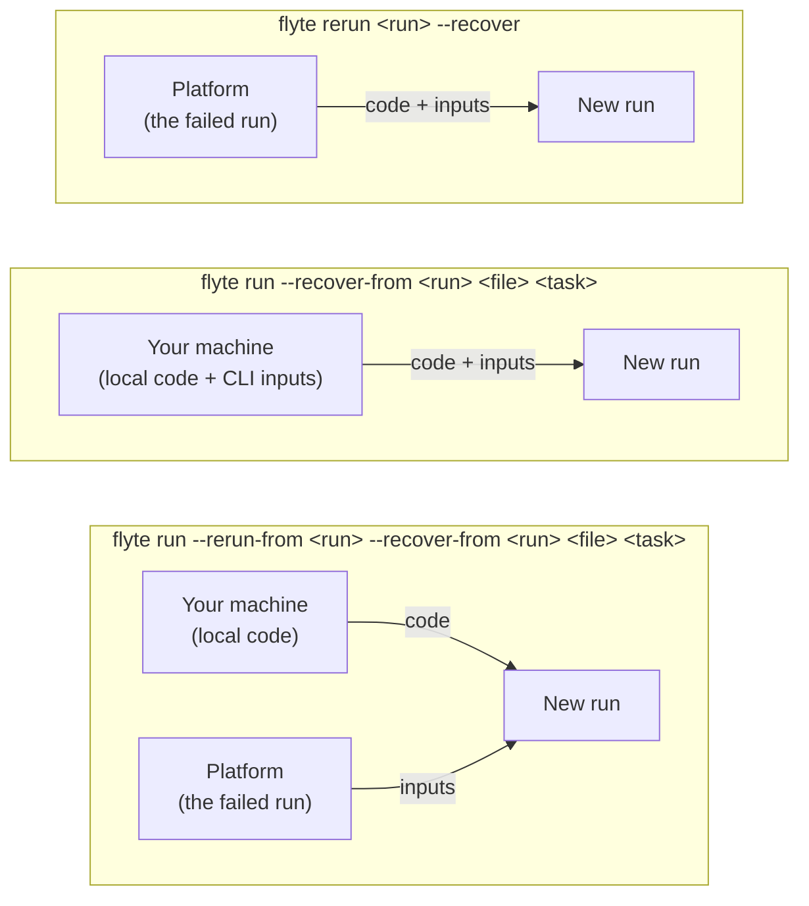
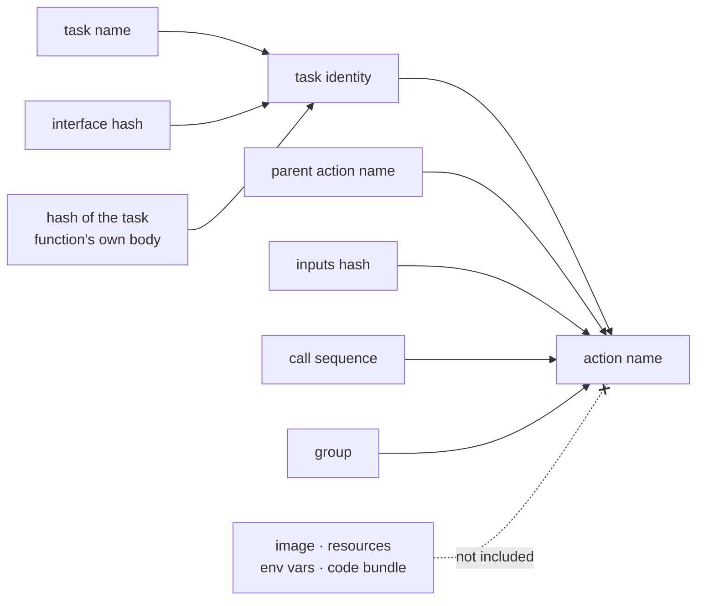

# Recover a failed run

When a run fails partway through, most of its work is usually still good. **Recovery** launches a
new run that reuses the successful actions from a previous one and re-executes only what failed.
A reused action is not executed again at all: its recorded output is handed straight to whatever
consumes it.

This is the difference between recovery and a plain [re-run](./rerun-runs): a re-run starts the
whole run over from the beginning, while a recovery picks up where the failure left off.

> [!NOTE] Version requirement
> Recovery requires `flyte` 2.6.0 or later. It is remote-only and cannot be combined with
> `--local`.

## What a recovery reuses

Given a run whose `summarize` task failed, leaving its downstream `report` task unreached:



The parent task that issues these calls always re-executes, since it is the code that re-drives
the graph. Its children are then matched one at a time as it calls them.

## How this differs from caching

Caching and recovery both skip work that has already been done, but they are keyed on different
things, and they are not alternatives to one another.

Caching is **content-addressed**. A task's cache key comes from its inputs, name, interface, and
cache version, so a hit can be served to any run at any time, subject to the lookup scope. You opt
in per task, in code, and `flyte.TaskEnvironment` defaults to caching disabled.

Recovery is **scoped to a single run**. It reuses what one named run produced, at the position in
the graph where that run produced it. You opt in per run, at launch, and no task has to be marked
as anything beforehand.

| | Caching | Recovery |
|---|---|---|
| Keyed on | inputs and task version | the source run, plus the action's position within it |
| Reuse comes from | any prior run in the lookup scope | the one run you name |
| Enabled | per task, in code (off by default) | per run, at launch |
| Two identical calls in one run | the second is a cache hit | both remain distinct actions |

Three practical consequences follow:

- **Recovery needs no preparation.** A task that was never marked cacheable is recovered anyway,
  which is usually the situation you are in when a long run fails.
- **Each one makes a different claim.** Marking a task cached asserts that it is a pure function of
  its inputs, for every future run. Recovery asserts only that one run's result at one point is
  still good, so it can reuse output from tasks that would not be safe to cache at all.
- **They are independent.** Caching applies on any run, including a recovery run; recovery covers
  the actions caching does not. A recovered action is reported in its own terminal phase, distinct
  from an action that succeeded by executing.

## Where the new run's code and inputs come from

Every recovery is a new run carrying a pointer back to the run it recovers from. What differs
between the commands is whose code and whose inputs the new run gets.




`flyte rerun --recover` fetches both the task spec and the inputs from the backend, so the new run
repeats the original code exactly:



| Command | Code | Inputs |
|---|---|---|
| `flyte rerun <run> --recover` | fetched from the backend | prior run's |

Because the code comes from the backend, this is the right tool for a transient or infrastructure
failure that simply needs another attempt. Local edits are not picked up.









| Command | Code | Inputs | Use it when |
|---|---|---|---|
| `flyte rerun <run> --recover` | fetched from the backend | prior run's | the failure was transient and the same code should be retried |
| `flyte run --recover-from <run> <file> <task>` | your local code | from the CLI | you fixed the code |
| `flyte run --rerun-from <run> --recover-from <run> <file> <task>` | your local code | prior run's | you fixed the code and don't want to re-enter inputs |

There is no separate deploy step in any of these. `flyte run` bundles and uploads your working
directory on every launch, so "recover with my fix" is just a `flyte run` with a recovery pointer.

> [!WARNING] `rerun` does not pick up your edits
> `flyte rerun` re-launches the task spec stored on the backend, which is the code that already
> failed. If you have changed your code locally, use `flyte run --recover-from` instead.




## Recover from the CLI

Retry a failed run, reusing everything that succeeded:

```bash
flyte rerun <run-name> --recover --follow
```




Recover with code you have changed locally:

```bash
flyte run --recover-from <run-name> main.py main
```

The clearest way to see what each command ships is to fix the failing task and then run both
against the same failed run:

```bash
# edit the body of the task that failed, then:

flyte rerun <run-name> --recover                  # re-launches the stored spec: fails again
flyte run --recover-from <run-name> main.py main  # ships your edit: the task succeeds
```

Both reuse the actions that already succeeded, and both re-execute the one that failed. Only
the second one re-executes it with your fix.




Additional options:

| Option | Description |
|---|---|
| `--force-rerun-action <action>` | Re-execute an action even though it succeeded in the source run. Repeatable. |
| `--allow-missing-outputs` | Proceed when the source run's outputs have been cleaned up from storage. |
| `-e`, `--env KEY=VALUE` | Set an environment variable on the new run. Repeatable. |
| `--name` | Name for the new run. |

Use `flyte get action <run-name>` to list a run's actions and find the names to pass to
`--force-rerun-action`. Naming a parent re-enqueues its children, so list those too when you want
to force a whole subtree. Unknown names are ignored silently.

## Recover programmatically

`flyte.with_runcontext()` exposes the same behavior. Pass `recover=True` to `rerun()` to recover
from the run being rerun:

```python
import flyte

flyte.init_from_config()

# Retry a failed run with its original code, reusing succeeded actions:
flyte.with_runcontext(recover=True).rerun("<run-name>")

# Force specific actions to re-execute even though they succeeded:
flyte.with_runcontext(
    recover=True,
    recover_force_rerun_actions=["a3", "a7"],
).rerun("<run-name>")
```




Passing a run name instead recovers a fresh `run()` from that run, using your local code:

```python
flyte.with_runcontext(recover="<run-name>").run(main)
```




`allow_missing_source_outputs=True` is the programmatic equivalent of `--allow-missing-outputs`.




## How actions are matched

Recovery matches actions from the source run **by action name**, and action names are computed
rather than assigned:



Two properties follow from this, and they explain nearly everything about recovery behavior:

- **Deployment details are excluded on purpose.** Changing a task's resources or image does not
  rename its action, so the rest of the run stays reusable. Raising the memory on a task that hit
  `flyte.errors.OOMError` and recovering does exactly what you would hope: the successful upstream
  is reused, and the failed task re-executes with its new limit.
- **Matching follows the data.** Because a child's name folds in its inputs hash, an upstream task
  that re-executes but produces *identical* outputs leaves its downstream actions matchable, and
  they are still reused.

### What re-runs after a code change

| You change | On recovery |
|---|---|
| A task's function body | that task re-runs |
| A task's signature | that task re-runs |
| A task's docstring | that task re-runs |
| The task function's name | that task re-runs |
| The `flyte.TaskEnvironment` name | every task in it re-runs |
| Comments inside a task | reused |
| Formatting or whitespace | reused |
| `flyte.Resources` (cpu, memory) | reused |
| The image, or added packages | reused |
| A module-level constant a task reads | reused (see below) |
| A helper function a task calls | reused (see below) |

> [!WARNING] Identity is the function body, and only the function body
> A task's identity hashes only the decorated function's own source. If you edit a module-level
> constant it reads, or a helper function it calls, the action name does not change, so a task
> that already succeeded is reused and your change has no effect on it. Nothing warns you.
>
> Use `--force-rerun-action` to re-execute those actions explicitly, or move the changed logic
> into the task body.

The same rule governs `flyte.trace` functions: a traced function hashes its own body, so editing it
causes it to re-execute instead of replaying its recorded result. A helper it calls still does
not count as a change.

Runs launched from a notebook or with a pickled code bundle behave differently: they version on the
bundle itself, so any code change renames every action and nothing is reused.




## Related

- [Re-run a run](./rerun-runs): launch a fresh run from a previous one, without reusing its actions.
- [Interact with runs and actions](./interacting-with-runs): retrieve, monitor, and inspect runs and actions.
- [Run command options](./run-command-options): the full set of `flyte run` options.


- [Debug a run](./debug-runs): inspect a failure before deciding how to recover from it.


