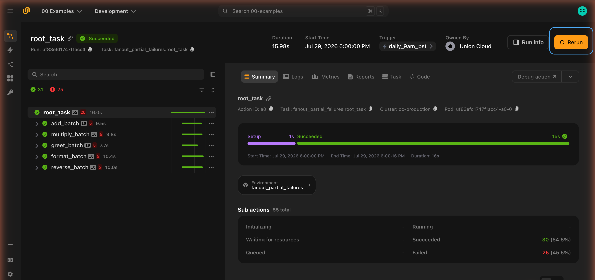
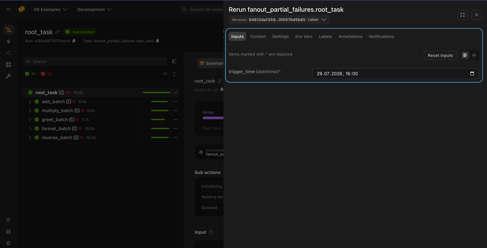
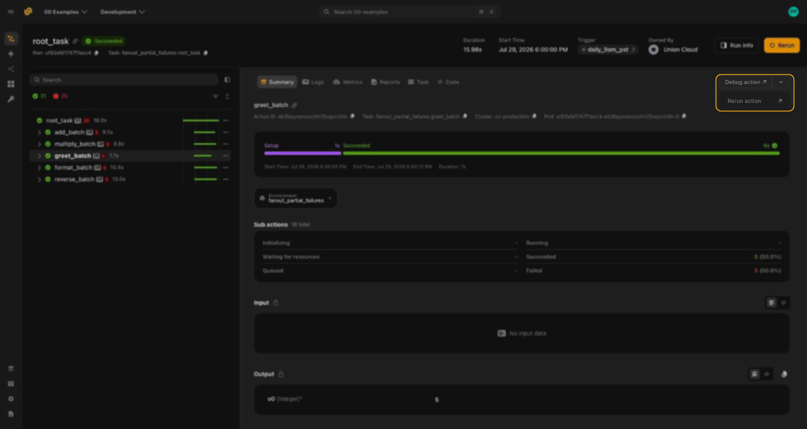
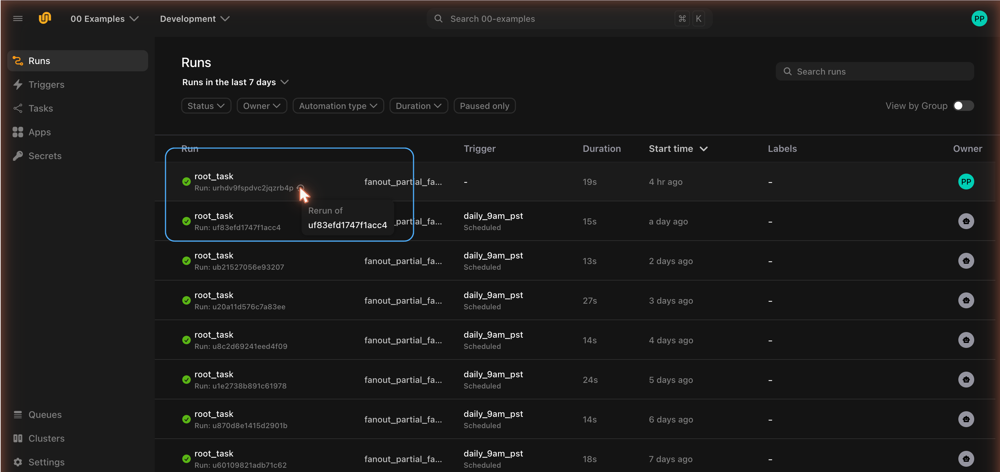
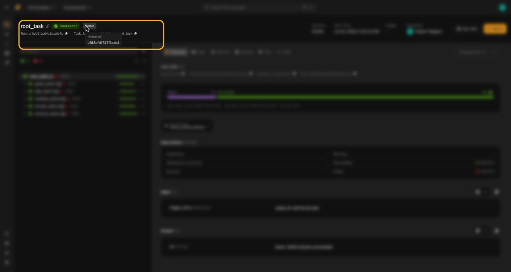

# Rerun a run

Every run in  is durable: its task, code, inputs, and configuration are all
recorded on the backend. That means you can launch a brand-new run from any previous one without
having the original code checked out locally. This is useful for retrying a transient failure,
reproducing a result, or tweaking a few inputs and running again.

You can rerun at two levels of granularity:

- **The whole run**: re-execute the entry point task (the `a0` action) and everything it calls.
- **A single action**: re-execute one nested action on its own.

And you can trigger a rerun from three places: the **UI**, the **CLI**, or **programmatically**
with the Python SDK.

## Rerun from the UI

### Rerun an entire run

Open the run in the UI. In the top-right corner of the run view, click **Rerun**.



This opens the launch form pre-filled with the original run's inputs, environment variables, and
code. You can either:

- Trigger the run as-is to reproduce the original execution exactly, or
- Edit the inputs, environment variables, and other launch settings in the form before triggering
  to run a variation.



### Rerun a single action

You can also rerun an individual action without rerunning the whole workflow. Navigate to the
action in the run's action list, open its details view, and use the **Rerun action** option (in the
action menu in the top-right of the action details panel).



This launches a new run starting from that action, using the action's recorded inputs. As with a
full rerun, you can adjust the inputs in the launch form first.




## Run lineage

When you rerun a run from the UI,  records the run you started from as the
new run's parent. This provenance is captured automatically, so you never have to set it yourself. A
parent link is also recorded when a run is derived from another run in other ways, such as recovering
a failed run.

Run lineage lets you trace a run back to the one it was started from.

The parent is surfaced in two places in the console:

- **In the run list**, a rerun is marked with a rerun icon next to its run ID. Hover the icon to see
  "Rerun of" and the ID of the parent run, so you can tell at a glance which runs were started from
  an earlier run. A rerun also shows no trigger and is owned by the user who started it, rather than
  by a schedule.



- **On the run details page**, a rerun shows a **Rerun** badge next to its status. Hover the badge,
  or open **Run info**, to see the **Rerun of** link to the parent run.






## Rerun from the CLI

`flyte rerun` fetches the prior run's task **and** inputs from the backend and launches a new run.
You don't need the original code checked out locally. Everything is pulled from the platform:

```bash
# Rerun with the prior run's exact code and inputs
flyte rerun <run-name>

# Give the new run a name and stream its parent-action logs
flyte rerun <run-name> --name retry-1 --follow
```

Common options:

| Option | Description |
|---|---|
| `-p`, `--project` | Project for the new run (defaults to your config). |
| `-d`, `--domain` | Domain for the new run (defaults to your config). |
| `--name` | Name for the new run (a random name is generated if unset). |
| `-e`, `--env KEY=VALUE` | Override an environment variable for the new run. Repeatable. |
| `--label KEY=VALUE` | Set a label on the new run. Repeatable. |
| `-f`, `--follow` | Stream the parent action's logs after launch. |

> [!NOTE]
> `flyte rerun` reuses the prior run's inputs as-is. To change input values from the command line,
> use the programmatic `flyte.rerun(<run-name>, key=value)` form shown below.

### Rerun compared with a fresh run

| Command | Code | Inputs |
|---|---|---|
| `flyte run <file> <task>` | local | from CLI |
| `flyte rerun <run>` | fetched from backend | prior run's |

Both start the run over from the beginning. To instead keep the successful actions of a failed
run and re-execute only what failed, add `--recover` to `flyte rerun`. See
[Recover a failed run](./recover-runs).



`flyte rerun` never substitutes local code, with or without `--recover`. To replay a prior run
with code you have changed, see [Fork a run](./fork-runs).




## Rerun programmatically

Use `flyte.rerun()` to rerun from Python. Like the CLI, it fetches the prior run's task and inputs
from the backend, so no local code is required:

```python
import flyte

flyte.init_from_config()

# Rerun a prior run with its exact inputs (task + inputs fetched from the platform):
flyte.rerun("ul56wcvgqrb9vzhzz5l2")

# Change input parameters — they are converted against the prior run's interface:
flyte.rerun("ul56wcvgqrb9vzhzz5l2", x_list=[1, 2, 3])

```

`flyte.rerun()` returns a `flyte.remote.Run`, just like `flyte.run()`, so you can monitor it, wait
on it, and retrieve its outputs in the same way. See
[Interact with runs and actions](./interacting-with-runs) for details.

To control launch settings (name, project, domain, environment variables, labels) use
`flyte.with_runcontext(...).rerun(...)`:

```python
flyte.with_runcontext(
    name="retry-1",
    env_vars={"LOG_LEVEL": "20"},
).rerun("ul56wcvgqrb9vzhzz5l2")
```

## Related

- [Recover a failed run](./recover-runs): re-run only what failed, reusing the actions that succeeded.
- [Interact with runs and actions](./interacting-with-runs): retrieve, monitor, and inspect runs and actions.
- [Run command options](./run-command-options): the full set of `flyte run` options.
